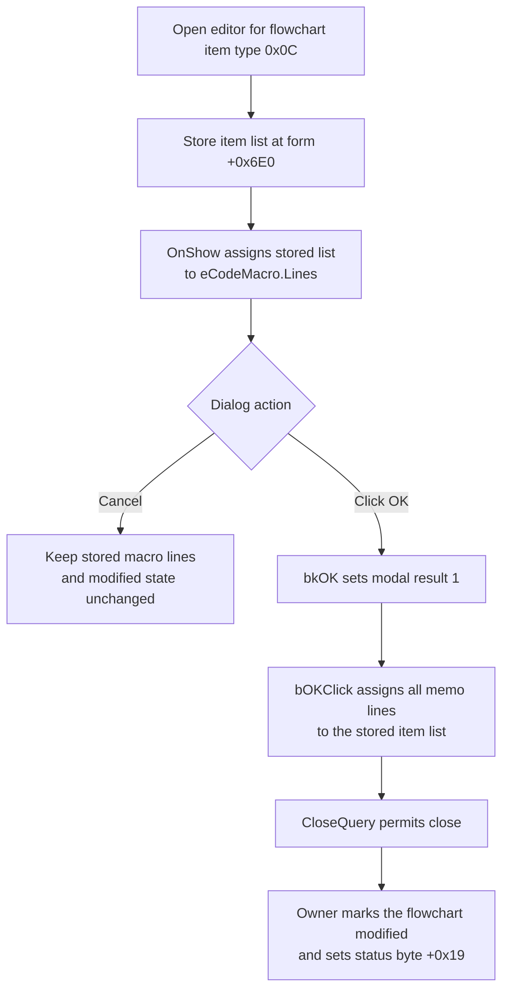

# Accept the code macro text

> Analysis status: Evidence-backed source review complete.

## Control

| Property | Recovered value |
| --- | --- |
| Form | dlgFlowChartCodeMacro |
| Form caption | Code Macro |
| Component path | dlgFlowChartCodeMacro.bOK |
| Control class | TBitBtn |
| Caption | Supplied by the standard `bkOK` kind; no explicit caption is stored. |
| Hint | Not present in the recovered resource. |
| Text | Not present in the recovered resource. |
| Handler name | bOKClick |
| Handler address | 00fd8d40 |
| Graph node | `resource:dfm:dlgFlowChartCodeMacro/dlgFlowChartCodeMacro.bOK` |
| Handler node | `function:00fd8d40` |
| Graph layer | UI |

## What happens when clicked

`FUN_00fd8d40` reads the `Lines` object of the `eCodeMacro` memo and assigns the complete list to the destination object at form offset `+0x6E0`. The dialog setup routine stores the selected flowchart item's object at item offset `+0x5C0` in this form field. Thus, OK replaces that item's stored code-macro lines with the current memo lines.

This is a complete list assignment. It is not an append, a selected-line update, or a file write. An empty memo is accepted and replaces the stored macro with an empty list. The handler does not compare the old and new text. Therefore, accepting unchanged text still performs the assignment.

The handler does not parse the macro, validate syntax, check for empty text, show a warning, or call a compiler. It also does not change the memo text before the assignment.

## Dialog setup and modal result

The modal owner opens this dialog only for the recovered flowchart item type value `0x0C`. It passes the selected item to the dialog setup routine. `FUN_00fd8d70` stores the item's object at `+0x5C0` in form field `+0x6E0`. When the form is shown, `FUN_00fd8cf0` assigns that stored list to `eCodeMacro.Lines`. This gives the user an editable copy of the current macro text.

The standard `bkOK` button sets modal result `1` before it dispatches `bOKClick`. The form's close-query flag at `+0x6D8` starts at zero. The click handler does not set it, so `FUN_00fd8d20` permits the normal OK close and resets the flag to zero.

After `ShowModal` returns `1`, the owner marks the flowchart model as modified, mirrors that state to an optional secondary editor object, and sets the separate model status byte at `+0x19` to `1`. These state updates occur for every accepted OK result, even when the macro text did not change.

The Cancel button has standard kind `bkCancel` and no custom click handler. Cancel does not run `bOKClick`, so it does not assign the staged memo lines to the selected item and does not run the accepted-result modified-state updates.

## Error and partial-state behavior

The click handler contains only the virtual list-assignment call and a return. It has no local exception handler, rollback, or error-message branch. If list assignment raises, the exact destination contents depend on the list implementation and the point of failure. The recovered code does not prove an atomic replacement or restoration of the old lines. Higher-level exception handling and the final dialog state after such a failure are not recovered here.

## Click flow

## Handler evidence

- [bOKClick](../../../DecompiledSources/Tina16/functions/0000000000FD8D40__FUN_00fd8d40.c) gets `eCodeMacro.Lines` through control offset `+0x4D8` and passes it to the destination object's virtual assignment method.
- [FormShow](../../../DecompiledSources/Tina16/functions/0000000000FD8CF0__FUN_00fd8cf0.c) performs the reverse assignment from form field `+0x6E0` to `eCodeMacro.Lines`.
- [The dialog setup routine](../../../DecompiledSources/Tina16/functions/0000000000FD8D70__FUN_00fd8d70.c) copies the selected item's pointer at `+0x5C0` to form field `+0x6E0`.
- [The modal owner](../../../DecompiledSources/Tina16/functions/00000000010512F0__FUN_010512f0.c) creates the dialog, passes the selected item, tests `ShowModal` for result `1`, and performs the accepted-result state updates.
- [The item dispatcher](../../../DecompiledSources/Tina16/functions/000000000104EF30__FUN_0104ef30.c) selects this modal owner for item type value `0x0C`.
- [FormCreate](../../../DecompiledSources/Tina16/functions/0000000000FD8CD0__FUN_00fd8cd0.c) clears the close-query flag, and [FormCloseQuery](../../../DecompiledSources/Tina16/functions/0000000000FD8D20__FUN_00fd8d20.c) permits closing only while that flag is zero.
- [The modified-state synchronizer](../../../DecompiledSources/Tina16/functions/0000000001053E80__FUN_01053e80.c) passes state `1` to the flowchart model and an optional secondary editor object. [The status setter](../../../DecompiledSources/Tina16/functions/0000000000F629B0__FUN_00f629b0.c) writes `1` to model byte `+0x19`.
- Standard `bkOK` modal-result dispatch is recovered in [TBitBtn.SetKind](../../../DecompiledSources/Tina16/functions/000000000082BC30__FUN_0082bc30.c) and [TCustomButton.Click](../../../DecompiledSources/Tina16/functions/0000000000687F30__FUN_00687f30.c).
- The recovered [UI evidence](../../../DecompiledSources/Tina16/resources/dfm/ui-evidence.json) identifies `eCodeMacro` as a `TMemo`, binds `bOK.OnClick` to `bOKClick`, gives the button kind as `bkOK`, and provides the form and label text. No custom glyph, hint, or explicit button caption is present.

## Direct calls

- No direct call edge is present in the recovered graph. The handler uses one indirect virtual call on the destination list object.

## Resource evidence

- The form caption is `Code Macro`.
- `eCodeMacro` is the form's only recovered memo.
- The label `Code Macro:` is a nearby layout candidate and agrees with the form and memo identity. Proximity alone does not establish the implementation.
- `bOK` has standard kind `bkOK`. It has no extracted custom glyph, hint, text, or explicit caption.

## Analysis limits

- The recovered code does not expose the original Delphi field name or concrete class for the selected item's object at `+0x5C0`. The two opposite list assignments establish its string-list role.
- The recovered type value `0x0C` selects this Code Macro dialog, but its original enumeration member name is not recovered.
- The separate model byte at `+0x19` is set after acceptance. Its semantic Delphi name is not recovered.
- No compile, execution, persistence, or file-save call occurs in this path. This article does not claim when or how another workflow later uses or saves the stored macro text.
