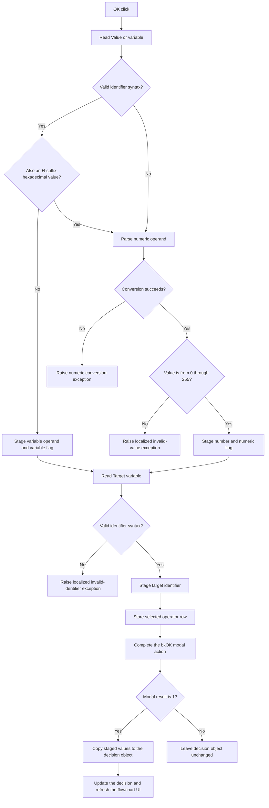

# OK

## Control

| Property | Recovered value |
| --- | --- |
| Form | dlgFlowChartDecision |
| Component path | dlgFlowChartDecision.bOK |
| Control class | TBitBtn |
| Caption | Supplied by the recovered `bkOK` button kind. |
| Hint | Not present in the recovered resource. |
| Text | Not present in the recovered resource. |
| Handler name | bOKClick |
| Handler address | 00f939c0 |
| Graph node | `resource:dfm:dlgFlowChartDecision/dlgFlowChartDecision.bOK` |
| Handler node | `function:00f939c0` |
| Graph layer | UI |

## What happens when clicked

The click validates and stages the three parts of a flowchart decision:

1. The right operand from `eValue` can be a variable name or an 8-bit number.
2. The target from `eIdentifier` must be an identifier.
3. The selected `cbOperator` row supplies the comparison operation.

An identifier must be nonempty, start with an ASCII letter or underscore, and
contain only ASCII letters, digits, or underscores. If `eValue` meets this
identifier rule and is not also an `H`-suffix hexadecimal value, the handler
stores it as a variable operand and sets the operand-type flag to variable.

All other `eValue` text goes to the integer parser. The parser accepts decimal
text and hexadecimal text whose final character is `H`; hexadecimal digits can
use upper-case or lower-case letters. The handler sets the operand-type flag to
numeric, stores the parsed integer, and requires a value from 0 through 255.
Text that the integer parser cannot convert raises its normal conversion
exception. A converted value outside the 8-bit range raises the localized
`HDLStrings.Msg_FC_InvValue` exception.

The handler then validates `eIdentifier`. An invalid target raises the
localized `HDLStrings.Msg_FC_InvIdentifier` exception. A valid target is copied
to the dialog's staged target field. Finally, the handler stores the combo-box
row as the operator code. The DFM makes this combo a drop-down list with these
ordered rows: `=`, `>`, `<`, `>=`, `<=`, and `<>`. The handler has no separate
index guard.

The button has kind `bkOK`. After normal modal acceptance, caller
`FUN_01050f20` copies the staged target, operand string or numeric value,
operand-type flag, and operator code back to the flowchart decision object. It
then calls the object's update method and refreshes the flowchart UI. Cancel or
any modal result other than 1 skips this copy and refresh path.

The click handler does not change the flowchart object directly. A validation
exception interrupts normal handler completion. The recovered function has no
local catch, retry, fallback, or rollback block.

## Click flow

## Handler evidence

- Handler source: [FUN_00f939c0](../../../DecompiledSources/Tina16/functions/0000000000F939C0__FUN_00f939c0.c)
- Identifier validator: [FUN_00f60aa0](../../../DecompiledSources/Tina16/functions/0000000000F60AA0__FUN_00f60aa0.c)
- Hexadecimal-form validator: [FUN_00f60e10](../../../DecompiledSources/Tina16/functions/0000000000F60E10__FUN_00f60e10.c)
- Integer parser: [FUN_00f60f70](../../../DecompiledSources/Tina16/functions/0000000000F60F70__FUN_00f60f70.c)
- Modal caller and commit path: [FUN_01050f20](../../../DecompiledSources/Tina16/functions/0000000001050F20__FUN_01050f20.c)
- Form-show staging source: [FUN_00f93850](../../../DecompiledSources/Tina16/functions/0000000000F93850__FUN_00f93850.c)
- Recovered role: Validate and stage a flowchart decision expression for modal
  acceptance.
- Complexity: complex
- Distinct outgoing calls: 12

The DFM binds `dlgFlowChartDecision.bOK.OnClick` to `bOKClick` at `00f939c0`
and assigns kind `bkOK`. The source reads `eValue` at form field `+0x6E0`,
`eIdentifier` at `+0x6D8`, and `cbOperator.ItemIndex` at `+0x6F0`. It stages
the target at `+0x700`, variable operand at `+0x708`, numeric operand at
`+0x710`, operand type at `+0x714`, and operator code at `+0x715`.

`FUN_01050f20` initializes these dialog fields from decision-object offsets
`+0x110` through `+0x126`. It copies them back only when `ShowModal` returns 1,
which establishes the accepted-output boundary.

## Direct calls

- `function:0064dd90` - read Unicode text from `eValue` and `eIdentifier`.
- `function:00f60aa0` - validate identifier syntax.
- `function:00f60e10` - detect an `H`-suffix hexadecimal integer.
- `function:00f60f70` - parse decimal or hexadecimal integer text.
- `function:00414ad0` - copy accepted strings to staged form fields.
- `function:00b89270`, `function:0041ddd0`, and `function:00b8e650` - load
  localized validation text.
- `function:00416cd0` - format the rejected input into the validation message.
- `function:0044d490` and `function:004134c0` - construct and raise the
  validation exception.
- `function:00414560` - finalize temporary Unicode strings.

## Resource evidence

- The form caption is `Test Variable`.
- The labels identify `Target variable`, `Operator`, and `Value or variable`.
- `cbOperator` is a `csDropDownList` with items `=`, `>`, `<`, `>=`, `<=`, and
  `<>`; its initial text is `=`.
- The OK control has kind `bkOK`. It has no recovered hint or custom glyph.

## Nearby label candidates

The handler and control fields confirm these labels; their distance alone is
not the evidence.

- `Value or variable` is the label for `eValue`.
- `Operator` is the label for `cbOperator`.
- `Target variable` is the label for `eIdentifier`.

## Analysis limits

- The handler stores `cbOperator.ItemIndex` as one byte without an explicit
  bounds check. The drop-down-list resource constrains normal user selection,
  but the recovered handler does not guard a programmatic invalid index.
- The source proves that invalid numeric syntax reaches the Delphi conversion
  exception path. It does not provide a form-specific message for that case.
