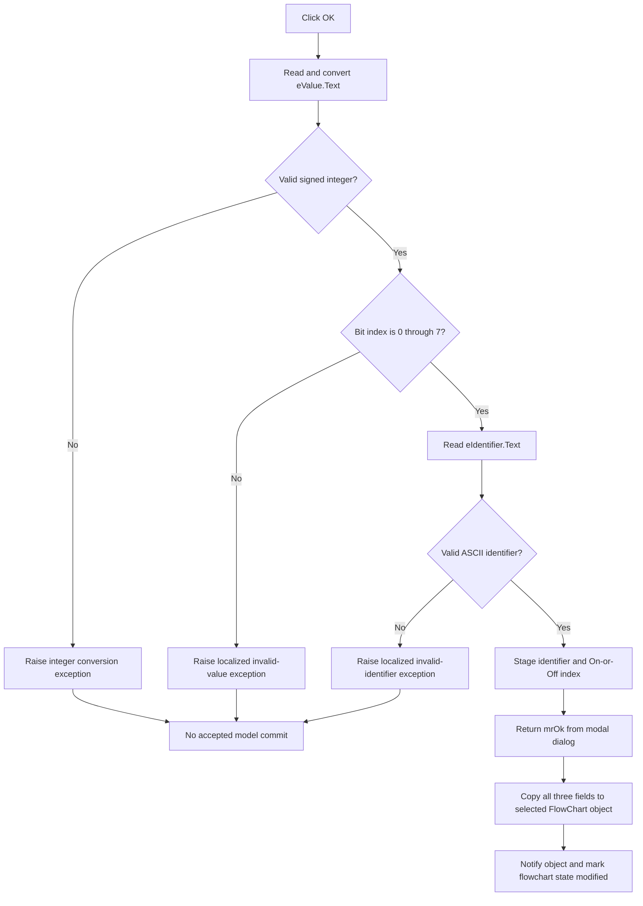

# bOK

> Analysis status: Complete for input validation, staged state, modal acceptance, live-model commit, error behavior, and persistence limits.

## Control

| Property | Recovered value |
| --- | --- |
| Form | dlgFlowChartDecisionBit |
| Form caption | Test Bit |
| Component path | dlgFlowChartDecisionBit.bOK |
| Control class | TBitBtn |
| Button kind | bkOK |
| Handler name | bOKClick |
| Handler address | 00fd7100 |
| Graph node | `resource:dfm:dlgFlowChartDecisionBit/dlgFlowChartDecisionBit.bOK` |
| Handler node | `function:00fd7100` |
| Graph layer | UI |

## What happens when clicked

`FUN_00fd7100` validates and stages the three Test Bit settings. It does not change the selected FlowChart object directly.

First, the handler reads `eValue.Text`, converts it to a signed 32-bit integer, and stores the result in dialog field `+0x708`. It then requires a value from `0` through `7`. A value outside that range causes a localized `HDLStrings.Msg_FC_InvValue` exception. Text that the integer converter cannot parse causes the converter's normal exception before the dialog field is written.

Next, the handler reads `eIdentifier.Text` and calls `FUN_00f60aa0`. The identifier must be nonempty. Its first character must be an ASCII letter or underscore. Each later character must be an ASCII letter, underscore, or decimal digit. Invalid text causes a localized `HDLStrings.Msg_FC_InvIdentifier` exception. Valid text replaces the staged identifier at dialog field `+0x700`.

After both validations pass, the handler reads `cbState.ItemIndex` and stores its low byte at dialog field `+0x70c`. The recovered drop-down-only list contains **On** at index `0` and **Off** at index `1`. The handler does not apply an additional index check.

The handler has no local exception handler, rollback, retry, or success message. An input exception stops the remaining click path and prevents a normal accepted return on that attempt.

## Accepted commit

`FUN_01050ff0` opens this modal dialog for a selected FlowChart object whose recovered type code is `1`. Before display, `FUN_00fd6f60` copies the object's current identifier at `+0x110`, bit index at `+0x120`, and state index at `+0x125` into the three staged dialog fields. `FormShow` writes those fields to `eIdentifier`, `eValue`, and `cbState`.

The modal caller changes the selected object only when `ShowModal` returns `1` (`mrOk`):

1. Copy the staged identifier to object field `+0x110`.
2. Copy the staged bit index to object field `+0x120`.
3. Copy the staged On-or-Off index to object field `+0x125`.
4. Invoke virtual method `+0x10` on the changed object.
5. Mark the flowchart model modified through `FUN_01053e80`.
6. Set the separate flowchart-model byte at `+0x19` to one through `FUN_00f629b0`.

The caller has no equality check. If the user accepts unchanged values, it still invokes the object method and marks the flowchart state as modified. A modal result other than `1`, including the standard `bkCancel` result, skips all object writes and modified-state calls.

## Click flow

## Handler evidence

- Source: [DecompiledSources/Tina16/functions/0000000000FD7100__FUN_00fd7100.c](../../../DecompiledSources/Tina16/functions/0000000000FD7100__FUN_00fd7100.c)
- Recovered role: Validate and stage the FlowChart Test Bit identifier, bit index, and state.
- Current graph summary: Handles 1 Delphi UI event: dlgFlowChartDecisionBit.bOK.OnClick.
- Current graph behavior: Converts and range-checks the bit index, validates the identifier, and stages the identifier and On-or-Off index. The modal caller commits the fields only after result `mrOk` and then marks the flowchart modified.
- Current graph evidence: `FUN_00fd7100` reads `eValue` at form field `+0x6f0`, stores its converted integer at `+0x708`, enforces `0..7`, validates `eIdentifier` at `+0x6d8`, copies valid text to `+0x700`, and stores `cbState.ItemIndex` from `+0x6e8` at `+0x70c`. `FUN_01050ff0` copies the three staged fields to object offsets `+0x110`, `+0x120`, and `+0x125` only after modal result `1`.
- Complexity: complex
- Distinct outgoing calls: 11

## Direct calls

- `function:004134c0` — Raises the constructed validation exception.
- `function:00414560` — Delphi UnicodeString array finalization helper
- `function:00414ad0` — Delphi UnicodeString assignment helper
- `function:00416cd0` — Formats the validation message with the entered text.
- `function:0041ddd0` — Retrieves a runtime resource string used by the localized message.
- `function:0043fc00` — Converts the bit text to a signed integer and raises on invalid syntax.
- `function:0044d490` — Constructs the validation exception.
- `function:0064dd90` — VCL control Unicode text reader
- `function:00b89270` and `function:00b8e650` — Load the localized invalid-value or invalid-identifier resource.
- `function:00f60aa0` — Validates the recovered ASCII identifier grammar.

## Resource evidence

- Kind: bkOK
- Modal result: Not present in the recovered resource.
- Checked state: Not present in the recovered resource.
- List items: Not present in the recovered resource.
- Image reference: Not present in the recovered resource.
- Extracted glyph: None.

## Nearby label candidates

Nearby labels are layout candidates only. They are not proof of behavior.

- Rank 1: Variable at distance 90.
- Rank 2: Bit at distance 215.
- Rank 3: State at distance 271.

## Related source evidence

- [Dialog initializer `FUN_00fd6f60`](../../../DecompiledSources/Tina16/functions/0000000000FD6F60__FUN_00fd6f60.c) copies object fields `+0x110`, `+0x120`, and `+0x125` into dialog fields `+0x700`, `+0x708`, and `+0x70c`.
- [FormShow `FUN_00fd6fc0`](../../../DecompiledSources/Tina16/functions/0000000000FD6FC0__FUN_00fd6fc0.c) displays the staged identifier, decimal bit index, and state index in the three controls.
- [Identifier validator `FUN_00f60aa0`](../../../DecompiledSources/Tina16/functions/0000000000F60AA0__FUN_00f60aa0.c), [letter-or-underscore predicate `FUN_01b215c0`](../../../DecompiledSources/Tina16/functions/0000000001B215C0__FUN_01b215c0.c), and [digit predicate `FUN_01b215f0`](../../../DecompiledSources/Tina16/functions/0000000001B215F0__FUN_01b215f0.c) prove the accepted identifier characters.
- [Modal coordinator `FUN_01050ff0`](../../../DecompiledSources/Tina16/functions/0000000001050FF0__FUN_01050ff0.c) commits only result `1`, invokes the object method, marks the model modified, and sets the separate model byte.
- [Modified-state synchronizer `FUN_01053e80`](../../../DecompiledSources/Tina16/functions/0000000001053E80__FUN_01053e80.c) sets the primary flowchart modified state and mirrors it to an optional secondary editor or view.
- [Recovered Delphi form evidence](../../../DecompiledSources/Tina16/resources/dfm/ui-evidence.json) supplies the form caption, controls, labels, `cbState` items, standard button kinds, and event bindings.

## Persistence and partial-update boundaries

The OK handler changes only dialog-owned staged fields. The accepted caller path changes the live FlowChart object and marks the model modified. It does not save a file, generate code, or run the flowchart.

The OK handler stores the parsed bit index before its range check. If that value is outside `0..7`, the dialog field contains the rejected value, but the modal caller does not copy it to the live object on that failing attempt. An invalid identifier can occur after a valid bit index was staged; the old staged identifier remains because the assignment occurs only on the valid branch. A later successful click reads all controls again and replaces the staged fields.

The accepted caller writes the object fields in order and has no transaction or rollback. An exception during its object notification or modified-state calls can leave a partial live-model update.

## Analysis limits

- The exact localized text for `HDLStrings.Msg_FC_InvValue` and `HDLStrings.Msg_FC_InvIdentifier` is not present as plain text. Their resource keys, entered-text formatting, exception construction, and raise are recovered.
- The original Delphi names of the three staged fields and three object fields are not recovered. Their identifier, bit-index, and state-index roles are established by the initializer, FormShow, click handler, controls, and modal caller.
- The object virtual method at `+0x10` is unresolved. The caller invokes it after all three accepted field writes.
- The semantic Delphi name of flowchart-model byte `+0x19` is not recovered. Save and build paths use it separately from the modified-state flag.
