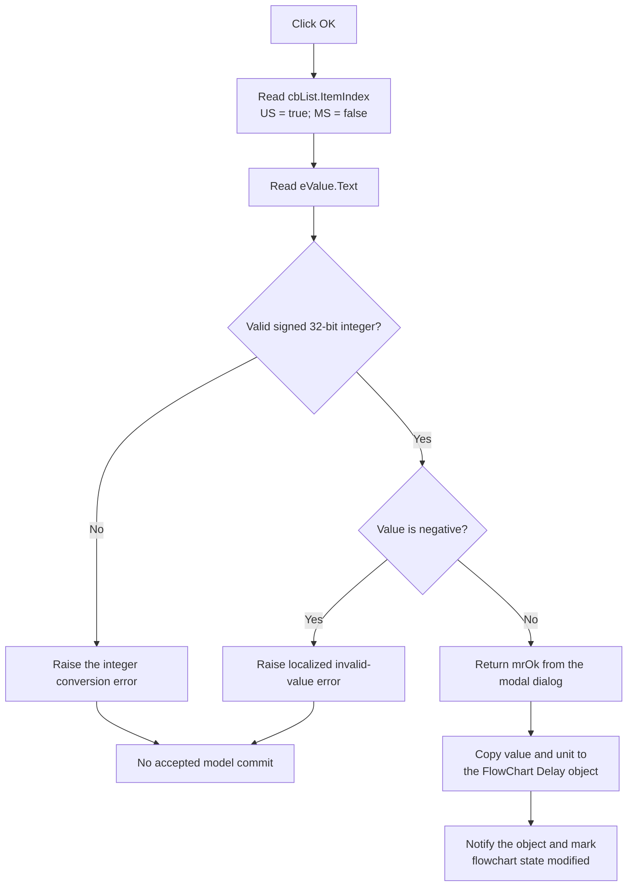

# Accept the FlowChart delay

> Analysis status: Complete for input parsing, unit selection, validation, modal acceptance, model commit, refresh, errors, and cancellation.

## Control

| Property | Recovered value |
| --- | --- |
| Form | dlgFlowChartDelay |
| Form caption | Delay |
| Component path | dlgFlowChartDelay.bOK |
| Control class | TBitBtn |
| Button kind | bkOK |
| Handler name | bOKClick |
| Handler address | 00f97c30 |
| Graph node | `resource:dfm:dlgFlowChartDelay/dlgFlowChartDelay.bOK` |
| Handler node | `function:00f97c30` |
| Graph layer | UI |

The button has no explicit caption, hint, action, image reference, or extracted glyph. Its `bkOK` kind supplies the standard OK behavior. The nearby **Value** label identifies `eValue` together with the form resource and handler data flow.

## What happens when clicked

`FUN_00f97c30` first reads `cbList.ItemIndex`. The list contains `US` at index `0` and `MS` at index `1`. The handler stores `true` in the dialog unit flag at `+0x6e8` for `US`, and stores `false` for every other index. Normal DFM operation limits the drop-down-only list to the two supplied items.

The handler then reads `eValue.Text` and converts it to a signed 32-bit integer through `FUN_0043fc00`. It stores the result in the dialog value field at `+0x6e4`.

- A value of zero or a positive value passes this handler's range check.
- A negative value causes a localized `HDLStrings.Msg_FC_InvValue` exception. The message construction includes the entered text.
- Text that the integer converter cannot parse raises the converter's normal exception before the result is stored.

The click has no local exception handler. An input exception stops the remaining click path and prevents a normal accepted return to the caller.

## Accepted commit

`FUN_01051150` creates this modal dialog for a selected FlowChart object whose recovered type code is `5`. Before display, `FUN_00f97f90` copies the object's current value at `+0x120` and unit flag at `+0x125` to the dialog. `FormShow` formats the value into `eValue` and selects `US` when the flag is true or `MS` when it is false.

After the modal dialog returns, the caller changes the selected FlowChart Delay object only when the modal result is `1` (`mrOk`):

1. Copy the accepted integer from dialog field `+0x6e4` to object field `+0x120`.
2. Copy the unit flag from dialog field `+0x6e8` to object field `+0x125`.
3. Invoke virtual method `+0x10` on the changed object.
4. Mark the flowchart model modified through `FUN_01053e80`.
5. Set the related flowchart state byte at `+0x19` through `FUN_00f629b0`.

The caller has no equality check. Accepting the current values again still invokes the object notification and marks the flowchart state as modified.

## Click flow

## Cancel, retry, and error behavior

- `bCancel` is a standard `bkCancel` button with no custom click handler. A modal result other than `1` skips all object writes, notification, and modified-state calls.
- The OK handler writes the selected unit to the dialog before it parses the value. It writes a parsed negative value to the dialog before it raises the range exception. These are staged dialog fields; the caller does not copy them to the model on the failing path.
- After an input error, a later successful attempt reads the controls again and replaces both staged fields.
- Zero is accepted. There is no additional minimum greater than zero and no custom upper limit after the signed integer conversion.
- The handler has no retry, rollback, or success message. The caller writes the value before the unit and before its notification calls. An exception in that accepted commit sequence can therefore leave a partial live-model change.

## Persistence and no-op boundaries

The click does not write a file, registry value, or external device. A successful caller path changes the live FlowChart object and marks the flowchart model modified. The separate save path owns durable file output.

The handler does not start flowchart execution, wait for the delay, convert US to MS, or scale the numeric value. It stores the selected integer and unit as separate fields. Runtime execution owns the later timing interpretation.

## Source evidence

- [OK handler `FUN_00f97c30`](../../../DecompiledSources/Tina16/functions/0000000000F97C30__FUN_00f97c30.c) reads the unit and value, stores both dialog fields, and rejects negative input.
- [Dialog initializer `FUN_00f97f90`](../../../DecompiledSources/Tina16/functions/0000000000F97F90__FUN_00f97f90.c) copies the current FlowChart Delay fields into the dialog.
- [Form show handler `FUN_00f97b50`](../../../DecompiledSources/Tina16/functions/0000000000F97B50__FUN_00f97b50.c) formats the current value and restores the US or MS selection.
- [Modal caller `FUN_01051150`](../../../DecompiledSources/Tina16/functions/0000000001051150__FUN_01051150.c) commits the dialog fields only after modal result `1`, notifies the object, and marks flowchart state modified.
- [Flowchart modified-state synchronizer `FUN_01053e80`](../../../DecompiledSources/Tina16/functions/0000000001053E80__FUN_01053e80.c) marks the primary model and optional related view modified.
- [Integer converter `FUN_0043fc00`](../../../DecompiledSources/Tina16/functions/000000000043FC00__FUN_0043fc00.c) supplies the signed integer conversion and its conversion-error path.
- [Recovered Delphi form evidence](../../../DecompiledSources/Tina16/resources/dfm/ui-evidence.json) supplies the controls, list items, standard button kinds, layout, and event bindings.

## Direct calls

- `function:004134c0` - raises the constructed invalid-value exception
- `function:00414560` - finalizes temporary UnicodeString arrays
- `function:00416cd0` - builds the invalid-value message text
- `function:0041ddd0` - retrieves a runtime resource string
- `function:0043fc00` - converts the value text to a signed integer
- `function:0044d490` - constructs the invalid-value exception
- `function:0064dd90` - reads VCL control text
- `function:00b89270` and `function:00b8e650` - load the localized invalid-value resource

## Analysis limits

- The original Delphi names of the integer and Boolean object fields are not recovered. Their value and US/MS roles are proven by the form show path, OK handler, modal caller, and list items.
- The exact localized invalid-value text is not present as plain text. Its resource key, entered-value substitution, exception construction, and raise are recovered.
- The object virtual method at `+0x10` is unresolved. The caller invokes it after both accepted field writes, but its internal work is not available.
