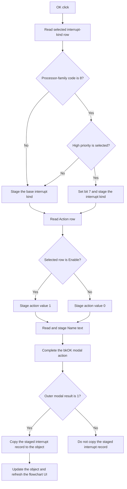

# OK

## Control

| Property | Recovered value |
| --- | --- |
| Form | dlgFlowchartInterrupt |
| Component path | dlgFlowchartInterrupt.bOK |
| Control class | TBitBtn |
| Caption | Supplied by the recovered `bkOK` button kind. |
| Hint | Not present in the recovered resource. |
| Text | Not present in the recovered resource. |
| Handler name | bOKClick |
| Handler address | 00fd1350 |
| Graph node | `resource:dfm:dlgFlowchartInterrupt/dlgFlowchartInterrupt.bOK` |
| Handler node | `function:00fd1350` |
| Graph layer | UI |

## What happens when clicked

The click stages the selected interrupt settings in the dialog record. It does
not write them directly to the flowchart interrupt object.

The handler reads the selected row of `cbKind` and uses the row-to-kind table
that `FormShow` built for the active processor and device. For processor-family
code 8, it also reads `CB_highpriority`. A selected high-priority check box sets
bit 7 of the staged kind byte. An unselected check box leaves the base kind
byte unchanged. Other processor-family codes do not use this priority bit.

The handler reads the `rgAction` item index. Item 0 is the recovered `Enable`
row and stages action value 1. Any other index stages action value 0; the normal
second row is `Disable`. It then reads the Unicode text from `eName` and copies
it to the staged name field. The handler does not validate an empty name or its
characters. It also has no explicit bounds check for the combo-box or radio
group indexes.

The control has kind `bkOK`. When the outer dialog returns modal result 1,
`FUN_010511e0` copies the complete staged interrupt record back to the
flowchart interrupt object, calls the object's update method, and refreshes the
flowchart UI. Another modal result skips that record copy, update call, and UI
refresh. The caller does assign two separate timing fields before it shows the
dialog, so the recovered source does not prove that cancel leaves every field
of the object unchanged.

The click handler has no form-specific exception, retry, fallback, or rollback
branch.

## Click flow

## Handler evidence

- Handler source: [FUN_00fd1350](../../../DecompiledSources/Tina16/functions/0000000000FD1350__FUN_00fd1350.c)
- Form-show kind-map source: [FUN_00fce660](../../../DecompiledSources/Tina16/functions/0000000000FCE660__FUN_00fce660.c)
- Modal caller and commit path: [FUN_010511e0](../../../DecompiledSources/Tina16/functions/00000000010511E0__FUN_010511e0.c)
- Dialog-record initializer: [FUN_00fce590](../../../DecompiledSources/Tina16/functions/0000000000FCE590__FUN_00fce590.c)
- Recovered role: Stage a flowchart interrupt selection for modal acceptance.
- Complexity: complex
- Distinct outgoing calls: 3

The DFM binds `dlgFlowchartInterrupt.bOK.OnClick` to `bOKClick` at `00fd1350`
and assigns kind `bkOK`. The handler reads `cbKind` at form field `+0x6B0`,
the Action radio group at `+0x6D0`, `eName` at `+0x6E8`, and the high-priority
check box at `+0x6F8`. It stages action at `+0x7F0`, kind at `+0x7F1`, and name
at `+0x7F8`.

`FUN_010511e0` initializes the dialog record from interrupt-object offset
`+0x128`. Only its exact modal-result-1 branch copies the dialog record back,
invokes object VMT slot `+0x10`, and calls the editor refresh functions.

## Direct calls

- `function:0064dd90` - read Unicode text from `eName`.
- `function:00414ad0` - copy the name to the staged dialog record.
- `function:00414480` - finalize the temporary Unicode string.

## Resource evidence

- The form caption is `Interrupt`.
- `cbKind` is a `csDropDownList`; `FormShow` supplies its rows from processor
  type and device-register availability.
- `rgAction` supplies the ordered rows `Enable` and `Disable`.
- `CB_highpriority` has caption `High priority`.
- The nearby `Name:` label agrees with the handler's read from `eName`.
- The OK control has kind `bkOK`. It has no recovered hint or custom glyph.

## Analysis limits

- Normal form setup selects a valid kind row, but the click handler has no
  explicit guard for an invalid `cbKind.ItemIndex`.
- The handler treats every Action index other than 0 as disabled.
- The exact names of the processor-family enumeration and staged-record type
  are not recovered. This article uses their numeric fields and proven data
  flow.
