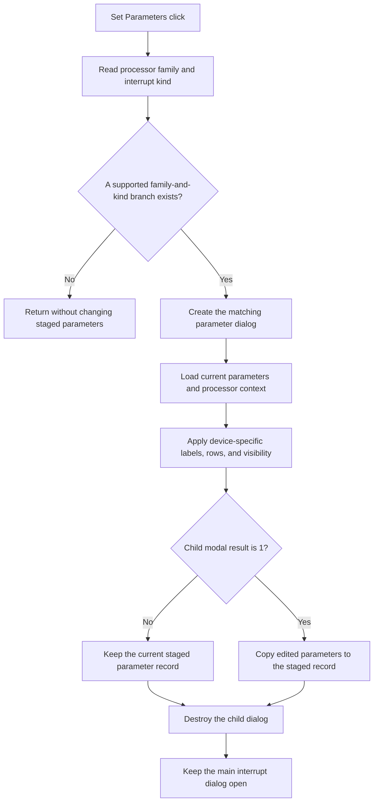

# Set Parameters...

## Control

| Property | Recovered value |
| --- | --- |
| Form | dlgFlowchartInterrupt |
| Component path | dlgFlowchartInterrupt.bSetParameters |
| Control class | TButton |
| Caption | Set Parameters... |
| Hint | Not present in the recovered resource. |
| Text | Not present in the recovered resource. |
| Handler name | bSetParametersClick |
| Handler address | 00fd1520 |
| Graph node | `resource:dfm:dlgFlowchartInterrupt/dlgFlowchartInterrupt.bSetParameters` |
| Handler node | `function:00fd1520` |
| Graph layer | UI |

## What happens when clicked

The click opens a parameter editor that matches the current processor family
and selected interrupt kind. The processor-family code is stored at dialog
offset `+0x7E0`. The selected kind byte is stored at `+0x7F1`; `FormShow`
builds the visible kind list and its row-to-kind table from the processor and
available device registers, and `cbKindChange` updates this byte when the row
changes.

The recovered handler has explicit branches for processor-family codes 1 and
8, code 2, and code 4. Their available kind branches cover these proven groups:

- processor codes 1 and 8: PIC external and port-change interrupts, timers,
  compare or PWM functions, and UART receive or transmit;
- processor code 2: 8051 external interrupts, timer or capture functions, and
  UART receive or transmit;
- processor code 4: AVR external-pin sense, timer, compare or PWM functions,
  and UART receive or transmit.

For a supported pair, the handler creates the matching specialized dialog. It
passes the current staged parameter record, processor code, device name, and
shared processor context to that dialog's initializer. Some branches also set
device-specific captions, available sense or clock rows, control visibility,
and size before `ShowModal`.

If the child dialog returns modal result 1, the handler copies the child
dialog's edited parameter record into the main interrupt dialog's staged record
at `+0x7F0`. Cancel or another child result leaves that staged record unchanged.
The child dialog is destroyed after either result. A processor or interrupt
kind with no recovered branch returns without opening a child dialog or
changing the staged record.

This button does not accept the main interrupt dialog and does not write the
flowchart interrupt object. `FUN_010511e0` performs that outer copy and UI
refresh only if the main dialog later returns modal result 1. The parameter
handler has no local catch, retry, or rollback block and no form-specific error
message branch.

## Click flow

## Handler evidence

- Handler source: [FUN_00fd1520](../../../DecompiledSources/Tina16/functions/0000000000FD1520__FUN_00fd1520.c)
- Form-show kind-map source: [FUN_00fce660](../../../DecompiledSources/Tina16/functions/0000000000FCE660__FUN_00fce660.c)
- Kind-change staging source: [FUN_00fd1480](../../../DecompiledSources/Tina16/functions/0000000000FD1480__FUN_00fd1480.c)
- Managed-record copy helper: [FUN_00417c40](../../../DecompiledSources/Tina16/functions/0000000000417C40__FUN_00417c40.c)
- Outer modal caller and commit path: [FUN_010511e0](../../../DecompiledSources/Tina16/functions/00000000010511E0__FUN_010511e0.c)
- Recovered role: Edit processor-specific flowchart interrupt parameters in a
  nested modal dialog.
- Complexity: complex
- Distinct outgoing calls: 38

Each supported branch creates a recovered dialog class through
`function:007fc180`, initializes it from `param_1 + 0x7F0`, calls VMT slot
`+0x2D0` for `ShowModal`, and tests the result for exact value 1. Only that
branch calls `function:00417c40` to copy the managed record back. Every created
child is passed to `function:00410f20` after the modal result is handled.

## Direct calls

- `function:007fc180` - create the selected specialized parameter dialog.
- `function:00f9add0`, `function:00f9d790`, `function:00f989c0`,
  `function:00fa1430`, `function:00fa7550`, `function:00fac6b0`, and
  `function:00faddb0` - initialize PIC-family parameter dialogs.
- `function:00fc16a0`, `function:00fc2500`, `function:00fc4680`,
  `function:00fc6f10`, `function:00fc8f30`, and `function:00fca700` -
  initialize 8051-family parameter dialogs.
- `function:00faf440`, `function:00fb0e70`, `function:00fb3d10`,
  `function:00fba580`, `function:00fbdd90`, and `function:00fc0010` -
  initialize AVR-family parameter dialogs.
- `function:0064de00` and `function:0064dbe0` - set child captions and control
  visibility for specific devices or kinds.
- `function:00417c40` - copy an accepted managed parameter record.
- `function:00410f20` - destroy the child dialog.

## Resource evidence

- The button caption is `Set Parameters...`.
- `cbKind` is the `csDropDownList` beside the `Type:` label.
- `FormShow` populates `cbKind`; the DFM does not contain static kind rows.
- The button has no recovered hint, image, or custom glyph.

## Analysis limits

- The numeric processor-family and interrupt-kind names are not present as
  recovered Delphi enumeration symbols. The family labels above come from
  include paths, register names, and child-dialog captions in the source.
- The handler does not report unsupported pairs. They are silent no-op paths.
- The exact internal fields of the managed parameter record differ by child
  dialog and are outside this control-level article.
