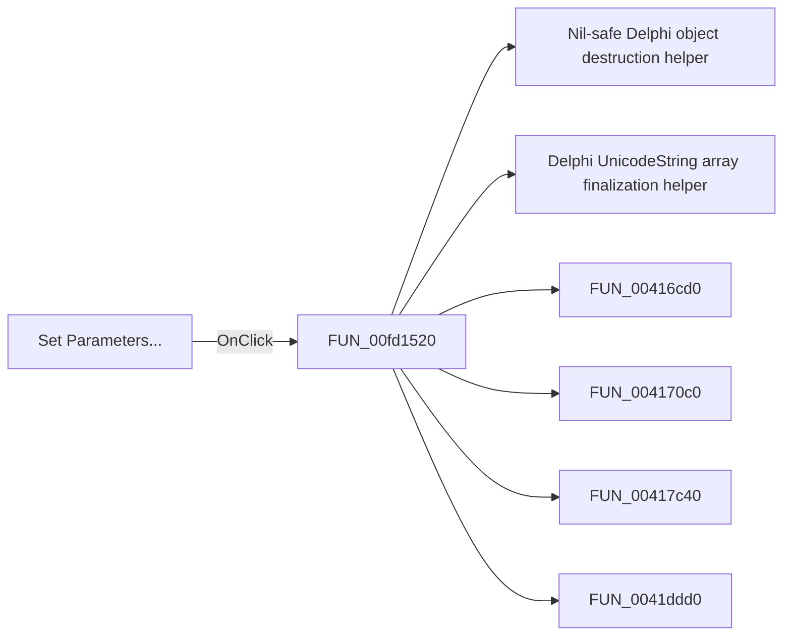

# Set Parameters...

> Analysis status: Pending individual source review.

## Control

| Property | Recovered value |
| --- | --- |
| Form | dlgFlowchartInterrupt |
| Component path | dlgFlowchartInterrupt.bSetParameters |
| Control class | TButton |
| Caption | Set Parameters... |
| Hint | Not present in the recovered resource. |
| Text | Not present in the recovered resource. |
| Handler name | bSetParametersClick |
| Handler address | 00fd1520 |
| Graph node | `resource:dfm:dlgFlowchartInterrupt/dlgFlowchartInterrupt.bSetParameters` |
| Handler node | `function:00fd1520` |
| Graph layer | UI |

## What happens when clicked

Pending individual analysis. An agent must read the recovered handler source and its relevant callees before it replaces this text.

## Click flow

## Handler evidence

- Source: [DecompiledSources/Tina16/functions/0000000000FD1520__FUN_00fd1520.c](../../../DecompiledSources/Tina16/functions/0000000000FD1520__FUN_00fd1520.c)
- Recovered role: Not present in the recovered resource.
- Current graph summary: Handles 1 Delphi UI event: dlgFlowchartInterrupt.bSetParameters.OnClick.
- Current graph behavior: Not present in the recovered resource.
- Current graph evidence: Not present in the recovered resource.
- Complexity: complex
- Distinct outgoing calls: 38

## Direct calls

- `function:00410f20` — Nil-safe Delphi object destruction helper
- `function:00414560` — Delphi UnicodeString array finalization helper
- `function:00416cd0` — FUN_00416cd0
- `function:004170c0` — FUN_004170c0
- `function:00417c40` — FUN_00417c40
- `function:0041ddd0` — FUN_0041ddd0
- `function:0043e130` — FUN_0043e130
- `function:00440a20` — FUN_00440a20
- `function:00450070` — FUN_00450070
- `function:004b6930` — FUN_004b6930
- `function:0064cb90` — FUN_0064cb90
- `function:0064cbf0` — FUN_0064cbf0
- `function:0064cc50` — FUN_0064cc50
- `function:0064dbe0` — FUN_0064dbe0
- `function:0064de00` — VCL control text setter with change suppression
- `function:007fc180` — FUN_007fc180
- `function:00b89270` — FUN_00b89270
- `function:00b8e650` — FUN_00b8e650
- `function:00f989c0` — FUN_00f989c0
- `function:00f9add0` — FUN_00f9add0
- `function:00f9d790` — FUN_00f9d790
- `function:00fa1430` — FUN_00fa1430
- `function:00fa7550` — FUN_00fa7550
- `function:00fac6b0` — FUN_00fac6b0
- `function:00faddb0` — FUN_00faddb0
- `function:00faf440` — FUN_00faf440
- `function:00fb0e70` — FUN_00fb0e70
- `function:00fb3d10` — FUN_00fb3d10
- `function:00fba580` — FUN_00fba580
- `function:00fbdd90` — FUN_00fbdd90
- `function:00fc0010` — FUN_00fc0010
- `function:00fc16a0` — FUN_00fc16a0
- `function:00fc2500` — FUN_00fc2500
- `function:00fc4680` — FUN_00fc4680
- `function:00fc6f10` — FUN_00fc6f10
- `function:00fc8f30` — FUN_00fc8f30
- `function:00fca700` — FUN_00fca700
- `function:00fd5790` — FUN_00fd5790

## Resource evidence

- Kind: Not present in the recovered resource.
- Modal result: Not present in the recovered resource.
- Checked state: Not present in the recovered resource.
- List items: Not present in the recovered resource.
- Image reference: Not present in the recovered resource.
- Extracted glyph: None.

## Nearby label candidates

Nearby labels are layout candidates only. They are not proof of behavior.

- Rank 1: Type: at distance 268.
- Rank 2: Name: at distance 296.

## Analysis limits

- Do not infer behavior from the control class, caption, hint, glyph, or nearby label alone.
- Do not replace the pending status until the handler source and relevant call path provide enough evidence.
