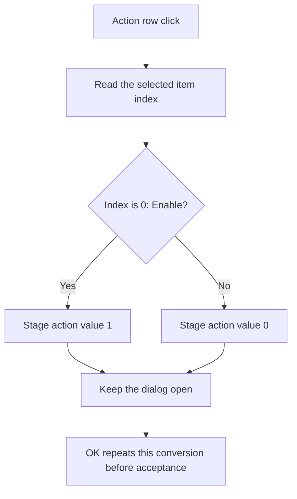

# Action

## Control

| Property | Recovered value |
| --- | --- |
| Form | dlgFlowchartInterrupt |
| Component path | dlgFlowchartInterrupt.rgAction |
| Control class | TRadioGroup |
| Caption | Action |
| Hint | Not present in the recovered resource. |
| Text | Not present in the recovered resource. |
| Handler name | rgActionClick |
| Handler address | 00fd14f0 |
| Graph node | `resource:dfm:dlgFlowchartInterrupt/dlgFlowchartInterrupt.rgAction` |
| Handler node | `function:00fd14f0` |
| Graph layer | UI |

## What happens when clicked

The radio group has two ordered rows: `Enable` at index 0 and `Disable` at
index 1. The click handler reads the current item index and immediately updates
the action byte in the dialog's staged interrupt record. Index 0 stores value
1. Any other index stores value 0.

The handler does not call another function, close the dialog, update the
flowchart interrupt object, or refresh the UI. It has no validation, exception,
retry, or rollback branch. The OK handler repeats the same index-to-value
conversion before modal acceptance, so the accepted record uses the Action row
that is current when the user selects OK.

`FUN_010511e0` copies the staged record to the flowchart interrupt object only
if the outer dialog later returns modal result 1. Another result skips that
record copy and its UI refresh. Two separate object timing fields are assigned
before the dialog opens, independent of this Action click.

## Click flow

## Handler evidence

- Handler source: [FUN_00fd14f0](../../../DecompiledSources/Tina16/functions/0000000000FD14F0__FUN_00fd14f0.c)
- OK staging source: [FUN_00fd1350](../../../DecompiledSources/Tina16/functions/0000000000FD1350__FUN_00fd1350.c)
- Modal caller and commit path: [FUN_010511e0](../../../DecompiledSources/Tina16/functions/00000000010511E0__FUN_010511e0.c)
- Recovered role: Stage the selected interrupt enable or disable action.
- Complexity: simple
- Distinct outgoing calls: 0

The DFM binds `dlgFlowchartInterrupt.rgAction.OnClick` to `rgActionClick` at
`00fd14f0`. The handler reads the radio-group item index from form field
`+0x6D0` through VMT slot `+0x260`. It writes one byte at form offset `+0x7F0`.

## Direct calls

- No direct call edge is present. The recovered handler contains only the item
  index test and the staged-byte write.

## Resource evidence

- The control caption is `Action`.
- Its ordered items are `Enable` and `Disable`.
- The control has no recovered hint, image, or custom glyph.

## Nearby label candidates

The nearby `Type:` and `Name:` labels identify other controls on the same form.
They do not describe the Action radio group and were not used to infer its
behavior.

## Analysis limits

- The handler has no explicit index guard. It treats every value other than 0
  as disabled.
- The Delphi name of the staged record is not recovered.
