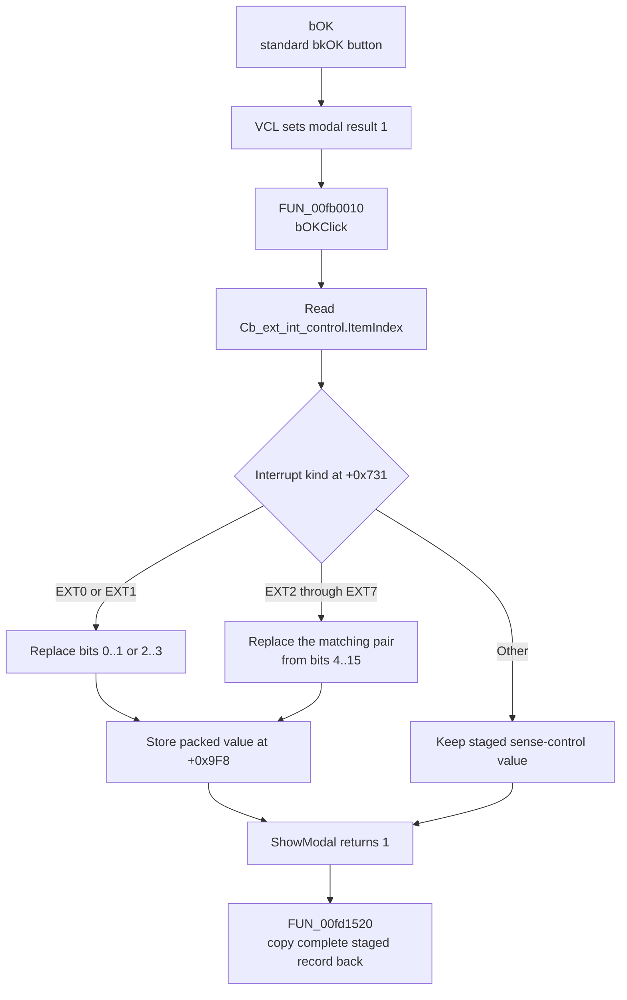

# bOK

> Analysis status: Complete. The handler address was recovered manually from the Delphi published-method table.

## Control

| Property | Recovered value |
| --- | --- |
| Form | dlgflowchartInterruptAVRext0 |
| Component path | dlgflowchartInterruptAVRext0.bOK |
| Control class | TBitBtn |
| Caption | Not present in the recovered resource. |
| Hint | Not present in the recovered resource. |
| Text | Not present in the recovered resource. |
| Handler name | bOKClick |
| Handler address | `00fb0010` (manual published-method-table recovery; the current graph edge is unresolved) |
| Graph node | `resource:dfm:dlgflowchartInterruptAVRext0/dlgflowchartInterruptAVRext0.bOK` |
| Handler node | `concept:dfm-handler:TdlgflowchartInterruptAVRext0/bOKClick` |
| Graph layer | tina.exe |

## What happens when clicked

The button has standard kind `bkOK`. The VCL button path sets modal result `1`, then calls `bOKClick` at `00fb0010`. The handler reads `Cb_ext_int_control.ItemIndex` and uses the interrupt-kind byte in the dialog's staged interrupt record to select one two-bit sense-control field.

The handler updates the packed value at form offset `+0x9F8` as follows:

| Interrupt kind at `+0x731` | Replaced bits in `+0x9F8` |
| --- | --- |
| `0x01` | `0..1` for AVR EXT0 |
| `0x02` | `2..3` for AVR EXT1 |
| `0x11` | `4..5` for AVR EXT2 |
| `0x12` | `6..7` for AVR EXT3 |
| `0x13` | `8..9` for AVR EXT4 |
| `0x14` | `10..11` for AVR EXT5 |
| `0x15` | `12..13` for AVR EXT6 |
| `0x16` | `14..15` for AVR EXT7 |

Each supported branch clears the target pair, keeps the other bits in the low 16-bit value, and places the selected combo-box index in the target pair. An unsupported interrupt-kind value causes no change in this handler. There is no validation, error message, file write, code generation, or hardware update.

The setup routine copies the caller's complete interrupt record to the dialog at `+0x730`. `FormShow` restores the applicable two-bit value to the combo box and changes an invalid selection of `-1` to item `0`. After a normal modal result of `1`, the owner at `00fd1520` copies the complete staged record back to the selected flowchart interrupt. Cancel does not call this handler and does not run that copy-back branch.

## Click flow

## Handler evidence

- Source: [`FUN_00fb0010`](../../../DecompiledSources/Tina16/functions/0000000000FB0010__FUN_00fb0010.c)
- Recovered role: Commit the selected AVR external-interrupt sense mode to the matching packed field in the staged interrupt record.
- Current graph summary: The UI trigger still targets unresolved concept `TdlgflowchartInterruptAVRext0/bOKClick`. The separate function node `function:00fb0010` exists but is not connected to that trigger.
- Manual address evidence: The `TdlgFlowchartInterruptAVRext0` VMT is based at `00FAEC08`. Its published-method-table pointer at VMT offset `-0x98` points to `00FAF0C4`. The `bOKClick` record at `00FAF12A` contains code address `00FB0010`.
- Complexity: simple
- Distinct outgoing graph calls: None. The handler uses indirect combo-box VMT calls.

## Recovered data-flow evidence

- [`FUN_00fb0010`](../../../DecompiledSources/Tina16/functions/0000000000FB0010__FUN_00fb0010.c) reads the combo-box item index through VMT slot `+0x260`, selects a bit pair from interrupt kind `+0x731`, and updates staged field `+0x9F8`.
- [`FUN_00faf440`](../../../DecompiledSources/Tina16/functions/0000000000FAF440__FUN_00faf440.c) copies the caller's complete interrupt record into the dialog at `+0x730` and stores the processor and device context.
- [`FUN_00faf560`](../../../DecompiledSources/Tina16/functions/0000000000FAF560__FUN_00faf560.c) is `FormShow`. It restores the appropriate sense-control pair to the combo box and replaces item index `-1` with `0`.
- [`FUN_00faffe0`](../../../DecompiledSources/Tina16/functions/0000000000FAFFE0__FUN_00faffe0.c) is the separate combo-box change handler. It writes the current item index to the complete staged field before OK runs.
- [`FUN_00fd1520`](../../../DecompiledSources/Tina16/functions/0000000000FD1520__FUN_00fd1520.c) creates this form, configures the device-specific interrupt rows, shows it modally, and copies the complete record back only when the result is `1`.
- [`TCustomButton.Click`](../../../DecompiledSources/Tina16/functions/0000000000687F30__FUN_00687f30.c) copies the button's modal-result value to the parent form before it calls the inherited click event. [`TBitBtn.SetKind`](../../../DecompiledSources/Tina16/functions/000000000082BC30__FUN_0082bc30.c) applies the standard button-kind properties.

## Resource evidence

- Kind: bkOK
- Modal result: Not present in the recovered resource.
- Checked state: Not present in the recovered resource.
- List items: Not present in the recovered resource.
- Image reference: Not present in the recovered resource.
- Extracted glyph: None.

## Nearby label candidates

Nearby labels are layout candidates only. They are not proof of behavior.

- Rank 1: Interrupt 0 Sense Control at distance 87.
- Rank 2: of INT0 generates an interrupt request at distance 252.

## Analysis limits

- The current generated graph does not connect the DFM trigger to `function:00fb0010`. The published-method table and recovered source establish the address, but a later graph rebuild must fix or supplement the event-resolution step.
- The original Delphi record and field names are not recovered. This article uses offsets and the device-specific UI strings.
- The separate combo-box change handler writes the item index to all of `+0x9F8` before OK. For EXT1 through EXT7, this can remove other packed pairs in the dialog's local copy before `bOKClick` inserts the selected pair. The source does not establish that those other pairs are restored before copy-back.
- The OK handler does not validate `ItemIndex`. Normal `FormShow` changes `-1` to `0`, but the handler has no guard if another path later supplies an invalid index.
