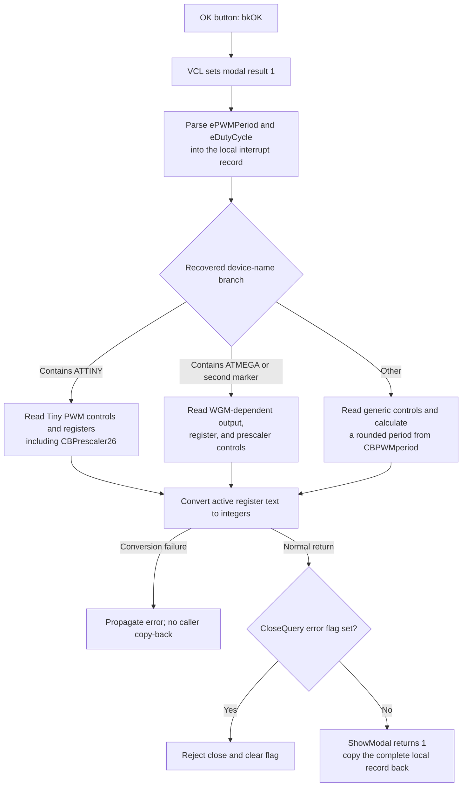

# Accept the AVR PWM1 settings

> Analysis status: Evidence-backed source review complete.

## Control

| Property | Recovered value |
| --- | --- |
| Form | dlgFlowchartInterruptAVRPWM1 |
| Form caption | AVR PWM1 Properties |
| Component path | dlgFlowchartInterruptAVRPWM1.bOK |
| Control class | TBitBtn |
| Caption | Supplied by the standard `bkOK` kind; no explicit caption is stored. |
| Hint | Not present in the recovered resource. |
| Text | Not present in the recovered resource. |
| Handler name | bOKClick |
| Handler address | 00fb5c10 |
| Graph node | `resource:dfm:dlgFlowchartInterruptAVRPWM1/dlgFlowchartInterruptAVRPWM1.bOK` |
| Handler node | `function:00fb5c10` |
| Graph layer | UI |

## What happens when clicked

`FUN_00fb5c10` reads the current PWM period and duty-cycle values from `ePWMPeriod` and `eDutyCycle`. It stores both floating-point values in the dialog's local interrupt record. It then selects one of three control mappings from the recovered device-name string and writes the active prescaler, PWM mode, output mode, and register values to that same local record.

The main recovered record fields are:

| Form offset | Recovered value |
| --- | --- |
| `+0xBF0` | Prescaler selection or mapped prescaler value. |
| `+0xBF4` | Compare register A. |
| `+0xBF8` | Compare register B. |
| `+0xBFC` | Compare register C. |
| `+0xC00` | Input Capture register. |
| `+0xC04` | PWM or waveform-generation mode. |
| `+0xC08` | Output mode for the active device path. |
| `+0xC10` | PWM period value. |
| `+0xC18` | Duty-cycle value. |

The setup routine copies the caller's complete interrupt record to form offset `+0x8C8`. OK changes fields inside this local copy. The modal caller copies the complete record back to the selected flowchart interrupt only when `ShowModal` returns `1`. Cancel has standard kind `bkCancel` and no click handler. It does not run this field update, and the caller does not copy the dialog record back.

## Device-dependent control mapping

The handler uses case-sensitive substring searches from character position `1` in the recovered device name.

### Device name contains `ATTINY`

- Store `CBPWMmod26.ItemIndex` as the PWM mode.
- Store `CbPWMOut26.ItemIndex` as the output mode.
- For PWM mode `1`, parse `Edit_ocr1b` only. For mode `2`, parse `Edit_ocr1a` only. For mode `3`, parse both fields. Other values leave both corresponding record fields unchanged.
- Always parse `Edit_ocr1C`.
- Store `CBPrescaler26.ItemIndex` as the prescaler.

The form-show path treats `ATTINY24` separately. It shows and initializes `Cbprescaler24`, but OK still reads `CBPrescaler26`, which the modal owner hides for that device. This is a recovered mismatch. The code does not establish the hidden control's run-time selection on every ATTINY24 use, so the saved prescaler consequence is not inferred here.

### Device name contains `ATMEGA` or a second unrecovered marker

- Store `CB_WGMn_mod.ItemIndex` as the waveform-generation mode.
- For modes `5`, `6`, `7`, `14`, and `15`, read the output selection from `CB_fastpwm_out`.
- For modes `1`, `2`, `3`, `8`, `9`, `10`, and `11`, read it from `CB_correctPWM_out`.
- For all other mode values, read it from `CB_nonPWM_out`.
- For modes `8`, `10`, `12`, and `14`, parse `Edit_Capture`. For other modes, parse `Edit_ocr1a`.
- Always parse `Edit_ocr1b` and `Edit_ocr1C`.
- Store `cbPrescaler0.ItemIndex` as the prescaler.

The second marker is present only as an unresolved data address in the recovered source. This article does not invent its device-family text.

### Other device names

- Store `CbPWMmod.ItemIndex` and `CbPWMout.ItemIndex`.
- Parse `Edit_ocr1a`.
- Store `cbPrescaler0.ItemIndex`.
- Read `CBPWMperiod.ItemIndex`, map it through the form's recovered counter array, calculate a period from that value, the oscillator frequency, and the counter limit, and round the result to an integer. This calculated value replaces the earlier `ePWMPeriod` value at `+0xC10`.

This path does not rewrite the other inactive register fields. They remain as they were in the local record copied during setup.

## Validation and error behavior

The floating-point getters parse the two `TFloatEdit` values and enforce their recovered numeric range. Their error events call a common reporter. The reporter shows the supplied message once and sets form flag `+0x810`. `FormCloseQuery` rejects the close when this flag is set and then clears the flag so that the user can try again.

Register fields use the recovered integer parser. Invalid integer text raises through the Delphi conversion path. The OK handler has no local exception handler, rollback, or error-message branch for this conversion.

The handler writes fields in sequence. A late conversion failure can therefore leave the dialog's local record partly changed. The caller copies this record to the selected interrupt only after a normal accepted modal return. A failure that prevents that return does not reach the caller's copy-back statement. The higher-level exception response is not recovered here.

The handler does not call the period or duty-cycle exit handlers and does not read the `LPerioderror` or `Ldutyerror` labels. It does not itself enforce the displayed period-versus-duty relationship. It also does not compare the new record with the old record, write a file, compile firmware, or update hardware.

## Click flow

## Handler evidence

- [bOKClick](../../../DecompiledSources/Tina16/functions/0000000000FB5C10__FUN_00fb5c10.c) proves the two floating-point reads, device-name branches, control selections, register conversions, calculated generic period, and local record writes.
- [Dialog setup](../../../DecompiledSources/Tina16/functions/0000000000FB3D10__FUN_00fb3d10.c) copies the caller's record to form offset `+0x8C8` and stores the oscillator frequency and device name.
- [FormShow](../../../DecompiledSources/Tina16/functions/0000000000FB3E30__FUN_00fb3e30.c) initializes the device-dependent controls from the local record and proves the separate ATTINY24 prescaler path.
- [The modal owner](../../../DecompiledSources/Tina16/functions/0000000000FD1520__FUN_00fd1520.c) selects this dialog for the recovered AVR PWM1 interrupt type, configures controls for the device, calls the setup routine, and copies the complete dialog record back only after modal result `1`.
- [The PWM period calculator](../../../DecompiledSources/Tina16/functions/0000000000FB57E0__FUN_00fb57e0.c) applies the recovered device-dependent counter formula. [The rounding helper](../../../DecompiledSources/Tina16/functions/000000000040C770__FUN_0040c770.c) rounds its result for the generic path.
- [The floating-point getter](../../../DecompiledSources/Tina16/functions/0000000000B90090__FUN_00b90090.c) parses a `TFloatEdit`, checks the recovered range, and invokes its validation callback. [The integer parser](../../../DecompiledSources/Tina16/functions/000000000043FC00__FUN_0043fc00.c) raises through the recovered conversion-error path when text is not a valid integer.
- [The shared form error reporter](../../../DecompiledSources/Tina16/functions/0000000000FB54D0__FUN_00fb54d0.c) delegates to [the one-message error gate](../../../DecompiledSources/Tina16/functions/0000000001B1CF30__FUN_01b1cf30.c), which displays the supplied message and sets flag `+0x810`.
- [FormCreate](../../../DecompiledSources/Tina16/functions/0000000000FB5AA0__FUN_00fb5aa0.c) clears the error flag and initializes the prescaler maps. [FormCloseQuery](../../../DecompiledSources/Tina16/functions/0000000000FB3E10__FUN_00fb3e10.c) rejects one close while the flag is set and then clears it.
- Standard `bkOK` modal-result dispatch is recovered in [TBitBtn.SetKind](../../../DecompiledSources/Tina16/functions/000000000082BC30__FUN_0082bc30.c) and [TCustomButton.Click](../../../DecompiledSources/Tina16/functions/0000000000687F30__FUN_00687f30.c).
- The recovered [UI evidence](../../../DecompiledSources/Tina16/resources/dfm/ui-evidence.json) supplies the form caption, control names, group and field labels, combo-box items, event bindings, and standard button kinds. No custom glyph or hint is present for `bOK`.

## Direct calls

- `function:00b90090` reads and validates the two floating-point edit values.
- `function:0043e130` copies the device-name string for each branch test.
- `function:004170c0` searches for each recovered device marker.
- `function:0043fc00` converts active register-edit text to an integer.
- `function:0064dd90` reads the active register-edit text.
- `function:00fb57e0` calculates the generic device path's PWM period.
- `function:0040c770` rounds that calculated period.
- `function:00414480` and `function:00414560` finalize temporary Delphi strings.

## Resource evidence

- The form caption is `AVR PWM1 Properties`.
- Recovered groups identify Timer registers, PWM mode, PWM data, PWM output, Compare registers, and Input Capture registers.
- Recovered field labels identify PWM Period, Duty Cycle, Clock 1 Prescale Select, Compare registers A through C, and Input Capture Register.
- `bOK` has standard kind `bkOK`. It has no explicit caption, hint, text, nearby same-parent label, or extracted custom glyph.

## Analysis limits

- The original Delphi type and field names of the local interrupt record are not recovered. This article uses UI labels and byte offsets for the proven fields.
- One device-family marker remains an unresolved static data address. Its text and intended processor family are not established.
- The source proves that the ATTINY24 setup and OK paths read different prescaler controls. It does not establish the hidden control's value for all calls or the final device effect of this mismatch.
- The exact higher-level exception dialog and focus behavior after a failed integer conversion are not recovered.
- No persistence, code generation, target programming, or hardware update occurs in this click path.
