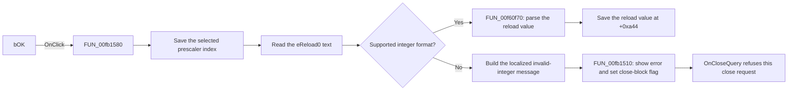

# bOK

> Analysis status: Reviewed from recovered source and UI evidence.

## Control

| Property | Recovered value |
| --- | --- |
| Form | dlgFlowchartInterruptAVRTmr0 |
| Component path | dlgFlowchartInterruptAVRTmr0.bOK |
| Control class | TBitBtn |
| Caption | Not present in the recovered resource. |
| Hint | Not present in the recovered resource. |
| Text | Not present in the recovered resource. |
| Handler name | bOKClick |
| Handler address | 00fb1580 |
| Graph node | `resource:dfm:dlgFlowchartInterruptAVRTmr0/dlgFlowchartInterruptAVRTmr0.bOK` |
| Handler node | `function:00fb1580` |
| Graph layer | UI |

## What happens when clicked

The handler first reads the selected item from `cbPrescaler0` and stores its index in form field `+0xa40`. It then reads the text from the `eReload0` edit and asks `FUN_00f60f00` whether the text uses a supported integer format.

If the text is valid, `FUN_00f60f70` converts it to a 32-bit integer. The handler stores the result in form field `+0xa44`. `FormShow` uses these same two fields to restore the prescaler selection and the reload text, which establishes their roles.

If the text is not valid, the handler builds a localized message with the key `HDLStrings.Msg_FC_NotValidInt` and the entered text. `FUN_00fb1510` shows the message and sets the form validation-error flag at `+0x730`. The form's `OnCloseQuery` handler tests this flag, refuses that close request, and then clears the flag. The invalid path does not replace the saved reload value, but it has already stored the selected prescaler index.

The handler does not check the reload range. The separate `eReload0.OnExit` handler clamps values below `0` or above `255`, but that check is not part of this click handler.

## Click flow

## Handler evidence

- Source: [DecompiledSources/Tina16/functions/0000000000FB1580__FUN_00fb1580.c](../../../DecompiledSources/Tina16/functions/0000000000FB1580__FUN_00fb1580.c)
- Recovered role: AVR Timer0 prescaler and reload-value commit handler.
- Current graph summary: Handles 1 Delphi UI event: dlgFlowchartInterruptAVRTmr0.bOK.OnClick.
- Current graph behavior: Not yet annotated. The recovered handler saves the prescaler index, validates and saves the reload integer, or reports an invalid integer and blocks the close request.
- Current graph evidence: The handler reads controls at form offsets `+0x6e0` and `+0x6c0`, stores fields `+0xa40` and `+0xa44`, and uses the localized key `HDLStrings.Msg_FC_NotValidInt`. `FormShow` copies the stored fields back to the same controls, and `FormCloseQuery` consumes the error flag set by `FUN_00fb1510`.
- Complexity: complex
- Distinct outgoing calls: 9

## Direct calls

- `function:00414560` — Delphi UnicodeString array finalization helper
- `function:00416cd0` — FUN_00416cd0
- `function:0041ddd0` — FUN_0041ddd0
- `function:0064dd90` — VCL control Unicode text reader
- `function:00b89270` — FUN_00b89270
- `function:00b8e650` — FUN_00b8e650
- `function:00f60f00` — FUN_00f60f00
- `function:00f60f70` — FUN_00f60f70
- `function:00fb1510` — FUN_00fb1510

## Resource evidence

- Kind: bkOK
- Modal result: Not present in the recovered resource.
- Checked state: Not present in the recovered resource.
- List items: Not present in the recovered resource.
- Image reference: Not present in the recovered resource.
- Extracted glyph: None.

## Nearby label candidates

Nearby labels are layout candidates only. They are not proof of behavior.

- No same-parent label candidate is available.

## Analysis limits

- The original Delphi names of form fields `+0xa40`, `+0xa44`, and `+0x730` are not recovered.
- The handler does not establish the valid numeric range. The `0` through `255` clamp belongs to the separate `eReload0.OnExit` event.
- The recovered click handler does not directly close the dialog. The control resource identifies `bOK` as `bkOK`, and `OnCloseQuery` controls whether the close request can finish.
