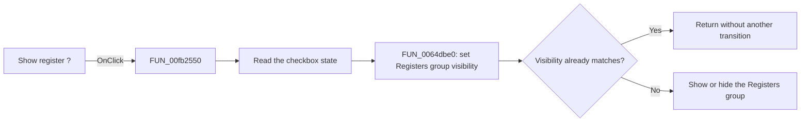

# Show register ?

> Analysis status: Reviewed from recovered source and UI evidence.

## Control

| Property | Recovered value |
| --- | --- |
| Form | dlgFlowchartInterruptAVRTmr0 |
| Component path | dlgFlowchartInterruptAVRTmr0.CbShowRegister |
| Control class | TCheckBox |
| Caption | Show register ? |
| Hint | Not present in the recovered resource. |
| Text | Not present in the recovered resource. |
| Handler name | CbShowRegisterClick |
| Handler address | 00fb2550 |
| Graph node | `resource:dfm:dlgFlowchartInterruptAVRTmr0/dlgFlowchartInterruptAVRTmr0.CbShowRegister` |
| Handler node | `function:00fb2550` |
| Graph layer | UI |

## What happens when clicked

The handler reads the current checked state from `CbShowRegister`. It passes this Boolean value and the form's `GbTimer0registers` group to `FUN_0064dbe0`, the shared VCL control-visibility setter. A checked box therefore shows the `Registers` group. A cleared box hides the group.

The visibility setter first compares the requested state with the current visible state. If both values are equal, it returns without another visibility transition. The click handler changes no timer value and has no error path.

## Click flow

## Handler evidence

- Source: [DecompiledSources/Tina16/functions/0000000000FB2550__FUN_00fb2550.c](../../../DecompiledSources/Tina16/functions/0000000000FB2550__FUN_00fb2550.c)
- Recovered role: AVR Timer0 register-panel visibility handler.
- Current graph summary: Handles 1 Delphi UI event: dlgFlowchartInterruptAVRTmr0.CbShowRegister.OnClick.
- Current graph behavior: Not yet annotated. The recovered handler copies the checkbox state to the Registers group visible state.
- Current graph evidence: The handler reads the Boolean property of form field `+0x720` and passes it with form field `+0x718` to the shared `TControl.SetVisible` path. The DFM identifies these fields as `CbShowRegister` and `GbTimer0registers`.
- Complexity: simple
- Distinct outgoing calls: 1

## Direct calls

- `function:0064dbe0` — VCL control visibility setter

## Resource evidence

- Kind: Not present in the recovered resource.
- Modal result: Not present in the recovered resource.
- Checked state: Not present in the recovered resource.
- List items: Not present in the recovered resource.
- Image reference: Not present in the recovered resource.
- Extracted glyph: None.

## Nearby label candidates

Nearby labels are layout candidates only. They are not proof of behavior.

- No same-parent label candidate is available.

## Analysis limits

- The recovered source identifies the two components through form offsets `+0x720` and `+0x718`; it does not preserve their original Delphi field declarations.
- The handler does not explain why the checkbox has `Visible = false` in the recovered DFM or which runtime condition can show it.
