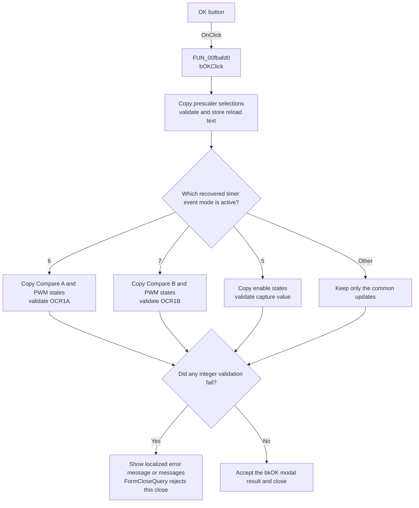

# bOK

> Analysis status: Recovered timer-parameter validation and acceptance path reviewed.

## Control

| Property | Recovered value |
| --- | --- |
| Form | dlgFlowchartInterruptAVRTmr1 |
| Component path | dlgFlowchartInterruptAVRTmr1.bOK |
| Control class | TBitBtn |
| Caption | Not present in the recovered resource. |
| Hint | Not present in the recovered resource. |
| Text | Not present in the recovered resource. |
| Handler name | bOKClick |
| Handler address | 00fbafd0 |
| Graph node | `resource:dfm:dlgFlowchartInterruptAVRTmr1/dlgFlowchartInterruptAVRTmr1.bOK` |
| Handler node | `function:00fbafd0` |
| Graph layer | UI |

## What happens when clicked

`bOKClick` copies the two recovered Timer1 prescaler selections to backing
fields. It then reads the reload-value text from `Edit_tcnt1`. The integer
validator accepts decimal digits or hexadecimal digits followed by uppercase
`H`. A valid value is converted and stored. An invalid value causes a localized
`HDLStrings.Msg_FC_NotValidInt` message and sets the form's close-block flag.

The handler next processes controls for the active timer event mode:

- Mode `6` copies the Compare A and PWM selection indexes, copies the three
  recovered enable check boxes, and validates and stores `Edit_ocr1a`.
- Mode `7` copies the Compare B and PWM selection indexes, copies the same
  enable check boxes, and validates and stores `Edit_ocr1b`.
- Mode `5` copies the three enable check boxes and validates and stores
  `Edit_Capt`.
- Other recovered mode values do not run one of these three extra branches.

Validation does not stop at the first error. The handler can copy selection
states and store other valid integers after an earlier field fails. Each
invalid integer shows an error message and leaves the close-block flag set.
Because the DFM button kind is `bkOK`, the button requests the OK modal result.
`FormCloseQuery` permits the close only when the flag is clear. If a validation
error set the flag, it rejects that close attempt and clears the flag so the
user can correct the text and try again.

## Click flow

## Handler evidence

- Source: [DecompiledSources/Tina16/functions/0000000000FBAFD0__FUN_00fbafd0.c](../../../DecompiledSources/Tina16/functions/0000000000FBAFD0__FUN_00fbafd0.c)
- Form value restore path: [DecompiledSources/Tina16/functions/0000000000FBA6A0__FUN_00fba6a0.c](../../../DecompiledSources/Tina16/functions/0000000000FBA6A0__FUN_00fba6a0.c)
- Close-query path: [DecompiledSources/Tina16/functions/0000000000FBA680__FUN_00fba680.c](../../../DecompiledSources/Tina16/functions/0000000000FBA680__FUN_00fba680.c)
- Recovered role: Validates and stores the current AVR Timer1 dialog values
  before the OK modal close.
- Current graph summary: Handles 1 Delphi UI event: dlgFlowchartInterruptAVRTmr1.bOK.OnClick.
- Current graph behavior: Copies selection and check-box values, validates the
  relevant integer fields for the active timer mode, stores valid values, and
  blocks the close attempt after an invalid value.
- Current graph evidence: `FUN_00fbafd0` reads control fields at `+0x6c0`,
  `+0x6e0`, `+0x6f0`, `+0x6f8`, `+0x708`, `+0x710`, `+0x730`, `+0x738`,
  `+0x740`, `+0x748`, `+0x750`, `+0x800`, `+0x808`, and `+0x810`. It stores
  recovered values at `+0xb70` through `+0xba2`, branches on mode byte
  `+0x8a1`, and calls `FUN_00fbaf60` for each validation error.
- Complexity: complex
- Distinct outgoing calls: 9

## Direct calls

- `function:00414560` — Delphi UnicodeString array finalization helper
- `function:00416cd0` — concatenates the recovered UnicodeString parts for an
  invalid-value message.
- `function:0041ddd0` — prepares a recovered Unicode string used by the
  localization path; its original value name is unavailable.
- `function:0064dd90` — VCL control Unicode text reader
- `function:00b89270` — returns the cached application localization manager.
- `function:00b8e650` — resolves `HDLStrings.Msg_FC_NotValidInt` through that
  localization manager.
- `function:00f60f00` — accepts decimal-digit text or hexadecimal-digit text
  with an uppercase `H` suffix.
- `function:00f60f70` — converts accepted decimal or `H`-suffix hexadecimal
  text to a 32-bit integer.
- `function:00fbaf60` — shows the supplied validation message and sets the
  form close-block flag.

## Resource evidence

- Kind: bkOK
- Modal result: Not present in the recovered resource.
- Checked state: Not present in the recovered resource.
- List items: Not present in the recovered resource.
- Image reference: Not present in the recovered resource.
- Extracted glyph: None.

## Nearby label candidates

Nearby labels are layout candidates only. They are not proof of behavior.

- No same-parent label candidate is available.

## Analysis limits

- The original names of mode byte `+0x8a1` and backing fields `+0xb70` through
  `+0xba2` are not recovered. DFM component names, matching getters and text
  reads, and the inverse assignments in `FormShow` establish the control
  mappings described above.
- The handler accepts only the recovered decimal and uppercase-`H` hexadecimal
  syntax. It does not trim input or accept a sign in the reviewed validation
  path.
- An invalid click can still update other backing fields before the close is
  rejected. The handler has no rollback for these partial updates.
