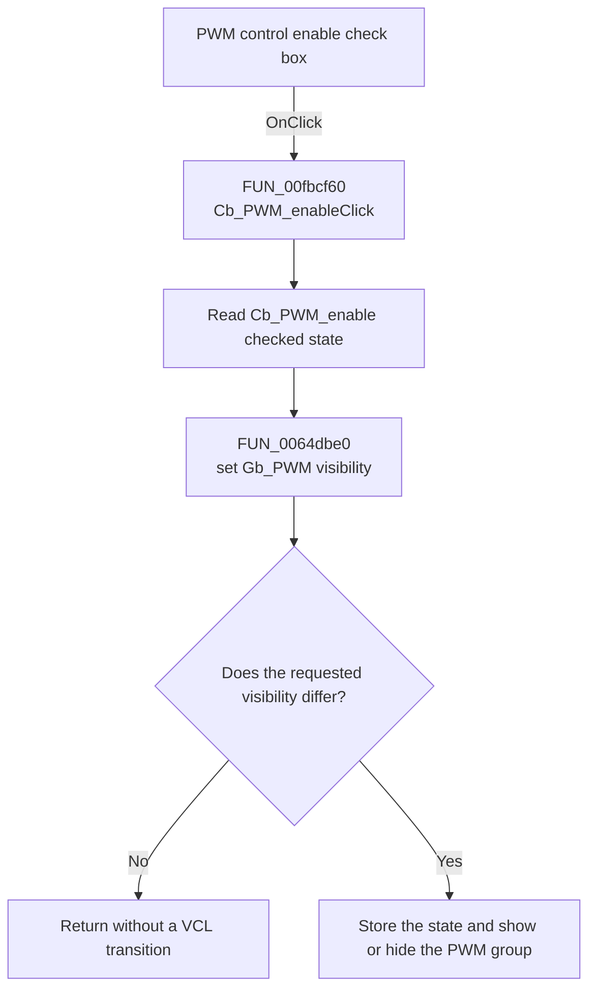

# PWM controll enable

> Analysis status: Recovered PWM group visibility path reviewed.

## Control

| Property | Recovered value |
| --- | --- |
| Form | dlgFlowchartInterruptAVRTmr1 |
| Component path | dlgFlowchartInterruptAVRTmr1.Cb_PWM_enable |
| Control class | TCheckBox |
| Caption | PWM controll enable |
| Hint | Not present in the recovered resource. |
| Text | Not present in the recovered resource. |
| Handler name | Cb_PWM_enableClick |
| Handler address | 00fbcf60 |
| Graph node | `resource:dfm:dlgFlowchartInterruptAVRTmr1/dlgFlowchartInterruptAVRTmr1.Cb_PWM_enable` |
| Handler node | `function:00fbcf60` |
| Graph layer | UI |

## What happens when clicked

`Cb_PWM_enableClick` reads the check box state from the control at form offset
`+0x7c8`. It passes that Boolean value to the VCL visibility setter for the
control at form offset `+0x7d8`. The DFM component order and the adjacent PWM
resources identify these fields as `Cb_PWM_enable` and `Gb_PWM`.

When the check box is selected, the handler makes the **PWM registers** group
visible. When it is clear, the handler hides that group. The shared VCL setter
does nothing when the requested state already equals the current visibility
state. For a change, it stores the new visibility state, sends the recovered
visible-changed message, and runs the VCL show or hide transition.

The click does not change a PWM mode, compare mode, register value, or enable
flag. It only controls whether the PWM group is visible.

## Click flow

## Handler evidence

- Source: [DecompiledSources/Tina16/functions/0000000000FBCF60__FUN_00fbcf60.c](../../../DecompiledSources/Tina16/functions/0000000000FBCF60__FUN_00fbcf60.c)
- Visibility setter: [DecompiledSources/Tina16/functions/000000000064DBE0__FUN_0064dbe0.c](../../../DecompiledSources/Tina16/functions/000000000064DBE0__FUN_0064dbe0.c)
- Recovered role: Shows or hides the PWM register group from the check box
  state.
- Current graph summary: Handles 1 Delphi UI event: dlgFlowchartInterruptAVRTmr1.Cb_PWM_enable.OnClick.
- Current graph behavior: Reads the check box state and applies it to the PWM
  group visibility.
- Current graph evidence: `FUN_00fbcf60` calls the Boolean getter at VMT slot
  `+0x260` on form field `+0x7c8`, then calls `FUN_0064dbe0` for form field
  `+0x7d8` with the returned value.
- Complexity: simple
- Distinct outgoing calls: 1

## Direct calls

- `function:0064dbe0` — sets a VCL control's visible state and suppresses a
  repeated request for its current state.

## Resource evidence

- Kind: Not present in the recovered resource.
- Modal result: Not present in the recovered resource.
- Checked state: Not present in the recovered resource.
- DFM visibility: `Visible = false`.
- List items: Not present in the recovered resource.
- Image reference: Not present in the recovered resource.
- Extracted glyph: None.

## Nearby label candidates

Nearby labels are layout candidates only. They are not proof of behavior.

- No same-parent label candidate is available.

## Analysis limits

- The DFM hides this check box. The recovered handler does not show which
  external path can make the control available later.
- The original Delphi field table is not recovered. The two field identities
  are supported by the adjacent DFM resources and their use as a check box and
  a group box, but their source-level declarations are unavailable.
- The handler changes group visibility only. It does not enable PWM operation
  or save PWM parameters.
