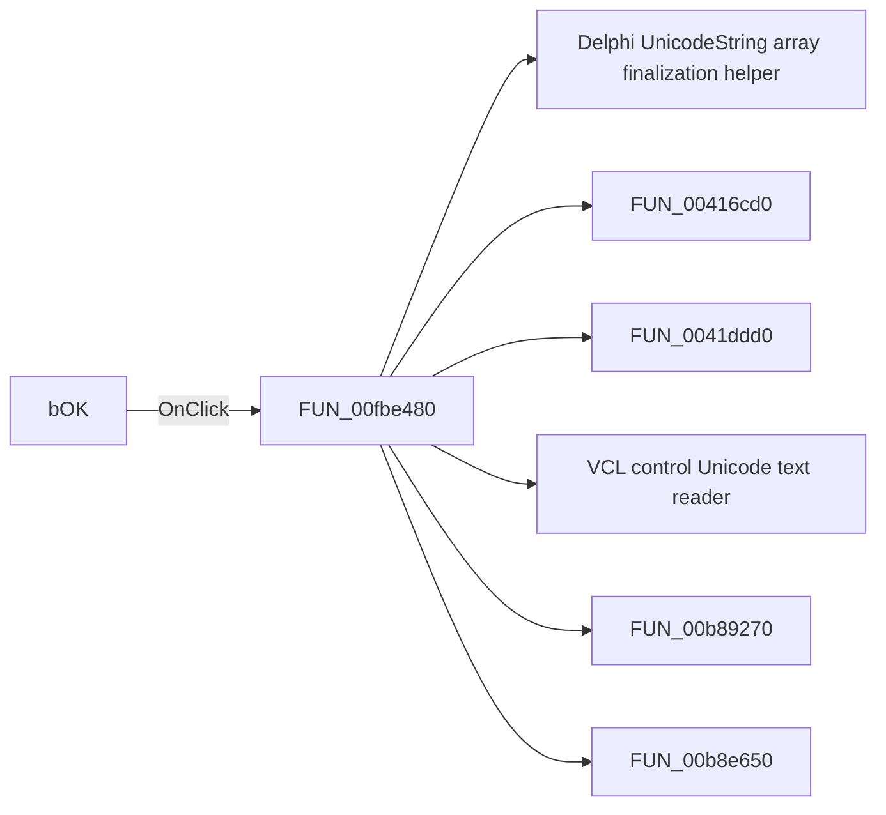

# bOK

> Analysis status: Pending individual source review.

## Control

| Property | Recovered value |
| --- | --- |
| Form | dlgFlowchartInterruptAVRTmr2 |
| Component path | dlgFlowchartInterruptAVRTmr2.bOK |
| Control class | TBitBtn |
| Caption | Not present in the recovered resource. |
| Hint | Not present in the recovered resource. |
| Text | Not present in the recovered resource. |
| Handler name | bOKClick |
| Handler address | 00fbe480 |
| Graph node | `resource:dfm:dlgFlowchartInterruptAVRTmr2/dlgFlowchartInterruptAVRTmr2.bOK` |
| Handler node | `function:00fbe480` |
| Graph layer | UI |

## What happens when clicked

Pending individual analysis. An agent must read the recovered handler source and its relevant callees before it replaces this text.

## Click flow

## Handler evidence

- Source: [DecompiledSources/Tina16/functions/0000000000FBE480__FUN_00fbe480.c](../../../DecompiledSources/Tina16/functions/0000000000FBE480__FUN_00fbe480.c)
- Recovered role: Not present in the recovered resource.
- Current graph summary: Handles 1 Delphi UI event: dlgFlowchartInterruptAVRTmr2.bOK.OnClick.
- Current graph behavior: Not present in the recovered resource.
- Current graph evidence: Not present in the recovered resource.
- Complexity: complex
- Distinct outgoing calls: 9

## Direct calls

- `function:00414560` — Delphi UnicodeString array finalization helper
- `function:00416cd0` — FUN_00416cd0
- `function:0041ddd0` — FUN_0041ddd0
- `function:0064dd90` — VCL control Unicode text reader
- `function:00b89270` — FUN_00b89270
- `function:00b8e650` — FUN_00b8e650
- `function:00f60f00` — FUN_00f60f00
- `function:00f60f70` — FUN_00f60f70
- `function:00fbe410` — FUN_00fbe410

## Resource evidence

- Kind: bkOK
- Modal result: Not present in the recovered resource.
- Checked state: Not present in the recovered resource.
- List items: Not present in the recovered resource.
- Image reference: Not present in the recovered resource.
- Extracted glyph: None.

## Nearby label candidates

Nearby labels are layout candidates only. They are not proof of behavior.

- Rank 1: Asynchronous Status Register  ASSR at distance 57.

## Analysis limits

- Do not infer behavior from the control class, caption, hint, glyph, or nearby label alone.
- Do not replace the pending status until the handler source and relevant call path provide enough evidence.
