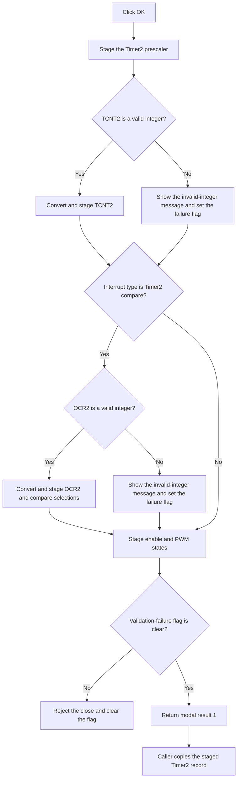

# OK

> Analysis status: Reviewed from recovered source, form resources, lifecycle handlers, and the caller path.

## Control

| Property | Recovered value |
| --- | --- |
| Form | dlgFlowchartInterruptAVRTmr2 |
| Component path | dlgFlowchartInterruptAVRTmr2.bOK |
| Control class | TBitBtn |
| Caption | Supplied by the built-in button kind. |
| Kind | `bkOK` |
| Hint | Not present in the recovered resource. |
| Handler name | bOKClick |
| Handler address | 00fbe480 |
| Graph node | `resource:dfm:dlgFlowchartInterruptAVRTmr2/dlgFlowchartInterruptAVRTmr2.bOK` |
| Handler node | `function:00fbe480` |
| Graph layer | UI |

## What happens when clicked

The OK button validates and stages the Timer2 interrupt settings before the dialog closes.

`FUN_00fbe480` always reads these controls:

- It saves the selected Timer2 prescaler.
- It validates the `Reload value: (TCNT2)` text. A valid value is converted to an integer and saved.
- It saves the states of `OVF2_enable`, `Comp_enable`, and `PWM_enable`.

The handler reads the interrupt type from the dialog's working record. When the type is 3, which the caller uses for the Timer2 compare dialog, it also does these operations:

- It validates and saves `Output Compare Register OCR2`.
- It saves the normal compare-mode selection.
- It saves the PWM compare-mode selection.
- It saves the asynchronous-status selection for `ASSR`.

When the type is 4, which the caller uses for the Timer2 overflow dialog, the handler does not read or change those compare-specific staged fields.

## Integer validation and close behavior

The shared validator accepts a decimal integer or an integer with an `H` hexadecimal suffix. The OK handler does not apply a separate Timer2 range check.

If `TCNT2` or the compare value is not valid, the handler formats the localized `HDLStrings.Msg_FC_NotValidInt` message with the entered text. `FUN_00fbe410` shows the message and sets the form's validation-failure flag. The handler continues and stages the other selections and check-box states. It does not replace the previous staged value for an invalid numeric field.

The built-in `bkOK` action then tries to close the modal dialog. `FUN_00fbde90`, the `OnCloseQuery` handler, rejects that close when the validation-failure flag is set. It also clears the flag. The user can correct the value and select OK again. In compare mode, two invalid numeric fields can cause two messages during one click because the first failure does not stop the second validation.

## Accepted-state use

The caller gives the dialog a working copy of the flowchart record before it shows the form. `FUN_00fbdeb0` restores the staged values to the controls when the form opens. The OK handler writes new values back to that working copy.

The caller copies the working record back to the flowchart item only when `ShowModal` returns 1. A failed close query does not reach that accepted branch. Canceling the dialog also leaves the caller's original record unchanged.

The `Time` float edit is not saved directly by OK. Its change handler derives a prescaler and `TCNT2` reload value first. The prescaler-change and `TCNT2`-exit handlers also update the displayed time. OK saves the resulting prescaler and integer text values.

## Click flow

## Handler evidence

- Primary handler: [FUN_00fbe480](../../../DecompiledSources/Tina16/functions/0000000000FBE480__FUN_00fbe480.c) reads the prescaler, integer edits, compare selections, asynchronous selection, and check-box states. It stages them at offsets within the dialog's working record.
- Integer validator: [FUN_00f60f00](../../../DecompiledSources/Tina16/functions/0000000000F60F00__FUN_00f60f00.c) accepts either of the two recovered integer formats.
- Integer converter: [FUN_00f60f70](../../../DecompiledSources/Tina16/functions/0000000000F60F70__FUN_00f60f70.c) converts decimal text or removes an `H` suffix and converts hexadecimal text.
- Error reporter: [FUN_00fbe410](../../../DecompiledSources/Tina16/functions/0000000000FBE410__FUN_00fbe410.c) shows the supplied message and sets the validation-failure flag.
- Close guard: [FUN_00fbde90](../../../DecompiledSources/Tina16/functions/0000000000FBDE90__FUN_00fbde90.c) permits the close only when that flag is clear, then resets the flag.
- Form restore: [FUN_00fbdeb0](../../../DecompiledSources/Tina16/functions/0000000000FBDEB0__FUN_00fbdeb0.c) restores the staged fields to the controls and calculates the displayed Timer2 time data.
- Working-record setup: [FUN_00fbdd90](../../../DecompiledSources/Tina16/functions/0000000000FBDD90__FUN_00fbdd90.c) copies the caller's record into the dialog before display.
- Caller: [FUN_00fd1520](../../../DecompiledSources/Tina16/functions/0000000000FD1520__FUN_00fd1520.c) selects the Timer2 overflow or compare layout, shows the dialog, and copies the record back only for modal result 1.
- Time synchronization: [FUN_00fbebb0](../../../DecompiledSources/Tina16/functions/0000000000FBEBB0__FUN_00fbebb0.c), [FUN_00fbef40](../../../DecompiledSources/Tina16/functions/0000000000FBEF40__FUN_00fbef40.c), and [FUN_00fbf100](../../../DecompiledSources/Tina16/functions/0000000000FBF100__FUN_00fbf100.c) synchronize time, prescaler, and reload controls before acceptance.
- Complexity: complex; 9 distinct outgoing calls.

## Resource evidence

- The control is a `TBitBtn` with the built-in `bkOK` kind. It has no custom caption, hint, image reference, or extracted glyph.
- The Timer2 register group identifies `Prescale Select` and `Reload value: (TCNT2)`.
- The compare group identifies `Output Compare Register OCR2`, normal compare mode, PWM compare mode, and `PWM_enable`.
- The asynchronous combo contains the 16 combinations of `AS2`, `TCN2UB`, `OCR2UB`, and `TCR2UB` values. Its nearby `ASSR` label supports that control meaning but does not establish the whole OK behavior by itself.

## State and error limits

- A failed numeric check does not roll back the other values staged during the same click. The caller cannot consume those partial changes unless a later OK attempt closes with modal result 1.
- The handler does not verify that a combo has a nonnegative selected index.
- The handler has no local exception recovery for message, string, or VCL failures. Such failures use the application's normal Delphi exception path.
- This handler changes the dialog's working record only. The caller owns the final copy-back operation.
