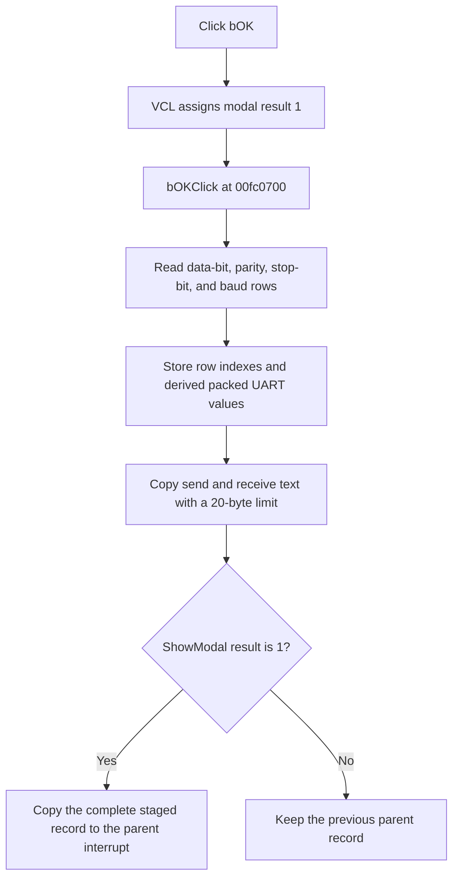

# bOK

> Analysis status: Complete. The handler address was recovered manually from the Delphi published-method table.

## Control

| Property | Recovered value |
| --- | --- |
| Form | dlgflowchartInterruptAVRUART |
| Component path | dlgflowchartInterruptAVRUART.bOK |
| Control class | TBitBtn |
| Caption | Not present in the recovered resource. |
| Hint | Not present in the recovered resource. |
| Text | Not present in the recovered resource. |
| Handler name | bOKClick |
| Handler address | `00fc0700` (manual published-method-table recovery; the current graph edge is unresolved) |
| Graph node | `resource:dfm:dlgflowchartInterruptAVRUART/dlgflowchartInterruptAVRUART.bOK` |
| Recovered function node | `function:00fc0700` |
| Generated handler node | `concept:dfm-handler:TdlgflowchartInterruptAVRUART/bOKClick` |
| Graph layer | tina.exe |

## What happens when clicked

The button has the standard `bkOK` kind. The VCL assigns modal result `1`
before it calls `bOKClick` at `00fc0700`.

The handler ignores `Sender`. It reads the selected rows from the Data bits,
Parity, Stop bit, and Baud rate combo boxes. It stores these four row indexes in
the staged interrupt record at form offsets `+0xb88` through `+0xb94`.

The form's change handlers maintain derived UART values while the dialog is
open. The OK handler commits those derived values as follows:

| Input or derived value | Staged result |
| --- | --- |
| Data-bit selection | Stores the low character-size value in the packed field at `+0xbb8`. A 9-bit selection also sets value `4` at `+0xbb4`. |
| Parity selection | Adds the internal parity code at `+0x818`, multiplied by `0x10`, to the packed field at `+0xbb8`. |
| Stop-bit selection | Adds the selected row, multiplied by `8`, to the packed field at `+0xbb8`. |
| Baud selection | Stores the selected nominal rate at `+0xba8` and the calculated low and high UBRR parts at `+0xbbc` and `+0xbc0`. |
| Send and receive text | Converts each edit value to a fixed short string with a maximum payload of 20 bytes at `+0xbd9` and `+0xbc4`. |

The handler also writes the constant `2` at `+0xbb0`. It has no validation
branch, error message, retry, rollback, or local exception handler. The combo
boxes use `csDropDownList`, so normal UI input is restricted to their listed
rows, but the handler itself does not guard an invalid item index.

The modal owner staged the complete input record at form offset `+0x830` before
it showed this dialog. After `ShowModal` returns `1`, the owner copies that
complete record back to the selected flowchart interrupt. A result other than
`1` keeps the previous parent record.

## Click flow

## Handler evidence

- Handler source: [`FUN_00fc0700`](../../../DecompiledSources/Tina16/functions/0000000000FC0700__FUN_00fc0700.c)
- Setup source: [`FUN_00fc0010`](../../../DecompiledSources/Tina16/functions/0000000000FC0010__FUN_00fc0010.c)
- Form-show source: [`FUN_00fc0130`](../../../DecompiledSources/Tina16/functions/0000000000FC0130__FUN_00fc0130.c)
- Data-bit change source: [`FUN_00fc0910`](../../../DecompiledSources/Tina16/functions/0000000000FC0910__FUN_00fc0910.c)
- Parity change source: [`FUN_00fc09a0`](../../../DecompiledSources/Tina16/functions/0000000000FC09A0__FUN_00fc09a0.c)
- Stop-bit change source: [`FUN_00fc09e0`](../../../DecompiledSources/Tina16/functions/0000000000FC09E0__FUN_00fc09e0.c)
- Baud change source: [`FUN_00fc0a10`](../../../DecompiledSources/Tina16/functions/0000000000FC0A10__FUN_00fc0a10.c)
- Modal owner: [`FUN_00fd1520`](../../../DecompiledSources/Tina16/functions/0000000000FD1520__FUN_00fd1520.c)
- Recovered role: Commit the AVR UART dialog controls to the staged interrupt record.
- Current graph summary: The UI trigger still targets unresolved concept `TdlgflowchartInterruptAVRUART/bOKClick`. The separate function node `function:00fc0700` exists but is not connected to that trigger.
- Manual address evidence: The `TdlgFlowchartInterruptAVRUART` VMT is based at `00fbf398`. Its published-method-table pointer at VMT offset `-0x98` points to `00fbfb35`. The `bOKClick` record at `00fbfb95` contains code address `00fc0700`.
- Complexity: complex.
- Distinct outgoing graph calls: 4.

## Direct calls

- [`FUN_0064dd90`](../../../DecompiledSources/Tina16/functions/000000000064DD90__FUN_0064dd90.c) reads Unicode text from each edit control.
- [`FUN_00416910`](../../../DecompiledSources/Tina16/functions/0000000000416910__FUN_00416910.c) converts the Unicode text to a bounded short string.
- [`FUN_00415020`](../../../DecompiledSources/Tina16/functions/0000000000415020__FUN_00415020.c) copies at most 20 bytes to the staged fixed string.
- [`FUN_00414480`](../../../DecompiledSources/Tina16/functions/0000000000414480__FUN_00414480.c) releases the two temporary UnicodeStrings.

## Resource evidence

- Kind: bkOK
- Modal result: Not present in the recovered resource.
- Checked state: Not present in the recovered resource.
- List items: Data bits has `5-bit` through `9-bit`; Parity has no, even, and odd parity; Stop bit has one or two stop bits; Baud rate has 14 fixed rows from `2400` through `1M`.
- Image reference: Not present in the recovered resource.
- Extracted glyph: None.

## Nearby label candidates

Nearby labels are layout candidates only. They are not proof of behavior.

- Rank 1: UBRR at distance 39.
- Rank 2: Receive text: at distance 55.
- Rank 3: Send text: at distance 87.

## Analysis limits

- The generated graph still connects this click to an unresolved concept because the DFM export has `codeAddress = null`. The raw RTTI method table and recovered function body supply the address used in this review.
- The original Delphi record and field names are not recovered. This article uses form offsets and direct data flow.
- The packed value at `+0xbb8` matches the visible data-bit, parity, and stop-bit choices. This article does not assign an unsupported original register-field name.
- Cancel or a close through the window frame does not dispatch `bOKClick`. This article documents the `bOK` click path only.
