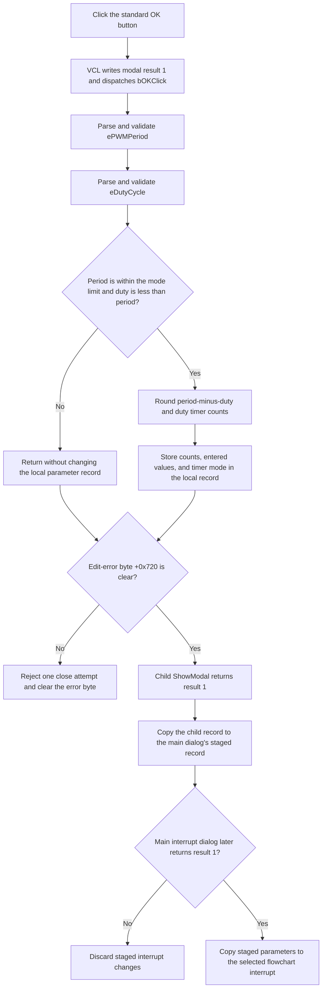

# Accept the 8051 PWM timer settings

> Analysis status: Complete. The recovered DFM, OK handler, mode handlers, float-edit parser, child-dialog owner, and outer interrupt commit path support this explanation.

## Control

| Property | Recovered value |
| --- | --- |
| Form | dlgFlowchartInterrupti8051PWM |
| Form caption | 8051 PWM Properties |
| Component path | dlgFlowchartInterrupti8051PWM.bOK |
| Control class | TBitBtn |
| Caption | Supplied by `Kind = bkOK`; no custom caption is present. |
| Hint | Not present in the recovered resource. |
| Period editor | dlgFlowchartInterrupti8051PWM.ePWMPeriod (`TFloatEdit`) |
| Duty editor | dlgFlowchartInterrupti8051PWM.eDutyCycle (`TFloatEdit`) |
| Timer mode | dlgFlowchartInterrupti8051PWM.CB_TMOD0 (`TComboBox`) |
| Handler name | bOKClick |
| Handler address | 00fc94f0 |
| Graph node | `resource:dfm:dlgFlowchartInterrupti8051PWM/dlgFlowchartInterrupti8051PWM.bOK` |
| Handler node | `function:00fc94f0` |
| Graph layer | UI |

`bOK` uses the standard VCL `bkOK` kind. This kind supplies the OK caption, stock glyph, default-button state, and modal result `1`. The DFM has no custom caption, hint, image, or extracted glyph for the button.

## Mode inputs and limits

The dialog receives the oscillator frequency at form offset `+0xbe0`. `FormShow` and `CB_TMOD0Change` derive a timer divider at `+0x724` and a counter limit at `+0x728` from the selected timer mode.

| Mode index | Recovered mode text | Divider | Counter limit | OK period limit |
| --- | --- | ---: | ---: | --- |
| 0 | 8-bit timer/counter with 5-bit prescaler | 32 | 256 | `8192 / Fosc` |
| 1 | 16-bit timer/counter | 1 | 65536 | `65536 / Fosc` |
| 2 | 8-bit auto-reload timer/counter | 1 | 256 | `256 / Fosc` |
| 3 | Split TL0 and TH0 timer mode | 1 | 256 | `256 / Fosc` |

The formulas prove that the period, duty cycle, and oscillator frequency use compatible units. The source does not name those units.

## What happens when clicked

The inherited VCL button path assigns modal result `1` to the form and then dispatches `bOKClick`. The handler ignores `Sender` and performs these operations:

1. It reads and validates `ePWMPeriod` through the shared float-edit getter.
2. It reads and validates `eDutyCycle` through the same getter.
3. It tests `period <= counterLimit * divider / Fosc`.
4. It also tests `duty < period`.
5. Only when both tests pass, it calculates and stores two rounded timer counts:
   - `round((period - duty) * Fosc / divider)` at local-record field `+0xb68`;
   - `round(duty * Fosc / divider)` at local-record field `+0xb6c`.
6. It stores the entered period at `+0xb58`, the entered duty cycle at `+0xb60`, and `CB_TMOD0.ItemIndex` at `+0xb44`.

The two count fields are 32-bit values. The period and duty fields are doubles. These offsets are inside the dialog's local copy of the interrupt parameter record.

The handler does not require a positive period or duty cycle. It also does not validate the mode index directly. The generic float-edit getter limits each parsed value to `-1e50` through `+1e50` and applies an optional edit validator, but the recovered form does not prove a separate positive-value validator.

## Relation failure is a silent no-op

If the period is above the mode limit, or if `duty >= period`, `bOKClick` returns without writing any of the five record fields. It does not set the dialog error byte, change an error label, show a message, or cancel modal result `1`.

The two edit `OnExit` handlers can write `PERIOD ERROR` and `duty cycle error` to the empty error labels. They use the same upper-period and duty-versus-period tests. These labels are informational only. The handlers do not set the close-guard byte at `+0x720`, and `bOKClick` does not call them.

Therefore, a relation failure can close the child dialog as OK while its local parameter record stays unchanged. The child owner then copies that unchanged record to the main interrupt dialog's staged record. There is no recovered message that tells the user that OK made no settings change.

## Parse errors and close guard

The shared float-edit getter reads the current Unicode text, parses it, checks the generic numeric range, invokes an optional validator, and caches a successful value. A conversion, range, or callback failure raises a Delphi input exception.

Both numeric edits bind `OnError` to `EditFloatError`. That handler forwards the edit's message through the dialog error wrapper. The shared one-message presenter shows the first pending message and sets byte `+0x720`. `FormCloseQuery` permits the close only while this byte is clear. It then clears the byte. Thus, a reported edit error blocks one close attempt.

The direct parser path and `OnError` event are separate in the recovered code. The source does not prove that each parser exception invokes `OnError`. `bOKClick` has no local catch, fallback, or rollback. If the first parse succeeds and the second parse raises, only the edit controls' numeric caches can be partly updated; no local-record field has been written yet.

## Staging and copy-back

`FUN_00fc8f30` copies the complete caller record to dialog offset `+0x748` before the form opens. The current settings are therefore a working copy.

The `Set Parameters...` handler in the main interrupt dialog owns this child dialog. It selects the 8051 PWM child for processor-family code `2` and interrupt-kind byte `7`. It copies the child record back to the main dialog's record at `+0x7f0` only when the child returns modal result `1`. A child Cancel result keeps the prior main-dialog record.

The main interrupt dialog remains open after this child closes. Only if that outer dialog later returns modal result `1` does `FUN_010511e0` copy the staged record to the selected flowchart interrupt and request the outer UI update. This OK handler does not directly change the flowchart interrupt, compile code, program hardware, save a file, or persist settings.

## Display and calculation boundaries

The refresh helper displays `Max Period` as `(counterLimit + 1) * divider / Fosc`, but `bOKClick` and `ePWMPeriodExit` accept only `counterLimit * divider / Fosc`. The displayed maximum is therefore one timer tick above the recovered acceptance limit.

The refresh helper also reconstructs `ePWMPeriod` as `(storedCount1 + storedCount2 + 1) * divider / Fosc`. In contrast, OK calculates the two counts by rounding the requested period and duty parts separately. The recovered source does not add or subtract a compensating count during the OK write.

## Click flow

## Source evidence

- [OK handler `FUN_00fc94f0`](../../../DecompiledSources/Tina16/functions/0000000000FC94F0__FUN_00fc94f0.c) proves both float reads, both relation tests, the count formulas, and the five conditional local-record writes.
- [Dialog initializer `FUN_00fc8f30`](../../../DecompiledSources/Tina16/functions/0000000000FC8F30__FUN_00fc8f30.c) copies the complete input record to form offset `+0x748` and stores the oscillator frequency and device context.
- [Form-show handler `FUN_00fc9050`](../../../DecompiledSources/Tina16/functions/0000000000FC9050__FUN_00fc9050.c) restores the timer mode, derives its divider and counter limit, and calls the display refresh.
- [Mode-change handler `FUN_00fc97d0`](../../../DecompiledSources/Tina16/functions/0000000000FC97D0__FUN_00fc97d0.c) maps the current combo-box index to the timer divider and limit and refreshes the form values.
- [Display refresh `FUN_00fc9140`](../../../DecompiledSources/Tina16/functions/0000000000FC9140__FUN_00fc9140.c) formats Fosc and maximum labels and reloads the two numeric edits from the local record.
- [Period exit handler `FUN_00fc9610`](../../../DecompiledSources/Tina16/functions/0000000000FC9610__FUN_00fc9610.c) updates both relation-error labels. [Duty exit handler `FUN_00fc9740`](../../../DecompiledSources/Tina16/functions/0000000000FC9740__FUN_00fc9740.c) updates the duty relation label.
- [Edit error handler `FUN_00fc94b0`](../../../DecompiledSources/Tina16/functions/0000000000FC94B0__FUN_00fc94b0.c) forwards the edit message to [the dialog error wrapper](../../../DecompiledSources/Tina16/functions/0000000000FC9420__FUN_00fc9420.c).
- [Close-query handler `FUN_00fc9030`](../../../DecompiledSources/Tina16/functions/0000000000FC9030__FUN_00fc9030.c) assigns `CanClose` from the inverse of byte `+0x720` and then clears the byte.
- [Float-edit getter `FUN_00b90090`](../../../DecompiledSources/Tina16/functions/0000000000B90090__FUN_00b90090.c) parses text, applies the generic range and optional callback checks, caches a successful value, and raises on failure.
- [Rounding helper `FUN_0040c770`](../../../DecompiledSources/Tina16/functions/000000000040C770__FUN_0040c770.c) returns the rounded integer for each calculated count.
- [Child-dialog owner `FUN_00fd1520`](../../../DecompiledSources/Tina16/functions/0000000000FD1520__FUN_00fd1520.c) selects this 8051 PWM dialog and copies its complete record to the main dialog only after child result `1`.
- [Outer interrupt commit `FUN_010511e0`](../../../DecompiledSources/Tina16/functions/00000000010511E0__FUN_010511e0.c) copies the main dialog's staged record to the selected interrupt only after the outer dialog returns result `1`.
- [TBitBtn kind setter `FUN_0082bc30`](../../../DecompiledSources/Tina16/functions/000000000082BC30__FUN_0082bc30.c) maps `bkOK` to its standard caption, glyph, default state, and modal result. [The inherited click path](../../../DecompiledSources/Tina16/functions/0000000000687F30__FUN_00687f30.c) writes the modal result to the form before it dispatches `OnClick`.
- [Recovered Delphi resource evidence](../../../DecompiledSources/Tina16/resources/dfm/ui-evidence.json) supplies the form caption, controls, labels, timer-mode items, event bindings, and standard button kinds.

## Analysis limits and ownership

- This Bead owns the 8051 PWM OK handler, dialog initialization, mode and display helpers, relation-label handlers, edit-error wrapper, and close guard.
- The generic VCL button path, float-edit parser, rounding helper, record-copy helper, child owner, and outer commit path are evidence only.
- The original Delphi names of the local-record fields are not recovered. This article uses their form offsets and proven writers.
- The source does not name the time or oscillator units.
- The exact higher-level exception recovery after a direct parser failure is not recovered.
