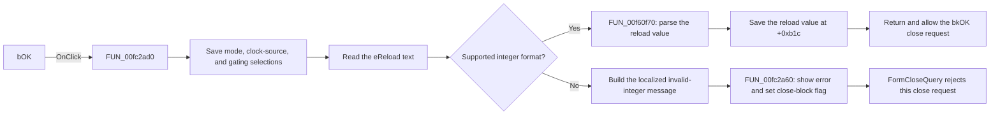

# bOK

> Analysis status: Reviewed from recovered source and UI evidence.

## Control

| Property | Recovered value |
| --- | --- |
| Form | dlgFlowchartInterrupti8051Tmr0 |
| Component path | dlgFlowchartInterrupti8051Tmr0.bOK |
| Control class | TBitBtn |
| Caption | Not present in the recovered resource. |
| Hint | Not present in the recovered resource. |
| Text | Not present in the recovered resource. |
| Handler name | bOKClick |
| Handler address | 00fc2ad0 |
| Graph node | `resource:dfm:dlgFlowchartInterrupti8051Tmr0/dlgFlowchartInterrupti8051Tmr0.bOK` |
| Handler node | `function:00fc2ad0` |
| Graph layer | UI |

## What happens when clicked

The handler saves four form settings. It reads the selected `Cb_TMOD0` item and stores the Timer0 mode index at form field `+0xb18`. It reads the checked states of `RadioCLK` and `RadioTR0` and stores them as `0` or `1` at `+0xb20` and `+0xb24`. These values record the system-clock selection and the TR0 gating selection. The form's `OnShow` handler uses the reverse path to restore the same combo-box and radio-button states.

The handler then reads the `eReload` text and asks `FUN_00f60f00` whether it uses a supported integer format. For valid text, `FUN_00f60f70` converts the text to a 32-bit integer, and the handler stores the result at `+0xb1c`.

For invalid text, the handler builds a localized message with the key `HDLStrings.Msg_FC_NotValidInt` and the entered text. `FUN_00fc2a60` shows the message and sets the form validation-error flag at `+0x750`. `FormCloseQuery` rejects that close request and then clears the flag. This path leaves the previous reload field unchanged, but it has already saved the mode and both radio-button states.

The click handler checks the integer format only. The separate `eReload.OnExit` handler applies the mode-dependent reload limit, but that range check is not part of this handler.

## Click flow

## Handler evidence

- Source: [DecompiledSources/Tina16/functions/0000000000FC2AD0__FUN_00fc2ad0.c](../../../DecompiledSources/Tina16/functions/0000000000FC2AD0__FUN_00fc2ad0.c)
- Recovered role: 8051 Timer0 selection and reload-value commit handler.
- Current graph summary: Handles 1 Delphi UI event: dlgFlowchartInterrupti8051Tmr0.bOK.OnClick.
- Current graph behavior: Not yet annotated. The recovered handler saves three Timer0 selections, validates and saves the reload integer, or reports an invalid integer and blocks the close request.
- Current graph evidence: The handler reads controls at form offsets `+0x710`, `+0x6e0`, `+0x6f0`, and `+0x6b8`; it stores fields `+0xb18` through `+0xb24`. `FormShow` copies these stored values back to `Cb_TMOD0`, both radio-button pairs, and `eReload`. The failure path uses `HDLStrings.Msg_FC_NotValidInt`, and `FormCloseQuery` consumes the flag set by `FUN_00fc2a60`.
- Complexity: complex
- Distinct outgoing calls: 9

## Direct calls

- `function:00414560` — Delphi UnicodeString array finalization helper
- `function:00416cd0` — FUN_00416cd0
- `function:0041ddd0` — FUN_0041ddd0
- `function:0064dd90` — VCL control Unicode text reader
- `function:00b89270` — FUN_00b89270
- `function:00b8e650` — FUN_00b8e650
- `function:00f60f00` — FUN_00f60f00
- `function:00f60f70` — FUN_00f60f70
- `function:00fc2a60` — FUN_00fc2a60

## Resource evidence

- Kind: bkOK
- Modal result: Not present in the recovered resource.
- Checked state: Not present in the recovered resource.
- List items: Not present in the recovered resource.
- Image reference: Not present in the recovered resource.
- Extracted glyph: None.

## Nearby label candidates

Nearby labels are layout candidates only. They are not proof of behavior.

- Rank 1: Reload value: (TL0,TH0) at distance 278.
- Rank 2: Timer 0 Mode Select Bit at distance 311.

## Analysis limits

- The original Delphi names of form fields `+0xb18` through `+0xb24` and `+0x750` are not recovered.
- The handler does not enforce a reload range. `eReload.OnExit` uses the current mode to select an 8-bit or 16-bit limit.
- The recovered click handler does not directly close the dialog. The resource identifies `bOK` as `bkOK`, and `FormCloseQuery` controls whether the close request can finish.
