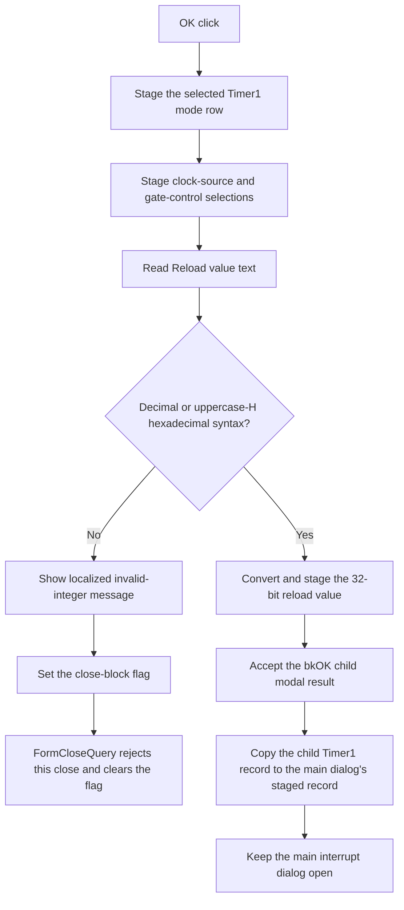

# OK

## Control

| Property | Recovered value |
| --- | --- |
| Form | dlgFlowchartInterrupti8051Tmr1 |
| Component path | dlgFlowchartInterrupti8051Tmr1.bOK |
| Control class | TBitBtn |
| Caption | Supplied by the recovered `bkOK` button kind. |
| Hint | Not present in the recovered resource. |
| Text | Not present in the recovered resource. |
| Handler name | bOKClick |
| Handler address | 00fc5220 |
| Graph node | `resource:dfm:dlgFlowchartInterrupti8051Tmr1/dlgFlowchartInterrupti8051Tmr1.bOK` |
| Handler node | `function:00fc5220` |
| Graph layer | UI |

## What happens when clicked

The click stages the current 8051 Timer1 settings in the child dialog record.
It first stores the selected `Cb_tmod1` row. The recovered drop-down list has
four ordered modes: 8-bit with a 5-bit prescaler, 16-bit, 8-bit auto-reload,
and halted while retaining the count.

The handler then stores two Boolean selections. The first selection comes from
the `System clock` and `External pin T1` radio pair. The second comes from the
`timer1 enable -TR1` and `Timer1 enable-INT1` gating pair. `FormShow` contains
the inverse assignments that restore these saved values to their radio pairs.

The handler reads the reload text from `Ereload1`. The integer validator accepts
nonempty decimal digits or hexadecimal digits followed by uppercase `H`.
Hexadecimal digits before the suffix can use upper-case or lower-case `A`
through `F`. The reviewed path does not trim text and does not accept a sign.

Valid text is converted to a 32-bit integer and stored as the Timer1 reload
value. The OK handler has no separate range check. Invalid text builds a
localized `HDLStrings.Msg_FC_NotValidInt` message, shows it, and sets the form's
close-block flag. The mode and radio selections were already staged before this
validation failure; the handler does not roll them back.

The control has kind `bkOK`. `FormCloseQuery` permits the modal close only when
the close-block flag is clear. An invalid reload sets the flag, so the current
close attempt is rejected. `FormCloseQuery` then clears the flag to permit a
later retry. Valid input permits modal result 1.

This Timer1 dialog is opened by the main interrupt dialog's Set Parameters
handler for the recovered 8051 Timer1-overflow kind. Only child modal result 1
copies the edited Timer1 record to the main interrupt dialog's staged interrupt
record. The main flowchart interrupt object is not changed until the main
interrupt dialog is also accepted later.

## Click flow

## Handler evidence

- Handler source: [FUN_00fc5220](../../../DecompiledSources/Tina16/functions/0000000000FC5220__FUN_00fc5220.c)
- Form-show restore path: [FUN_00fc47a0](../../../DecompiledSources/Tina16/functions/0000000000FC47A0__FUN_00fc47a0.c)
- Validation-message and close-block helper: [FUN_00fc51b0](../../../DecompiledSources/Tina16/functions/0000000000FC51B0__FUN_00fc51b0.c)
- Close-query path: [FUN_00fc4780](../../../DecompiledSources/Tina16/functions/0000000000FC4780__FUN_00fc4780.c)
- Child-record initializer: [FUN_00fc4680](../../../DecompiledSources/Tina16/functions/0000000000FC4680__FUN_00fc4680.c)
- Parent parameter-dialog dispatcher: [FUN_00fd1520](../../../DecompiledSources/Tina16/functions/0000000000FD1520__FUN_00fd1520.c)
- Integer syntax validator: [FUN_00f60f00](../../../DecompiledSources/Tina16/functions/0000000000F60F00__FUN_00f60f00.c)
- Integer converter: [FUN_00f60f70](../../../DecompiledSources/Tina16/functions/0000000000F60F70__FUN_00f60f70.c)
- Recovered role: Validate and stage 8051 Timer1 settings for child-dialog
  acceptance.
- Complexity: complex
- Distinct outgoing calls: 9

The DFM binds `dlgFlowchartInterrupti8051Tmr1.bOK.OnClick` to `bOKClick` at
`00fc5220` and assigns kind `bkOK`. The handler reads `Cb_tmod1` at form field
`+0x6D8`, the first radio selection at `+0x6F0`, the second at `+0x708`, and
`Ereload1` at `+0x6B8`. It stores these values at `+0xBA8`, `+0xBB0`,
`+0xBB4`, and `+0xBAC` respectively.

`FUN_00fc51b0` shows the supplied message and sets form byte `+0x768` to 1.
`FUN_00fc4780` writes `CanClose` from the inverse of that byte and then clears
the byte. In `FUN_00fd1520`, the 8051 kind-byte-5 branch creates this child,
initializes it through `FUN_00fc4680`, and copies its managed record only after
an exact modal result of 1.

## Direct calls

- `function:0064dd90` - read Unicode reload text from `Ereload1`.
- `function:00f60f00` - validate decimal or uppercase-`H` hexadecimal syntax.
- `function:00f60f70` - convert the validated text to a 32-bit integer.
- `function:00b89270`, `function:0041ddd0`, and `function:00b8e650` - load the
  localized `HDLStrings.Msg_FC_NotValidInt` text.
- `function:00416cd0` - build the validation message from the rejected text and
  localized content.
- `function:00fc51b0` - show the validation message and set the close-block
  flag.
- `function:00414560` - finalize temporary Unicode strings.

## Resource evidence

- The form caption is `i8051 Timer1 Properties`.
- `Cb_tmod1` is a `csDropDownList` with four recovered timer-mode descriptions.
- The reload editor is beside `Reload value: (TL1, TH1)`.
- The two radio groups are `Timer 1 Counter/Timer Select Bit` and `Timer 1
  Gating Control Bit`.
- The OK control has kind `bkOK`. It has no recovered hint or custom glyph.

## Nearby label candidates

The handler and inverse `FormShow` assignments identify the relevant controls;
distance alone is not the evidence.

- `Reload value: (TL1, TH1)` identifies the text read by the handler.
- `Timer 1 Mode Select Bit` identifies the mode drop-down list.
- `Baudrate:` is for separate edit controls and is not read by this handler.

## Analysis limits

- The original Delphi names of the managed Timer1 record fields are not
  recovered. Component names, matching getters, stored offsets, and inverse
  `FormShow` assignments establish the mappings used here.
- The OK handler validates syntax but has no explicit reload-value range check.
- A rejected click can change the child dialog's mode and radio backing fields
  before the close veto. It does not roll back those partial staged changes.
