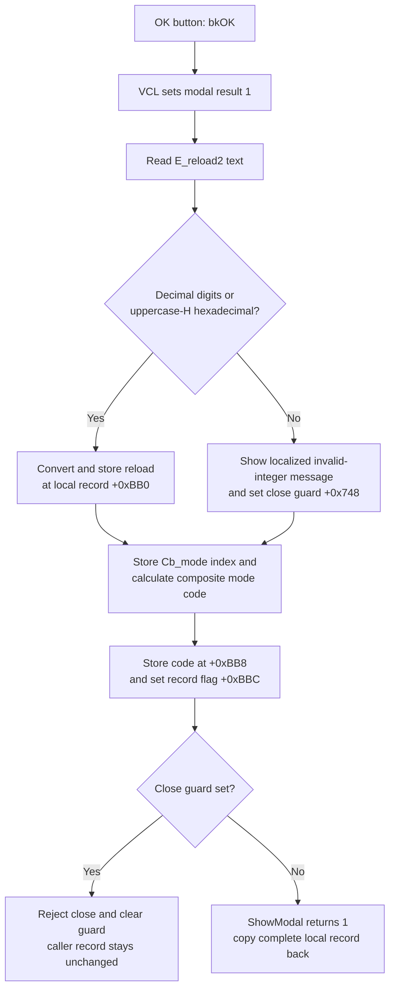

# Accept the i8051 Timer2 settings

> Analysis status: Evidence-backed source review complete.

## Control

| Property | Recovered value |
| --- | --- |
| Form | dlgFlowchartInterrupti8051Tmr2 |
| Form caption | i8051 Timer2 Properties |
| Component path | dlgFlowchartInterrupti8051Tmr2.bOK |
| Control class | TBitBtn |
| Caption | Supplied by the standard `bkOK` kind; no explicit caption is stored. |
| Hint | Not present in the recovered resource. |
| Text | Not present in the recovered resource. |
| Handler name | bOKClick |
| Handler address | 00fc7a40 |
| Graph node | `resource:dfm:dlgFlowchartInterrupti8051Tmr2/dlgFlowchartInterrupti8051Tmr2.bOK` |
| Handler node | `function:00fc7a40` |
| Graph layer | UI |

## What happens when clicked

`FUN_00fc7a40` validates the text in `E_reload2`. The accepted formats are decimal digits or hexadecimal digits followed by uppercase `H`. The validator does not accept a sign or whitespace.

If the text is valid, the handler converts it to a 32-bit integer and stores it at form offset `+0xBB0`. It does not apply an 8-bit or 16-bit range check. A decimal conversion that exceeds the recovered 32-bit conversion range can raise. The hexadecimal converter accumulates its result in 32 bits, and this click path has no separate overflow check.

If the text is invalid, the handler builds a localized `HDLStrings.Msg_FC_NotValidInt` message that includes the entered text. `FUN_00fc79d0` shows the message and sets the form close-guard byte at `+0x748`. The handler leaves the old reload value at `+0xBB0` unchanged but continues to stage the mode fields described below.

## Mode and composite code

The handler always stores `Cb_mode.ItemIndex` at `+0xBC0`. `Cb_mode.OnChange` maps the three named rows to four internal values. OK combines those values as:

`(+0x7B8 * 32) + (+0x7BC * 16) + (+0x7C4 * 4) + +0x7C0`

This produces the following recovered codes:

| Combo row | Recovered item | Stored mode index | Composite code at `+0xBB8` |
| --- | --- | ---: | ---: |
| 0 | 16-bit auto-reload | 0 | 4 |
| 1 | 16-bit capture | 1 | 5 |
| 2 | baud rate generator | 2 | 52 |

The handler writes the same calculated code to form staging field `+0x7C8` and record field `+0xBB8`. It then sets staging flag `+0x7CC` and record flag `+0xBBC` to `1`.

The resource contains a fourth empty combo row. The mode-change handler has no branch for row `3`, and it also has no branch for no selection. In those cases, OK stores the selected index but calculates the composite code from the four values that are already in the form. The recovered code does not establish a new code for the empty row. Normal form setup restores a saved mode and explicitly calls the mode mapper, but this does not make row `3` valid.

## Modal copy boundary

`FUN_00fc6f10` copies the caller's complete interrupt record to form offset `+0x7D0` before the dialog opens. The click handler changes fields in this local copy. The recovered modal owner uses this Timer2 dialog for interrupt type bytes `3` and `4`. It copies the complete form-local record back to the caller only when `ShowModal` returns `1`.

The standard `bkOK` button sets modal result `1` before it dispatches `bOKClick`. `FormCloseQuery` permits the close only when the close-guard byte is zero. When invalid reload text sets the guard, close query rejects that close and then clears the guard so that the user can correct the value and try again. Because `ShowModal` has not returned, the caller record is not changed by the rejected attempt.

`bCancel` has standard kind `bkCancel` and no custom click handler. Cancel does not run `bOKClick`, and the caller does not copy the local record back.

## Time and baud-rate fields

`E_reload2.OnExit` calculates the displayed Timer2 interval from the reload value and the oscillator input. `FE_time1.OnChange` performs the reverse calculation and can replace `E_reload2` text. These events can therefore change the text that OK later validates and stores.

OK itself does not read `FE_time1`, `Ebaud`, or `Ebaud1`. It does not recalculate the time label or baud-rate fields. It uses only the current `E_reload2` text and current mode state.

## Error and partial-state behavior

The invalid-format path is recoverable: it shows one message, stages the current mode and composite code, and relies on close query to keep the dialog open. A later successful OK overwrites the active fields before the caller copies the record.

The valid decimal-conversion path has no local exception handler or rollback. If conversion raises, the reload store and later mode stores are not reached. Higher-level exception handling and focus behavior are not recovered here.

The click does not compare old and new values, write a file, generate code, program a target, or update hardware. Accepting unchanged values still performs the local stores and the caller's complete record copy.

## Click flow

## Handler evidence

- [bOKClick](../../../DecompiledSources/Tina16/functions/0000000000FC7A40__FUN_00fc7a40.c) proves reload validation and conversion, the mode-index store, the composite-code formula, and both flag stores.
- [The integer-form validator](../../../DecompiledSources/Tina16/functions/0000000000F60F00__FUN_00f60f00.c) accepts decimal digits or the recovered uppercase-`H` hexadecimal form. [The integer converter](../../../DecompiledSources/Tina16/functions/0000000000F60F70__FUN_00f60f70.c) selects decimal or hexadecimal conversion.
- [The mode mapper](../../../DecompiledSources/Tina16/functions/0000000000FC7E10__FUN_00fc7e10.c) supplies the four values for combo rows `0`, `1`, and `2` and has no other row branch.
- [The error presenter](../../../DecompiledSources/Tina16/functions/0000000000FC79D0__FUN_00fc79d0.c) shows the supplied message and sets close guard `+0x748`. [FormCloseQuery](../../../DecompiledSources/Tina16/functions/0000000000FC7010__FUN_00fc7010.c) rejects closure while that byte is set and then clears it. [FormCreate](../../../DecompiledSources/Tina16/functions/0000000000FC79B0__FUN_00fc79b0.c) initializes the guard to zero.
- [Dialog setup](../../../DecompiledSources/Tina16/functions/0000000000FC6F10__FUN_00fc6f10.c) creates the form-local managed-record copy and stores the oscillator, processor, and device-name context. [FormShow](../../../DecompiledSources/Tina16/functions/0000000000FC7030__FUN_00fc7030.c) restores the reload, mode, timing state, and related controls from that copy.
- [The modal owner](../../../DecompiledSources/Tina16/functions/0000000000FD1520__FUN_00fd1520.c) uses this dialog for recovered type bytes `3` and `4`, calls setup, tests for modal result `1`, and only then copies the complete record back.
- [Reload exit handling](../../../DecompiledSources/Tina16/functions/0000000000FC7EC0__FUN_00fc7ec0.c) calculates time from reload text. [Time-edit change handling](../../../DecompiledSources/Tina16/functions/0000000000FC8020__FUN_00fc8020.c) calculates reload text from the entered time and reports an out-of-range display state.
- Standard `bkOK` modal-result dispatch is recovered in [TBitBtn.SetKind](../../../DecompiledSources/Tina16/functions/000000000082BC30__FUN_0082bc30.c) and [TCustomButton.Click](../../../DecompiledSources/Tina16/functions/0000000000687F30__FUN_00687f30.c).
- The recovered [UI evidence](../../../DecompiledSources/Tina16/resources/dfm/ui-evidence.json) gives the form caption, combo items, reload and timing controls, event bindings, nearby labels, and standard button kinds. No custom glyph or hint is present for `bOK`.

## Direct calls

- `function:0064dd90` reads the reload edit text.
- `function:00f60f00` validates the two accepted integer forms.
- `function:00f60f70` converts valid decimal or hexadecimal text.
- `function:00b89270` and `function:00b8e650` obtain the localized invalid-integer message.
- `function:0041ddd0` and `function:00416cd0` build the displayed message with the entered text.
- `function:00fc79d0` shows the error and sets the close guard.
- `function:00414560` finalizes temporary Delphi strings.

## Resource evidence

- The form caption is `i8051 Timer2 Properties`.
- `Cb_mode` contains `16-bit auto-reload`, `16-bit capture`, `baud rate generator`, and one empty row.
- The form contains the labels `Mode`, `Reload value: (RCAP)`, `Output Compare Register RCAP`, `Frequency:`, `Time:`, and `Baudrate:`.
- Nearby-label ranking puts `Mode` first and `Baudrate:` second. These are layout candidates only; the handler and lifecycle source establish the data path.
- `bOK` has standard kind `bkOK`. It has no explicit caption, hint, text, or extracted custom glyph.

## Analysis limits

- The original Delphi type and field names for record offsets `+0xBB0`, `+0xBB8`, `+0xBBC`, and `+0xBC0` are not recovered. The UI controls, reverse FormShow path, and mode mapper establish their roles.
- The composite code values are proven. The recovered click path does not expose the final hardware-register writer, so this article does not assign individual 8051 register-bit names to the four internal values.
- The semantic name of record flag `+0xBBC` is not recovered.
- The exact upper-bound result for hexadecimal accumulation beyond 32 bits follows the recovered converter's 32-bit arithmetic; this click path has no explicit rejection branch.
- No persistence or hardware side effect is present before the caller accepts and copies the local record.
