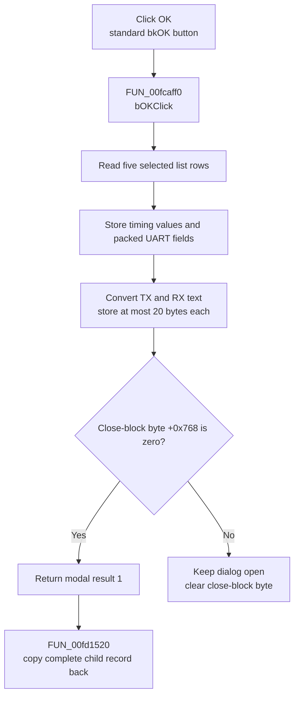

# OK

> Analysis status: Complete. The handler address was recovered manually from the Delphi published-method table.

## Control

| Property | Recovered value |
| --- | --- |
| Form | dlgflowchartInterrupti8051UART |
| Component path | dlgflowchartInterrupti8051UART.bOK |
| Control class | TBitBtn |
| Caption | Supplied by the recovered `bkOK` button kind. |
| Hint | Not present in the recovered resource. |
| Text | Not present in the recovered resource. |
| Handler name | bOKClick |
| Handler address | `00fcaff0` (manual published-method-table recovery; the current graph edge is unresolved) |
| Graph node | `resource:dfm:dlgflowchartInterrupti8051UART/dlgflowchartInterrupti8051UART.bOK` |
| Generated handler node | `concept:dfm-handler:TdlgflowchartInterrupti8051UART/bOKClick` |
| Recovered function node | `function:00fcaff0` |
| Graph layer | tina.exe |

## What happens when clicked

The standard `bkOK` button path requests modal result 1 and dispatches
`bOKClick` at `00fcaff0`. The handler reads the selected rows from these five
lists:

- serial mode;
- transmitter baud rate;
- receiver baud rate;
- transmitter clock source; and
- receiver clock source.

It stores those rows in the staged interrupt record at form offsets `+0xC78`,
`+0xC7C`, `+0xC80`, `+0xC9C`, and `+0xC98`. It also stores the calculated
transmitter and receiver timing values from `+0x820` and `+0x828` in record
fields `+0xC88` and `+0xC90`.

The handler then builds three packed configuration values. It stores
`serial-mode row * 0x40 + 0x10` at `+0xCA0`. It stores the value at `+0x818`,
shifted left by seven bits, at `+0xCA4`. The values at `+0xCA8` and `+0xCAC`
combine the two clock-source rows and the value at `+0x81C`. The recovered
source establishes these calculations but does not recover the original
Delphi field names.

Finally, the handler reads the transmitter and receiver text edits. It converts
each Unicode value to a Delphi ShortString and copies at most 20 bytes to the
record fields at `+0xCC5` and `+0xCB0`. If the conversion helper reports a
negative result, it supplies an empty ShortString. The handler does not show an
error, retry a conversion, or roll back earlier record writes.

`FormCreate` clears close-block byte `+0x768`. `FormCloseQuery` permits closure
while this byte is zero and clears it after each query. No recovered method in
this class sets the byte. Thus, the normal OK request can close with result 1.
The parent modal coordinator then copies the complete child record at `+0x850`
back to its staged interrupt record. Cancel or another result does not run that
copy-back branch.

## Click flow

## Handler evidence

- DFM event evidence: [ui-evidence.json](../../../DecompiledSources/Tina16/resources/dfm/ui-evidence.json)
- Event-address extractor: [TiaraUiEvidence.rs](../../../analysis/undelphi/TiaraUiEvidence.rs)
- Handler source: [FUN_00fcaff0](../../../DecompiledSources/Tina16/functions/0000000000FCAFF0__FUN_00fcaff0.c)
- Close-query source: [FUN_00fca800](../../../DecompiledSources/Tina16/functions/0000000000FCA800__FUN_00fca800.c)
- Form-show source: [FUN_00fca820](../../../DecompiledSources/Tina16/functions/0000000000FCA820__FUN_00fca820.c)
- Parent modal dispatcher: [FUN_00fd1520](../../../DecompiledSources/Tina16/functions/0000000000FD1520__FUN_00fd1520.c)
- Child-record initializer: [FUN_00fca700](../../../DecompiledSources/Tina16/functions/0000000000FCA700__FUN_00fca700.c)
- Recovered role: Stage the selected 8051 UART modes, timing configuration, and
  text in the modal child record.
- Current graph summary: The UI trigger still targets unresolved concept
  `TdlgflowchartInterrupti8051UART.bOKClick`. The separate function node
  `function:00fcaff0` exists but is not connected to that trigger.
- Manual address evidence: The class VMT used by `FUN_00fd1520` is based at
  `00fc9918`. Its published-method-table pointer at VMT offset `-0x98` points
  to `00fca18c`. The `bOKClick` record at `00fca1ee` contains code address
  `00fcaff0`.
- Complexity: complex.
- Distinct outgoing graph calls: 4.

The same published-method table maps `FormCloseQuery` to `00fca800`,
`FormShow` to `00fca820`, `FormCreate` to `00fcabc0`, and all five combo-box
change handlers to their recovered functions. Their accesses to the same
controls, staged fields, timing values, and close flag confirm the class
mapping.

## Direct calls

- [`FUN_0064dd90`](../../../DecompiledSources/Tina16/functions/000000000064DD90__FUN_0064dd90.c)
  reads a control's Unicode text.
- [`FUN_00416910`](../../../DecompiledSources/Tina16/functions/0000000000416910__FUN_00416910.c)
  converts the Unicode text to a ShortString of at most 255 bytes.
- [`FUN_00415020`](../../../DecompiledSources/Tina16/functions/0000000000415020__FUN_00415020.c)
  copies at most 20 bytes to the staged record.
- [`FUN_00414480`](../../../DecompiledSources/Tina16/functions/0000000000414480__FUN_00414480.c)
  releases each temporary Unicode string.

The list-row reads use indirect VCL calls, so they do not appear as direct
function-call edges.

## Resource evidence

- The form caption is `i8051 UART`.
- `Cb_serial_mode` supplies four serial modes.
- The transmitter and receiver baud lists each supply 12 rates.
- The transmitter and receiver clock-source lists supply `Timer1`, `Timer2`,
  and `INT_BRG`.
- The form has separate transmitter and receiver text edits.
- The OK control has kind `bkOK`. It has no recovered hint or custom glyph.

The raw method mapping and recovered source prove that the handler reads these
five lists and two text edits. The handler does not read the nearby labels.

## Nearby label candidates

The nearby labels are layout candidates only. They cannot replace the missing
handler data flow.

- Rank 1: `Text` at distance 71.
- Rank 2: `Baud rate` at distance 201.
- Rank 3: `Serial mode` at distance 241.

## Analysis limits

- The generated graph still connects this click to an unresolved concept
  because the DFM export has `codeAddress = null`. The raw published-method
  table and the recovered method body supply the address used in this review.
- The recovered source does not give Delphi names to record fields `+0xC78`
  through `+0xCC5`. This article uses control data flow and offsets.
- The handler has no local exception handler. It does not restore fields that
  it wrote before a later failure.
- The class methods do not set close-block byte `+0x768`. The source does not
  explain why the form keeps this close gate.
