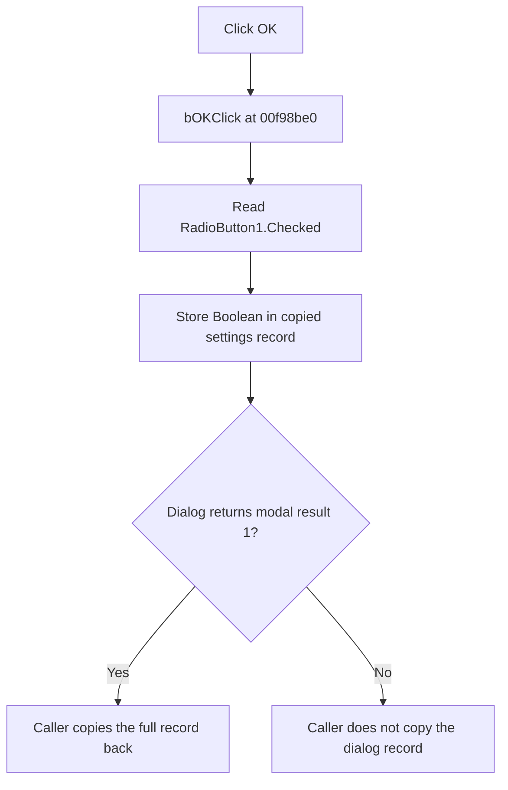

# bOK

> Analysis status: Evidence-backed source review complete.

## Control

| Property | Recovered value |
| --- | --- |
| Form | dlgFlowchartInterruptpiccomp3f |
| Component path | dlgFlowchartInterruptpiccomp3f.bOK |
| Control class | TBitBtn |
| Caption | Not present in the recovered resource. |
| Hint | Not present in the recovered resource. |
| Text | Not present in the recovered resource. |
| Handler name | bOKClick |
| Handler address | 00f98be0 |
| Graph node | `resource:dfm:dlgFlowchartInterruptpiccomp3f/dlgFlowchartInterruptpiccomp3f.bOK` |
| Handler node | `function:00f98be0` |
| Graph layer | UI |

## What happens when clicked

The OK handler reads the checked state of `RadioButton1`, whose recovered caption is `Controll`, and writes that Boolean to form field `+0x7ac`. This field is inside the interrupt settings record that the dialog constructor copied from its caller. Value `true` represents `Controll`; value `false` represents `Driver`.

The handler does not read either memo, validate text, or change pane visibility. It has no conditional branch, error message, or local rollback. A repeated click stores the current Boolean again.

The button has recovered kind `bkOK`. The surrounding flowchart editor checks the modal result and copies the full dialog record back only when the result is `1`. A Cancel result does not copy the record. When the dialog opens again, `FormCreate` and `FormShow` read the stored Boolean, select the matching radio button, and show the matching memo pane.

## Click flow

## Handler evidence

- Source: [DecompiledSources/Tina16/functions/0000000000F98BE0__FUN_00f98be0.c](../../../DecompiledSources/Tina16/functions/0000000000F98BE0__FUN_00f98be0.c)
- Recovered role: Commits the selected Compare 3f control-or-driver mode to the dialog record.
- Current graph summary: Handles 1 Delphi UI event: dlgFlowchartInterruptpiccomp3f.bOK.OnClick.
- Current graph behavior: The checked-in graph does not yet include this review annotation.
- Current graph evidence: The handler calls the virtual checked-state getter on form field `+0x6b8` and writes its Boolean result to record field `+0x7ac`.
- Complexity: simple
- Distinct outgoing calls: 0

## Direct calls

- No direct call edge is present in the recovered graph.

The checked-state read is an indirect VCL virtual call, so the graph has no direct call edge for it.

Relevant state paths:

- [`FormCreate`](../../../DecompiledSources/Tina16/functions/0000000000F98B80__FUN_00f98b80.c) reads record field `+0x7ac` and initializes the two radio checked states.
- [`FormShow`](../../../DecompiledSources/Tina16/functions/0000000000F98AE0__FUN_00f98ae0.c) reads the selected state and synchronizes the two memo panes.
- [`FUN_00f989c0`](../../../DecompiledSources/Tina16/functions/0000000000F989C0__FUN_00f989c0.c) copies the caller's interrupt record into the dialog before it is shown.
- [`FUN_00fd1520`](../../../DecompiledSources/Tina16/functions/0000000000FD1520__FUN_00fd1520.c) creates this dialog for interrupt discriminator `0x1f` and copies its record back only after modal result `1`.

## Resource evidence

- Kind: bkOK
- Modal result: Not present in the recovered resource.
- Checked state: Not present in the recovered resource.
- List items: Not present in the recovered resource.
- Image reference: Not present in the recovered resource.
- Extracted glyph: None.

## Nearby label candidates

Nearby labels are layout candidates only. They are not proof of behavior.

- No same-parent label candidate is available.

## Analysis limits

- The recovered source does not give a Delphi name to record field `+0x7ac`.
- The memo contents and the downstream meaning of the two modes are not present in the recovered DFM evidence. This article identifies the stored selection and UI visibility behavior only.
