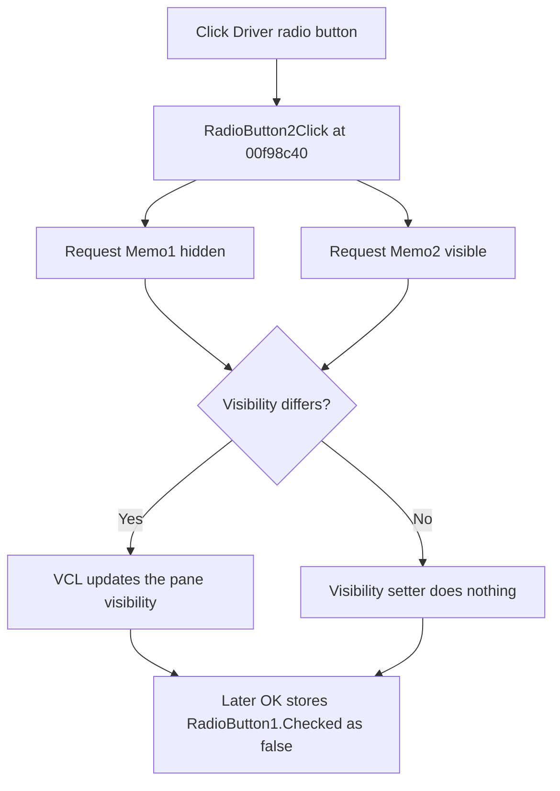

# Driver

> Analysis status: Evidence-backed source review complete.

## Control

| Property | Recovered value |
| --- | --- |
| Form | dlgFlowchartInterruptpiccomp3f |
| Component path | dlgFlowchartInterruptpiccomp3f.RadioButton2 |
| Control class | TRadioButton |
| Caption | Driver |
| Hint | Not present in the recovered resource. |
| Text | Not present in the recovered resource. |
| Handler name | RadioButton2Click |
| Handler address | 00f98c40 |
| Graph node | `resource:dfm:dlgFlowchartInterruptpiccomp3f/dlgFlowchartInterruptpiccomp3f.RadioButton2` |
| Handler node | `function:00f98c40` |
| Graph layer | UI |

## What happens when clicked

Clicking `Driver` selects the driver-side view and changes which of the form's two overlapping memo panes is visible. `RadioButton2Click` requests visible state `false` for the form field at `+0x6e0` and `true` for the field at `+0x6e8`. The DFM contains only two memo panes at the same position. The recovered form field sequence and the repeated `FormShow` path identify these fields as `Memo1` and `Memo2`, respectively.

The handler does not change the persisted mode field. The VCL first changes the radio selection. The later OK handler reads the opposite radio button, `RadioButton1.Checked`, so a selected `Driver` button produces stored value `false`. The flowchart editor copies the record back only when the dialog returns modal result `1`. Cancel therefore discards this selection.

The shared visibility setter compares each requested value with the control's current visible state. If both panes already have the requested states, both setter calls are no-ops. The handler has no validation, error message, or rollback branch.

## Click flow

## Handler evidence

- Source: [DecompiledSources/Tina16/functions/0000000000F98C40__FUN_00f98c40.c](../../../DecompiledSources/Tina16/functions/0000000000F98C40__FUN_00f98c40.c)
- Recovered role: Selects the driver-side memo pane for the Compare 3f dialog.
- Current graph summary: Handles 1 Delphi UI event: dlgFlowchartInterruptpiccomp3f.RadioButton2.OnClick.
- Current graph behavior: The checked-in graph does not yet include this review annotation.
- Current graph evidence: The handler passes `false` to the form field at `+0x6e0` and `true` to the field at `+0x6e8` through the recovered VCL visibility setter.
- Complexity: simple
- Distinct outgoing calls: 1

## Direct calls

- [`function:0064dbe0`](../../../DecompiledSources/Tina16/functions/000000000064DBE0__FUN_0064dbe0.c) — sets a VCL control's visible state and suppresses a repeated request for the current state.

Relevant state paths:

- [`FormShow`](../../../DecompiledSources/Tina16/functions/0000000000F98AE0__FUN_00f98ae0.c) applies the same two-pane visibility state from `RadioButton1.Checked` when the dialog opens.
- [`bOKClick`](../../../DecompiledSources/Tina16/functions/0000000000F98BE0__FUN_00f98be0.c) stores `RadioButton1.Checked`; `Driver` is the false state of that Boolean.
- [`FUN_00fd1520`](../../../DecompiledSources/Tina16/functions/0000000000FD1520__FUN_00fd1520.c) copies the record back only after modal result `1`.

## Resource evidence

- Kind: Not present in the recovered resource.
- Modal result: Not present in the recovered resource.
- Checked state: Not present in the recovered resource.
- List items: Not present in the recovered resource.
- Image reference: Not present in the recovered resource.
- Extracted glyph: None.

## Nearby label candidates

Nearby labels are layout candidates only. They are not proof of behavior.

- No same-parent label candidate is available.

## Analysis limits

- The recovered source does not expose the memo contents or Delphi names for the settings-record fields.
- The `Memo1` and `Memo2` offset mapping comes from the form component field sequence, the two overlapping DFM memo resources, and the matching `FormShow` visibility path. No separate field-symbol table is recovered.
