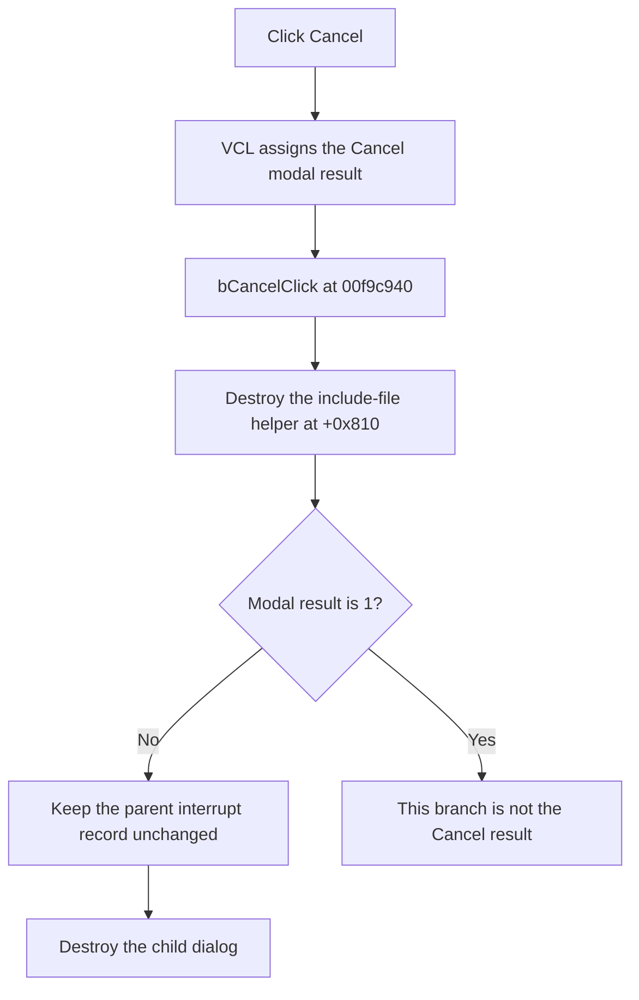

# bCancel

> Analysis status: Evidence-backed source review complete.

## Control

| Property | Recovered value |
| --- | --- |
| Form | dlgflowchartInterruptPicext0 |
| Component path | dlgflowchartInterruptPicext0.bCancel |
| Control class | TBitBtn |
| Caption | Supplied by the recovered `bkCancel` button kind. |
| Hint | Not present in the recovered resource. |
| Text | Not present in the recovered resource. |
| Handler name | bCancelClick |
| Handler address | 00f9c940 |
| Graph node | `resource:dfm:dlgflowchartInterruptPicext0/dlgflowchartInterruptPicext0.bCancel` |
| Recovered function node | `function:00f9c940` |
| Generated handler node | `concept:dfm-handler:TdlgflowchartInterruptPicext0/bCancelClick` |
| Current graph layer | tina.exe |

## What happens when clicked

The control has the standard `bkCancel` kind. The VCL gives the modal form a
Cancel result before it dispatches `bCancelClick`.

The recovered handler ignores `Sender`. It destroys the include-file helper at
form offset `+0x810` and returns. `FormShow` created this helper and loaded the
selected PIC device include file into it. The helper supports the pin and port
controls while the dialog is open.

The handler does not read a visible control. It does not change the staged
interrupt record, validate a value, show a message, or use a state branch.
`FUN_00410f20` is the recovered nil-safe object-destruction helper, so a null
helper is also accepted.

The parent modal coordinator copies the dialog record back only when
`ShowModal` returns `1`. The Cancel result is not `1`. Thus, the parent keeps
its previous interrupt record and then destroys the dialog.

## Click flow

## Handler evidence

- Handler source: [FUN_00f9c940](../../../DecompiledSources/Tina16/functions/0000000000F9C940__FUN_00f9c940.c)
- Form-show source: [FUN_00f9aef0](../../../DecompiledSources/Tina16/functions/0000000000F9AEF0__FUN_00f9aef0.c)
- Dialog setup source: [FUN_00f9add0](../../../DecompiledSources/Tina16/functions/0000000000F9ADD0__FUN_00f9add0.c)
- Parent modal coordinator: [FUN_00fd1520](../../../DecompiledSources/Tina16/functions/0000000000FD1520__FUN_00fd1520.c)
- Recovered role: Release the PIC interrupt dialog helper before modal
  cancellation.
- Complexity: simple.
- Distinct outgoing calls: 1.

The runtime RTTI method table for `TdlgFlowchartInterruptPicExt0` maps
`bCancelClick` to `00f9c940`. This mapping resolves the method even though the
generated DFM event row has a null `codeAddress`. The body at `00f9c940`
destroys the same `+0x810` object that `FormShow` creates. The neighboring RTTI
entries map `bOKClick` to `00f9c3a0` and `Ext_pinChange` to `00f9c960`. These
matching form fields and method responsibilities confirm the class boundary.

## Direct calls

- `function:00410f20` destroys the include-file helper. This shared Delphi
  runtime helper accepts a null object.

## Resource evidence

- Kind: `bkCancel`.
- The DFM binds `OnClick` to `bCancelClick`.
- The DFM extractor did not recover a code address for this class method.
- Modal result: Not present as an explicit DFM property.
- Hint: Not present in the recovered resource.
- Extracted glyph: None.

## Nearby label candidates

Nearby labels are layout candidates only. They do not describe the Cancel
operation.

- Rank 1: `5` at distance 72.
- Rank 2: `6` at distance 96.
- Rank 3: `4` at distance 104.

## Analysis limits

- The generated graph still connects this click to an unresolved concept
  because the DFM export has `codeAddress = null`. The raw RTTI method table
  and the recovered method body supply the address used in this review.
- The recovered source does not give a Delphi type name to the helper at
  `+0x810`. Its load, read, and destruction operations establish its role.
- A close through the window frame does not dispatch `bCancelClick`. This
  article documents the `bCancel` click path only.
