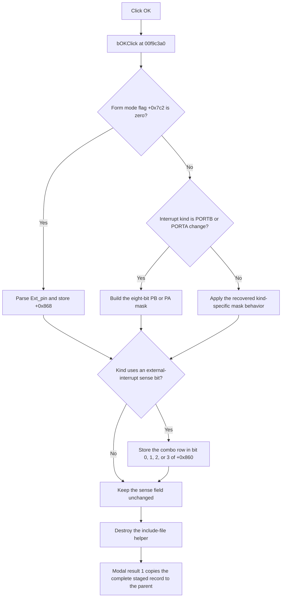

# bOK

> Analysis status: Evidence-backed source review complete.

## Control

| Property | Recovered value |
| --- | --- |
| Form | dlgflowchartInterruptPicext0 |
| Component path | dlgflowchartInterruptPicext0.bOK |
| Control class | TBitBtn |
| Caption | Supplied by the recovered `bkOK` button kind. |
| Hint | Not present in the recovered resource. |
| Text | Not present in the recovered resource. |
| Handler name | bOKClick |
| Handler address | 00f9c3a0 |
| Graph node | `resource:dfm:dlgflowchartInterruptPicext0/dlgflowchartInterruptPicext0.bOK` |
| Recovered function node | `function:00f9c3a0` |
| Generated handler node | `concept:dfm-handler:TdlgflowchartInterruptPicext0/bOKClick` |
| Current graph layer | tina.exe |

## What happens when clicked

This form is shared by six PIC interrupt kinds. The parent uses interrupt-kind
byte values `5`, `8`, `9`, `10`, `12`, and `13` for PIC EXT0 through EXT3 and
the PIC PORTB and PORTA change interrupts. `bOKClick` ignores `Sender`. It uses
this byte at staged-record offset `+0x01`, which is form offset `+0x819`, and a
form mode flag at `+0x7c2`.

If the mode flag is zero, the handler reads the `Ext_pin` text, converts it to
an integer, and stores it in the staged pin-or-mask field at `+0x868`. The
separate `Ext_pinChange` handler normally limits an entered value to the
recovered range. `bOKClick` itself has no range or syntax check.

If the mode flag is one, the handler builds an eight-bit mask. Kind `12` reads
the eight PB check boxes. Kind `13` reads the eight PA check boxes. It stores
bit 0 from the checkbox labelled `0` through bit 7 from the checkbox labelled
`7`. For kind `8`, `9`, or `10`, this branch writes the zero-initialized mask to
the applicable five-bit slice of `+0x868`. For kind `5`, this branch does not
change `+0x868`.

The handler then stores the interrupt sense selection from
`Cb_ext_int_control`. Kind `5` stores the combo row in bit 0 of `+0x860`. Kinds
`8`, `9`, and `10` store it in bits 1, 2, and 3. Kinds `12` and `13` do not
change this sense field.

Finally, the handler destroys the include-file helper at `+0x810`. It does not
write to the parent form directly. The standard `bkOK` path returns modal
result `1`. `FormCloseQuery` permits the close because its guard at `+0x7c0`
is clear. The parent then copies the complete staged record from form offset
`+0x818` back to its interrupt record.

The integer conversion has no local catch, retry, fallback, or rollback. If it
raises, the recovered handler does not reach the helper-destruction call. The
recovered source does not establish a successful modal copy after that error.

## Click flow

## Handler evidence

- Handler source: [FUN_00f9c3a0](../../../DecompiledSources/Tina16/functions/0000000000F9C3A0__FUN_00f9c3a0.c)
- Form-show source: [FUN_00f9aef0](../../../DecompiledSources/Tina16/functions/0000000000F9AEF0__FUN_00f9aef0.c)
- Combo-change source: [FUN_00f9c370](../../../DecompiledSources/Tina16/functions/0000000000F9C370__FUN_00f9c370.c)
- Pin-change source: [FUN_00f9c960](../../../DecompiledSources/Tina16/functions/0000000000F9C960__FUN_00f9c960.c)
- Dialog setup source: [FUN_00f9add0](../../../DecompiledSources/Tina16/functions/0000000000F9ADD0__FUN_00f9add0.c)
- Close-query source: [FUN_00f9aed0](../../../DecompiledSources/Tina16/functions/0000000000F9AED0__FUN_00f9aed0.c)
- Parent modal coordinator: [FUN_00fd1520](../../../DecompiledSources/Tina16/functions/0000000000FD1520__FUN_00fd1520.c)
- Recovered role: Stage PIC external-interrupt sense and port-change mask
  settings for modal acceptance.
- Complexity: complex.
- Distinct outgoing calls: 4.

The runtime RTTI method table for `TdlgFlowchartInterruptPicExt0` maps
`bOKClick` to `00f9c3a0`. This mapping resolves the method even though the
generated DFM event row has a null `codeAddress`. The same RTTI table maps the
matching form methods to `00f9aed0`, `00f9aef0`, `00f9c350`, `00f9c370`,
`00f9c940`, and `00f9c960`. Their accesses to this form's combo box, edit,
check boxes, guard bytes, staged record, and helper confirm the mapping.

`FUN_00f9add0` copies the caller's complete interrupt record to form offset
`+0x818`. `FUN_00f9aef0` initializes the visible controls from record fields
`+0x860` and `+0x868`. `FUN_00f9c3a0` performs the inverse writes. The parent
coordinator opens this class for the six supported PIC kinds and copies the
record back only after modal result `1`.

## Direct calls

- `function:0064dd90` gets the Unicode text from `Ext_pin`.
- `function:0043fc00` converts that text to an integer.
- `function:00410f20` destroys the include-file helper.
- `function:00414480` finalizes the temporary Unicode string.

The combo and checkbox reads use indirect VCL virtual calls. Thus, they do not
appear as direct function-call edges in the graph.

## Resource evidence

- Kind: `bkOK`.
- The DFM binds `OnClick` to `bOKClick`.
- `Cb_ext_int_control` contains falling-edge and rising-edge rows.
- The form contains `Ext_pin`, eight PA check boxes, and eight PB check boxes.
- Labels `PA`, `PB`, and `0` through `7` identify the two bit rows. The source
  accesses confirm their use; layout alone is not the evidence.
- The DFM extractor did not recover a code address for this class method.
- Extracted glyph: None.

## Nearby label candidates

The source and form-show mapping show that these labels belong to pin and mask
controls. They do not describe the OK button itself.

- `PB` is the nearest label at distance 33.
- `PA` is the second label at distance 57.
- `7` is the third label at distance 103.

## Analysis limits

- The generated graph still connects this click to an unresolved concept
  because the DFM export has `codeAddress = null`. The raw RTTI method table
  and the recovered method body supply the address used in this review.
- The recovered source does not name the record fields at `+0x860` and
  `+0x868`. Their read and write paths establish their sense and pin-or-mask
  roles.
- The source does not explain why the mode-one path writes a zero mask slice
  for kinds `8`, `9`, and `10`. This article states the recovered operation and
  does not assign an unsupported design intent to it.
- The handler has no explicit range check. The separate edit-change handler
  does not prove that every programmatic call to `bOKClick` receives valid
  text.
