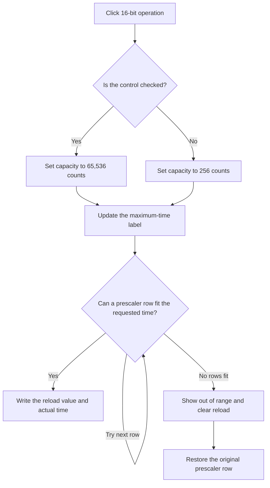

# 16-bit operation

> Analysis status: Reviewed from the recovered handler, timer controls, and form state.

## Control

| Property | Recovered value |
| --- | --- |
| Form | dlgFlowchartInterruptPicTmr1 |
| Component path | dlgFlowchartInterruptPicTmr1.GB_Data.bitszam1 |
| Control class | TCheckBox |
| Caption | 16-bit operation |
| Hint | Not present in the recovered resource. |
| Text | Not present in the recovered resource. |
| Handler name | bitszam1Click |
| Handler address | 00fa5950 |
| Graph node | `resource:dfm:dlgFlowchartInterruptPicTmr1/dlgFlowchartInterruptPicTmr1.GB_Data.bitszam1` |
| Handler node | `function:00fa5950` |
| Graph layer | UI |

## What happens when clicked

The handler reads the **16-bit operation** state and sets the working timer capacity to 65,536 counts when checked or 256 counts when clear. It then recalculates the Timer1 preview from the active clock, requested time, and prescaler.

First, it updates the maximum-time label. It then starts with the current prescaler row and increases the row while the requested time needs more counts than the selected timer capacity. If a row fits, the handler writes `capacity - required counts` to the reload editor and displays the time that this integer count represents.

If no prescaler row can fit the requested time, it displays `Time: Out of range`, clears the reload editor, and restores the prescaler row that was selected before the click. The handler does not show a message dialog, throw an explicit application error, or modify the caller's flowchart object.

## Click flow

## Handler evidence

- Source: [DecompiledSources/Tina16/functions/0000000000FA5950__FUN_00fa5950.c](../../../DecompiledSources/Tina16/functions/0000000000FA5950__FUN_00fa5950.c)
- Acceptance source: [DecompiledSources/Tina16/functions/0000000000FA28E0__FUN_00fa28e0.c](../../../DecompiledSources/Tina16/functions/0000000000FA28E0__FUN_00fa28e0.c)
- Recovered role: Recalculate Timer1 capacity, prescaler, reload, and time preview for 8-bit or 16-bit operation.
- Current graph summary: Handles 1 Delphi UI event: dlgFlowchartInterruptPicTmr1.GB_Data.bitszam1.OnClick.
- Current graph behavior: Selects a 256-count or 65,536-count capacity, increases the prescaler until the requested time fits, and updates the timer preview or its out-of-range state.
- Current graph evidence: The handler reads the event control at form field `+0x7c0`, writes capacity field `+0x8e0`, reads the clock at `+0x858`, reads the requested time at `+0x758`, operates on the prescaler at `+0x6c0`, and writes the time, maximum-time, and reload controls at `+0x738`, `+0x740`, and `+0x6c8`.
- Complexity: complex
- Distinct outgoing calls: 9

## Direct calls

- `function:00414560` — Delphi UnicodeString array finalization helper
- `function:00416ba0` — FUN_00416ba0
- `function:00460ba0` — FUN_00460ba0
- `function:00462650` — FUN_00462650
- `function:00468860` — FUN_00468860
- `function:0064de00` — VCL control text setter with change suppression
- `function:00b8fd60` — FUN_00b8fd60
- `function:00b90090` — FUN_00b90090
- `function:00f61040` — FUN_00f61040

## Resource evidence

- Kind: Not present in the recovered resource.
- Modal result: Not present in the recovered resource.
- Checked state: Not present in the recovered resource.
- List items: Not present in the recovered resource.
- Image reference: Not present in the recovered resource.
- Extracted glyph: None.

## Nearby label candidates

Nearby labels are layout candidates only. They are not proof of behavior.

- Rank 1: Time: at distance 24.
- Rank 2: Time: at distance 56.
- Rank 3: Time max: at distance 80.

## Analysis limits

- The recovered source identifies timer capacity and calculation data flow, but it does not give Delphi names for the intermediate form fields.
- The handler changes only the dialog preview. The OK path stages accepted settings for the caller.
