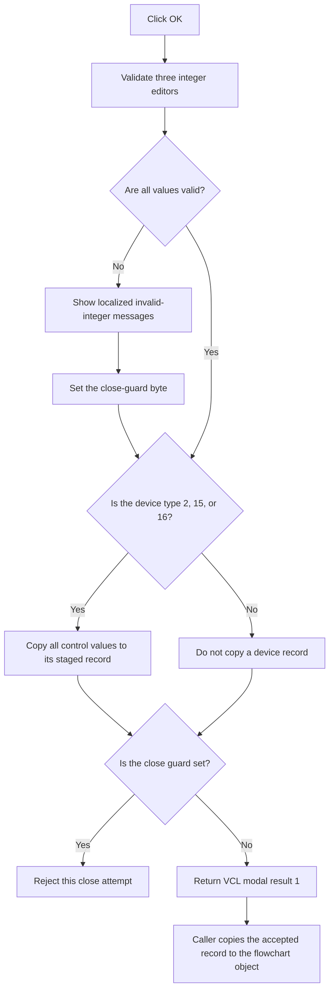

# bOK

> Analysis status: Reviewed from the recovered handler, close guard, and modal caller.

## Control

| Property | Recovered value |
| --- | --- |
| Form | dlgFlowchartInterruptPicTmr1 |
| Component path | dlgFlowchartInterruptPicTmr1.bOK |
| Control class | TBitBtn |
| Caption | Not present in the recovered resource. |
| Hint | Not present in the recovered resource. |
| Text | Not present in the recovered resource. |
| Handler name | bOKClick |
| Handler address | 00fa28e0 |
| Graph node | `resource:dfm:dlgFlowchartInterruptPicTmr1/dlgFlowchartInterruptPicTmr1.bOK` |
| Handler node | `function:00fa28e0` |
| Graph layer | UI |

## What happens when clicked

The OK handler validates three integer editors: the Timer1 reload value and the two Capture/Compare values. Each value can use the recovered decimal or `H`-suffix hexadecimal integer syntax.

For invalid text, the handler builds a localized `HDLStrings.Msg_FC_NotValidInt` message, displays it, and sets the form's close-guard byte. The `OnCloseQuery` handler then rejects that close attempt and clears the byte. Because the handler checks all three editors in sequence, one click can report more than one invalid value.

It parses each valid text value into a working integer. After it checks all three editors, it continues to the record-copy path. For device-type codes 2, 15, and 16, it copies the working integers, the prescaler and mode rows, interrupt and Timer1 check-box states, clock-source state, sleep-mode state, and sleep reload value into the matching device-specific record in the dialog. For other type codes, the recovered handler has no record-copy branch. It also releases the include-file object that the form loaded.

The button has VCL kind `bkOK`. The caller accepts only modal result 1. Only that accepted result copies the dialog's complete staged interrupt record back to the selected flowchart object. Cancel or a rejected close does not run that caller-side copy.

## Click flow

## Handler evidence

- Source: [DecompiledSources/Tina16/functions/0000000000FA28E0__FUN_00fa28e0.c](../../../DecompiledSources/Tina16/functions/0000000000FA28E0__FUN_00fa28e0.c)
- Validation-message source: [DecompiledSources/Tina16/functions/0000000000FA2870__FUN_00fa2870.c](../../../DecompiledSources/Tina16/functions/0000000000FA2870__FUN_00fa2870.c)
- Close-guard source: [DecompiledSources/Tina16/functions/0000000000FA1540__FUN_00fa1540.c](../../../DecompiledSources/Tina16/functions/0000000000FA1540__FUN_00fa1540.c)
- Modal caller: [DecompiledSources/Tina16/functions/0000000000FD1520__FUN_00fd1520.c](../../../DecompiledSources/Tina16/functions/0000000000FD1520__FUN_00fd1520.c)
- Recovered role: Validate and stage Timer1 interrupt properties for modal acceptance.
- Current graph summary: Handles 1 Delphi UI event: dlgFlowchartInterruptPicTmr1.bOK.OnClick.
- Current graph behavior: Validates three integer fields, reports recoverable errors, copies the full control state to a device-specific dialog record, and relies on the VCL modal result for caller-side acceptance.
- Current graph evidence: The handler reads editors at `+0x6c8`, `+0x7d8`, and `+0x7e8`; uses `FUN_00f60f00` and `FUN_00f60f70` for validation and conversion; calls error presenter `FUN_00fa2870`; and writes variant records for type bytes 2, 15, and 16. `FUN_00fa1540` blocks closure after an error. Caller `FUN_00fd1520` copies the record only when `ShowModal` returns 1.
- Complexity: complex
- Distinct outgoing calls: 10

## Direct calls

- `function:00410f20` — Nil-safe Delphi object destruction helper
- `function:00414560` — Delphi UnicodeString array finalization helper
- `function:00416cd0` — FUN_00416cd0
- `function:0041ddd0` — FUN_0041ddd0
- `function:0064dd90` — VCL control Unicode text reader
- `function:00b89270` — FUN_00b89270
- `function:00b8e650` — FUN_00b8e650
- `function:00f60f00` — FUN_00f60f00
- `function:00f60f70` — FUN_00f60f70
- `function:00fa2870` — FUN_00fa2870

## Resource evidence

- Kind: bkOK
- Modal result: Not present in the recovered resource.
- Checked state: Not present in the recovered resource.
- List items: Not present in the recovered resource.
- Image reference: Not present in the recovered resource.
- Extracted glyph: None.

## Nearby label candidates

Nearby labels are layout candidates only. They are not proof of behavior.

- Rank 1: Reload value:  at distance 566.
- Rank 2: Tmr1 prescaler rate:  at distance 611.
- Rank 3: Oscillator source at distance 655.

## Analysis limits

- The recovered copy branches use type codes 2, 15, and 16. This article does not assign product names to these numeric codes.
- The handler continues through its recovered field-copy code after it reports an invalid editor. The close guard prevents modal acceptance on that attempt, but the recovered C does not show a local rollback block.
