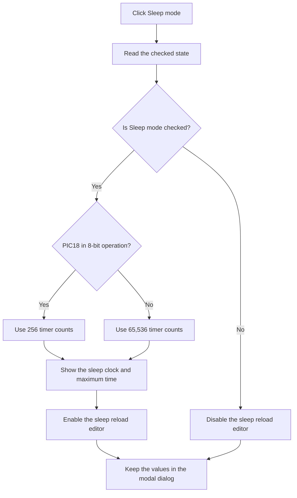

# Sleep mode

> Analysis status: Reviewed from the recovered handler, form state, and modal caller.

## Control

| Property | Recovered value |
| --- | --- |
| Form | dlgFlowchartInterruptPicTmr1 |
| Component path | dlgFlowchartInterruptPicTmr1.Cb_sleep |
| Control class | TCheckBox |
| Caption | Sleep mode |
| Hint | Not present in the recovered resource. |
| Text | Not present in the recovered resource. |
| Handler name | Cb_sleepClick |
| Handler address | 00fa4ff0 |
| Graph node | `resource:dfm:dlgFlowchartInterruptPicTmr1/dlgFlowchartInterruptPicTmr1.Cb_sleep` |
| Handler node | `function:00fa4ff0` |
| Graph layer | UI |

## What happens when clicked

The handler reads the new **Sleep mode** checked state. When the control is checked, it does these actions:

1. It changes the sleep-frequency label to the current sleep clock followed by `Hz (external)`.
2. It enables the sleep reload editor.
3. It calculates and displays the maximum sleep time. The calculation uses the maximum 1:8 prescaler and the current sleep clock. For the recovered PIC18 mode, it uses 65,536 counts for 16-bit operation and 256 counts for 8-bit operation. Other recovered modes use 65,536 counts.

When the control is clear, the handler disables the sleep reload editor. It does not clear the editor or its labels.

This click changes the dialog preview only. The OK handler stores the checked state and the parsed sleep reload value in the dialog record. The caller copies that record to the selected flowchart interrupt object only after modal result 1. This handler has no local error, retry, or message path.

## Click flow

## Handler evidence

- Source: [DecompiledSources/Tina16/functions/0000000000FA4FF0__FUN_00fa4ff0.c](../../../DecompiledSources/Tina16/functions/0000000000FA4FF0__FUN_00fa4ff0.c)
- Acceptance source: [DecompiledSources/Tina16/functions/0000000000FA28E0__FUN_00fa28e0.c](../../../DecompiledSources/Tina16/functions/0000000000FA28E0__FUN_00fa28e0.c)
- Modal caller: [DecompiledSources/Tina16/functions/0000000000FD1520__FUN_00fd1520.c](../../../DecompiledSources/Tina16/functions/0000000000FD1520__FUN_00fd1520.c)
- Recovered role: Update sleep-mode controls and timing preview.
- Current graph summary: Handles 1 Delphi UI event: dlgFlowchartInterruptPicTmr1.Cb_sleep.OnClick.
- Current graph behavior: Reads the sleep checkbox, enables or disables the reload editor, and refreshes the clock and maximum-time labels when enabled.
- Current graph evidence: The handler reads the checkbox at form field `+0x770`, changes the enabled state at `+0x788`, reads the sleep clock at `+0x868`, and writes the labels at `+0x7b0` and `+0x7a0`. Form creation supplies timer-count and prescaler constants. The OK handler and modal caller prove deferred acceptance.
- Complexity: complex
- Distinct outgoing calls: 8

## Direct calls

- `function:00414480` — Delphi UnicodeString clear and finalization helper
- `function:00414560` — Delphi UnicodeString array finalization helper
- `function:00416ba0` — FUN_00416ba0
- `function:00416cd0` — FUN_00416cd0
- `function:00448450` — FUN_00448450
- `function:0064dbe0` — FUN_0064dbe0
- `function:0064de00` — VCL control text setter with change suppression
- `function:00b8fd60` — FUN_00b8fd60

## Resource evidence

- Kind: Not present in the recovered resource.
- Modal result: Not present in the recovered resource.
- Checked state: Not present in the recovered resource.
- List items: Not present in the recovered resource.
- Image reference: Not present in the recovered resource.
- Extracted glyph: None.

## Nearby label candidates

Nearby labels are layout candidates only. They are not proof of behavior.

- Rank 1: Reload sleep at distance 32.
- Rank 2: Tmr1 prescaler rate:  at distance 196.
- Rank 3: Reload value:  at distance 217.

## Analysis limits

- The recovered source does not give Delphi names for the form fields. The DFM component order, event binding, control operations, labels, and shared form readers establish their roles.
- The click does not recalculate or validate the sleep reload value. Its `OnExit` handler and the OK path do that work.
