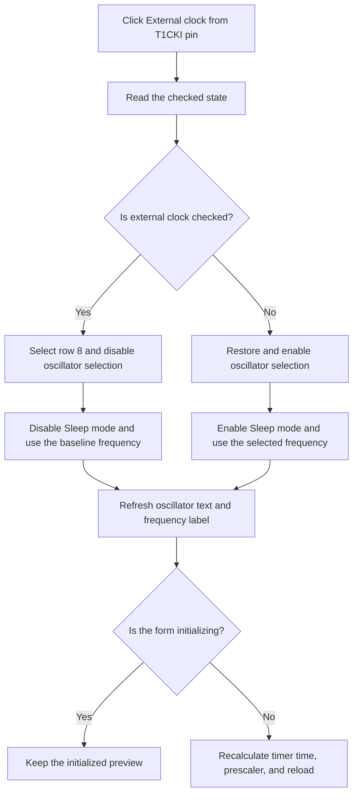

# External clock from T1CKI pin

> Analysis status: Reviewed from the recovered handler and form initialization path.

## Control

| Property | Recovered value |
| --- | --- |
| Form | dlgFlowchartInterruptPicTmr1 |
| Component path | dlgFlowchartInterruptPicTmr1.Ch_TMR1ClkS |
| Control class | TCheckBox |
| Caption | External clock from T1CKI pin |
| Hint | Not present in the recovered resource. |
| Text | Not present in the recovered resource. |
| Handler name | Ch_TMR1ClkSClick |
| Handler address | 00fa4d70 |
| Graph node | `resource:dfm:dlgFlowchartInterruptPicTmr1/dlgFlowchartInterruptPicTmr1.Ch_TMR1ClkS` |
| Handler node | `function:00fa4d70` |
| Graph layer | UI |

## What happens when clicked

The handler reads the new **External clock from T1CKI pin** state.

When the check box is clear, it enables the oscillator-source combo box, restores the saved oscillator row, marks the dialog clock-source flag as 1, and loads the frequency for that row from the form's frequency table. It also enables **Sleep mode**.

When the check box is checked, it selects oscillator row 8, disables that combo box, marks the clock-source flag as 0, restores the form's baseline frequency, and disables **Sleep mode**. The recovered row 8 resource text is `External oscillator`.

Both paths refresh the combo-box text and the displayed timer frequency. Outside form initialization, the handler also calls the time-change handler. That handler recalculates the maximum time, chooses a prescaler that can represent the requested time, and updates the reload value and actual-time label. An out-of-range time gets an `out of range` label and an empty reload value. This click has no local message, exception, retry, or rollback path.

## Click flow

## Handler evidence

- Source: [DecompiledSources/Tina16/functions/0000000000FA4D70__FUN_00fa4d70.c](../../../DecompiledSources/Tina16/functions/0000000000FA4D70__FUN_00fa4d70.c)
- Form initialization: [DecompiledSources/Tina16/functions/0000000000FA1560__FUN_00fa1560.c](../../../DecompiledSources/Tina16/functions/0000000000FA1560__FUN_00fa1560.c)
- Timer recalculation: [DecompiledSources/Tina16/functions/0000000000FA3F80__FUN_00fa3f80.c](../../../DecompiledSources/Tina16/functions/0000000000FA3F80__FUN_00fa3f80.c)
- Recovered role: Switch the Timer1 clock-source controls and recalculate the timer preview.
- Current graph summary: Handles 1 Delphi UI event: dlgFlowchartInterruptPicTmr1.Ch_TMR1ClkS.OnClick.
- Current graph behavior: Selects and enables the oscillator source for the checked state, updates the active clock frequency, changes Sleep mode availability, refreshes labels, and recalculates timer values outside initialization.
- Current graph evidence: The handler reads the check box at `+0x720`, changes the combo at `+0x760`, changes Sleep mode at `+0x770`, writes the source flag at `+0x890` and frequency at `+0x858`, and calls `FUN_00fa3f80` unless initialization byte `+0x874` is set. `FormShow` sets this byte around the same handler call.
- Complexity: complex
- Distinct outgoing calls: 7

## Direct calls

- `function:00414480` — Delphi UnicodeString clear and finalization helper
- `function:00414560` — Delphi UnicodeString array finalization helper
- `function:00416ba0` — FUN_00416ba0
- `function:00448450` — FUN_00448450
- `function:0064dbe0` — FUN_0064dbe0
- `function:0064de00` — VCL control text setter with change suppression
- `function:00fa3f80` — Handles 1 Delphi UI event: dlgFlowchartInterruptPicTmr1.GB_Data.FE_Time.OnChange.

## Resource evidence

- Kind: Not present in the recovered resource.
- Modal result: Not present in the recovered resource.
- Checked state: true
- List items: Not present in the recovered resource.
- Image reference: Not present in the recovered resource.
- Extracted glyph: None.

## Nearby label candidates

Nearby labels are layout candidates only. They are not proof of behavior.

- Rank 1: Reload sleep at distance 160.
- Rank 2: Reload value:  at distance 183.
- Rank 3: Tmr1 prescaler rate:  at distance 228.

## Analysis limits

- The recovered source does not name the source flag at `+0x890`. This article reports its exact stored values and does not invent a Delphi field name.
- The handler does not itself accept the dialog or write the caller's flowchart object.
