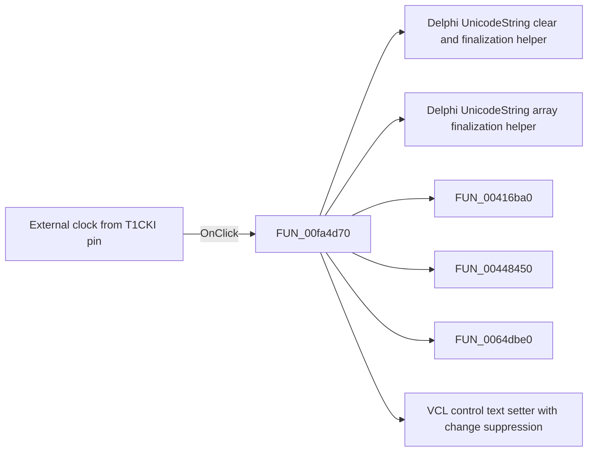

# External clock from T1CKI pin

> Analysis status: Pending individual source review.

## Control

| Property | Recovered value |
| --- | --- |
| Form | dlgFlowchartInterruptPicTmr1 |
| Component path | dlgFlowchartInterruptPicTmr1.Ch_TMR1ClkS |
| Control class | TCheckBox |
| Caption | External clock from T1CKI pin |
| Hint | Not present in the recovered resource. |
| Text | Not present in the recovered resource. |
| Handler name | Ch_TMR1ClkSClick |
| Handler address | 00fa4d70 |
| Graph node | `resource:dfm:dlgFlowchartInterruptPicTmr1/dlgFlowchartInterruptPicTmr1.Ch_TMR1ClkS` |
| Handler node | `function:00fa4d70` |
| Graph layer | UI |

## What happens when clicked

Pending individual analysis. An agent must read the recovered handler source and its relevant callees before it replaces this text.

## Click flow

## Handler evidence

- Source: [DecompiledSources/Tina16/functions/0000000000FA4D70__FUN_00fa4d70.c](../../../DecompiledSources/Tina16/functions/0000000000FA4D70__FUN_00fa4d70.c)
- Recovered role: Not present in the recovered resource.
- Current graph summary: Handles 1 Delphi UI event: dlgFlowchartInterruptPicTmr1.Ch_TMR1ClkS.OnClick.
- Current graph behavior: Not present in the recovered resource.
- Current graph evidence: Not present in the recovered resource.
- Complexity: complex
- Distinct outgoing calls: 7

## Direct calls

- `function:00414480` — Delphi UnicodeString clear and finalization helper
- `function:00414560` — Delphi UnicodeString array finalization helper
- `function:00416ba0` — FUN_00416ba0
- `function:00448450` — FUN_00448450
- `function:0064dbe0` — FUN_0064dbe0
- `function:0064de00` — VCL control text setter with change suppression
- `function:00fa3f80` — Handles 1 Delphi UI event: dlgFlowchartInterruptPicTmr1.GB_Data.FE_Time.OnChange.

## Resource evidence

- Kind: Not present in the recovered resource.
- Modal result: Not present in the recovered resource.
- Checked state: true
- List items: Not present in the recovered resource.
- Image reference: Not present in the recovered resource.
- Extracted glyph: None.

## Nearby label candidates

Nearby labels are layout candidates only. They are not proof of behavior.

- Rank 1: Reload sleep at distance 160.
- Rank 2: Reload value:  at distance 183.
- Rank 3: Tmr1 prescaler rate:  at distance 228.

## Analysis limits

- Do not infer behavior from the control class, caption, hint, glyph, or nearby label alone.
- Do not replace the pending status until the handler source and relevant call path provide enough evidence.
