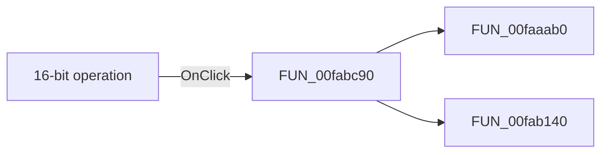

# 16-bit operation

> Analysis status: Pending individual source review.

## Control

| Property | Recovered value |
| --- | --- |
| Form | dlgFlowchartInterruptPicTmr2 |
| Component path | dlgFlowchartInterruptPicTmr2.GB_Data.bitszam1 |
| Control class | TCheckBox |
| Caption | 16-bit operation |
| Hint | Not present in the recovered resource. |
| Text | Not present in the recovered resource. |
| Handler name | bitszam1Click |
| Handler address | 00fabc90 |
| Graph node | `resource:dfm:dlgFlowchartInterruptPicTmr2/dlgFlowchartInterruptPicTmr2.GB_Data.bitszam1` |
| Handler node | `function:00fabc90` |
| Graph layer | UI |

## What happens when clicked

Pending individual analysis. An agent must read the recovered handler source and its relevant callees before it replaces this text.

## Click flow

## Handler evidence

- Source: [DecompiledSources/Tina16/functions/0000000000FABC90__FUN_00fabc90.c](../../../DecompiledSources/Tina16/functions/0000000000FABC90__FUN_00fabc90.c)
- Recovered role: Not present in the recovered resource.
- Current graph summary: Handles 1 Delphi UI event: dlgFlowchartInterruptPicTmr2.GB_Data.bitszam1.OnClick.
- Current graph behavior: Not present in the recovered resource.
- Current graph evidence: Not present in the recovered resource.
- Complexity: moderate
- Distinct outgoing calls: 2

## Direct calls

- `function:00faaab0` — Handles 1 Delphi UI event: dlgFlowchartInterruptPicTmr2.GB_Data.FE_STime.OnChange.
- `function:00fab140` — Handles 1 Delphi UI event: dlgFlowchartInterruptPicTmr2.GB_Data.Fe_Ptime.OnChange.

## Resource evidence

- Kind: Not present in the recovered resource.
- Modal result: Not present in the recovered resource.
- Checked state: Not present in the recovered resource.
- List items: Not present in the recovered resource.
- Image reference: Not present in the recovered resource.
- Extracted glyph: None.

## Nearby label candidates

Nearby labels are layout candidates only. They are not proof of behavior.

- Rank 1: Period time: at distance 24.
- Rank 2: Period time: at distance 48.
- Rank 3: Ptime_max: at distance 72.

## Analysis limits

- Do not infer behavior from the control class, caption, hint, glyph, or nearby label alone.
- Do not replace the pending status until the handler source and relevant call path provide enough evidence.
