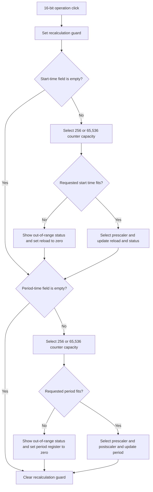

# 16-bit operation

## Control

| Property | Recovered value |
| --- | --- |
| Form | dlgFlowchartInterruptPicTmr2 |
| Component path | dlgFlowchartInterruptPicTmr2.GB_Data.bitszam1 |
| Control class | TCheckBox |
| Caption | 16-bit operation |
| Hint | Not present in the recovered resource. |
| Text | Not present in the recovered resource. |
| Handler name | bitszam1Click |
| Handler address | 00fabc90 |
| Graph node | `resource:dfm:dlgFlowchartInterruptPicTmr2/dlgFlowchartInterruptPicTmr2.GB_Data.bitszam1` |
| Handler node | `function:00fabc90` |
| Graph layer | UI |

## What happens when clicked

The click recalculates the timer start-time and period-time settings after the
check box changes state. It does not copy a check-box value to the caller's
settings record directly.

The handler first sets the form's recalculation guard at `+0x8A0`. It then
calls the same two functions that handle changes to `FE_STime` and `Fe_Ptime`.
The guard prevents these functions from resetting the prescaler at the start
of each calculation and prevents an uncontrolled cycle when one calculation
calls the other. The handler clears the guard after both calls.

Both calculation functions read the current `bitszam1` state from form field
`+0x800`. For processor-family code 8, an unchecked box selects a counter
capacity of 256 and a checked box selects 65,536. Processor-family code 1
always selects 256. Other recovered family codes select 65,536 without a
check-box decision. Thus, a click can have no capacity effect outside the
family-code-8 branch, although the two recalculation functions still run.

The start-time calculation reads `FE_STime`. If the field is empty, this part
does no calculation. Otherwise, it calculates the maximum start time from the
clock, counter capacity, and prescaler. If the requested time is too large, it
sets the start-time status to `out of range` and writes zero to `Edit_tmr2`.
If the time fits, it can increase the prescaler row until the counter value
fits. It then writes the reload value to `Edit_tmr2`, updates the start-time
status, and updates the prescaler display. A prescaler change also requests a
period recalculation.

The period-time calculation reads `Fe_Ptime`. If the field is empty, this part
does no calculation. Otherwise, it calculates the maximum period from the
clock, counter capacity, prescaler, and the 1-through-16 postscaler range. It
starts from postscaler row 0 and can increase the prescaler and postscaler rows
until the counter value fits. A value that is still too large sets the period
status to `out of range` and writes zero to `Edit_pr2`. A value that fits
updates `Edit_pr2`, the period-time status, and the displayed prescaler. A
prescaler change also requests a start-time recalculation.

The click does not raise a form-specific error and has no local catch, retry,
or rollback block. The recovered calculation paths report range failures in
labels and register edits. Empty time fields cause the related calculation to
return without an update.

## Click flow

## Handler evidence

- Click handler: [FUN_00fabc90](../../../DecompiledSources/Tina16/functions/0000000000FABC90__FUN_00fabc90.c)
- Start-time calculation: [FUN_00faaab0](../../../DecompiledSources/Tina16/functions/0000000000FAAAB0__FUN_00faaab0.c)
- Period-time calculation: [FUN_00fab140](../../../DecompiledSources/Tina16/functions/0000000000FAB140__FUN_00fab140.c)
- Form-show setup: [FUN_00fa7670](../../../DecompiledSources/Tina16/functions/0000000000FA7670__FUN_00fa7670.c)
- Recovered role: Recalculate Timer2, Timer3, Timer4, or Timer5 timing fields
  after the 16-bit-operation state changes.
- Complexity: moderate
- Distinct outgoing calls: 2

The DFM binds `bitszam1.OnClick` to `bitszam1Click` at `00fabc90`. The click
source writes one to guard byte `+0x8A0`, calls `00FAAAB0` and `00FAB140` with
the same form and event arguments, and then writes zero to the guard.

`FUN_00fa7670` reads the selected timer identity from the staged record. For
Timer3, Timer4, and Timer5, it looks for the related `PR3L`, `PR4L`, or `PR5L`
register in the loaded device include data. It enables and checks `bitszam1`
when that low register exists; otherwise, it disables and clears the control.
This setup confirms that the control selects a counter-width calculation path.

## Direct calls

- `function:00faaab0` - recalculate the start-time reload and prescaler from
  `FE_STime`.
- `function:00fab140` - recalculate the period register, prescaler, and
  postscaler from `Fe_Ptime`.

The two callees share the guard at `+0x8A0`. Each can call the other when it
changes the prescaler, which keeps the two requested times synchronized.

## Resource evidence

- `bitszam1` is a `TCheckBox` with caption `16-bit operation`.
- It is inside `GB_Data` with `FE_STime`, `Fe_Ptime`, `Edit_tmr2`, and
  `Edit_pr2`.
- The same group contains labels for frequency, start time, start-time maximum,
  period time, and period-time maximum.
- No glyph or hint is present.

## Nearby label candidates

The shared calculation functions and their control fields confirm the label
relationships. Distance alone is not the evidence.

- `Period time:` identifies the requested and calculated period fields.
- `Ptime_max:` identifies the period limit.
- `Start time:` identifies the requested and calculated start-time fields.

## Analysis limits

- The check box affects the counter-capacity branch only when the processor
  family code is 8. The recovered source does not name this family code.
- The click does not stage the check-box state in the Timer2/3/4/5 record. Its
  proven output is the set of recalculated control values.
- The source proves the formulas and control updates. It does not recover
  Delphi names for the calculation guard or intermediate numeric fields.
