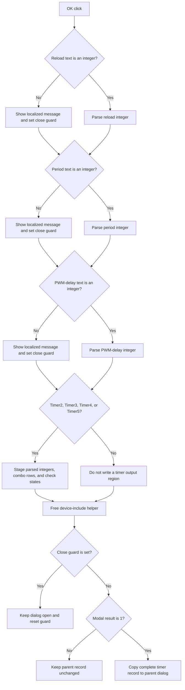

# OK

## Control

| Property | Recovered value |
| --- | --- |
| Form | dlgFlowchartInterruptPicTmr2 |
| Component path | dlgFlowchartInterruptPicTmr2.bOK |
| Control class | TBitBtn |
| Caption | Supplied by the recovered `bkOK` button kind. |
| Hint | Not present in the recovered resource. |
| Text | Not present in the recovered resource. |
| Handler name | bOKClick |
| Handler address | 00fa91b0 |
| Graph node | `resource:dfm:dlgFlowchartInterruptPicTmr2/dlgFlowchartInterruptPicTmr2.bOK` |
| Handler node | `function:00fa91b0` |
| Graph layer | UI |

## What happens when clicked

The click validates three integer edits and stages the complete timer and PWM
configuration for the selected Timer2, Timer3, Timer4, or Timer5 record.

The handler reads `Edit_tmr2`, `Edit_pr2`, and `Edit_PWM_DC`. Each field must
contain a decimal integer or an `H`-suffix hexadecimal integer. Valid text is
parsed. Invalid syntax opens the localized
`HDLStrings.Msg_FC_NotValidInt` message and sets the form's close guard at
`+0x838`. The handler continues to check the remaining fields. Thus, one click
can show more than one invalid-integer message.

After these checks, the selected timer identity at staged-record byte `+0x8B1`
chooses one of four output regions. The supported values are 3, 15, 16, and 17,
which the form-show source identifies as Timer2, Timer3, Timer4, and Timer5.
The handler writes the parsed reload, period, and PWM-delay integers to the
selected timer region. It also stores the current rows from the prescaler,
postscaler, ECCP mode, PWM mode, PWM least-significant-bit, auto-shutdown, and
shutdown-state combo boxes. Finally, it stores the steering and PWM-restart
check-box states.

The handler then frees the device-include helper that the form-show path
created. It does not copy the staged record to the parent dialog directly.
The OK control has kind `bkOK`. If the close guard is set, `FormCloseQuery`
denies the next close attempt and resets the guard. The parent handler
`FUN_00fd1520` remains inside the modal call, so it does not copy the record at
that point. After a later successful close, only modal result 1 copies the
complete child record back to the parent interrupt dialog. Cancel or a
different result keeps the parent's prior record.

A syntactically valid integer can still raise the parser's conversion exception
if its value does not fit the parser. The click handler has no local catch,
retry, fallback, or rollback block.

## Click flow

## Handler evidence

- Click handler: [FUN_00fa91b0](../../../DecompiledSources/Tina16/functions/0000000000FA91B0__FUN_00fa91b0.c)
- Integer-form validator: [FUN_00f60f00](../../../DecompiledSources/Tina16/functions/0000000000F60F00__FUN_00f60f00.c)
- Integer parser: [FUN_00f60f70](../../../DecompiledSources/Tina16/functions/0000000000F60F70__FUN_00f60f70.c)
- Recoverable-error helper: [FUN_00fa9140](../../../DecompiledSources/Tina16/functions/0000000000FA9140__FUN_00fa9140.c)
- Close guard: [FUN_00fa7650](../../../DecompiledSources/Tina16/functions/0000000000FA7650__FUN_00fa7650.c)
- Record initialization: [FUN_00fa7550](../../../DecompiledSources/Tina16/functions/0000000000FA7550__FUN_00fa7550.c)
- Form-show field mapping: [FUN_00fa7670](../../../DecompiledSources/Tina16/functions/0000000000FA7670__FUN_00fa7670.c)
- Parent modal coordinator: [FUN_00fd1520](../../../DecompiledSources/Tina16/functions/0000000000FD1520__FUN_00fd1520.c)
- Recovered role: Validate and stage a PIC timer and PWM configuration for
  modal acceptance.
- Complexity: complex
- Distinct outgoing calls: 10

`FUN_00fa7550` copies the parent record into the child form's staged record at
`+0x8B0`. `FUN_00fa7670` maps the Timer2, Timer3, Timer4, or Timer5 region into
the visible controls. `FUN_00fa91b0` performs the inverse operation. It writes
the visible control values back to the region for staged identity 3, 15, 16,
or 17.

`FUN_00fd1520` creates this form only for those four timer identities. It calls
`FUN_00fa7550`, shows the form modally, and copies the complete record from
child offset `+0x8B0` to the parent only when `ShowModal` returns 1. This is the
accepted-output boundary.

## Direct calls

- `function:0064dd90` - read Unicode text from `Edit_tmr2`, `Edit_pr2`, and
  `Edit_PWM_DC`.
- `function:00f60f00` - validate decimal or `H`-suffix hexadecimal integer
  syntax.
- `function:00f60f70` - parse each valid integer.
- `function:00b89270`, `function:0041ddd0`, and `function:00b8e650` - load the
  localized invalid-integer text.
- `function:00416cd0` - format the rejected input into the validation message.
- `function:00fa9140` - display the message and set the close guard.
- `function:00410f20` - free the device-include helper.
- `function:00414560` - finalize temporary Unicode strings.

## Resource evidence

- The form caption is `Timer2 Properties`.
- The OK control has kind `bkOK`. It has no recovered hint, custom glyph, or
  explicit modal-result property.
- The form contains `Edit_tmr2`, `Edit_pr2`, and `Edit_PWM_DC` edits.
- The form contains combo boxes for the timer prescaler and postscaler, ECCP1
  and ECCP2 modes, PWM output and least-significant bits, auto-shutdown,
  shutdown sources, and shutdown pin states.
- The form contains check boxes for steering synchronization, steering outputs
  A through D, and PWM restart.

## Nearby label candidates

The form-show source, click-handler field accesses, and resource layout confirm
the applicable labels. Distance alone is not the evidence.

- `PWM Delay Count bits` identifies `Edit_PWM_DC`.
- `Timer_n Output Postscaler Select bits` identifies `Cb_PostScaler`.
- The shutdown labels identify the related shutdown combo boxes, not the OK
  button itself.

## Analysis limits

- The invalid-syntax branches call the message helper but do not return before
  record staging. The recovered source does not assign a fallback to the local
  integer for an invalid field. The exact temporary value written for that
  field before the close guard keeps the dialog open is not recoverable from
  this decompilation. The parent record is not copied while the modal dialog
  remains open.
- The handler has no explicit range check after integer conversion. The valid
  device range for the three register fields is not established by this click
  source alone.
- A timer identity outside 3, 15, 16, and 17 writes no output region. The
  proven parent caller opens this form only for those four identities.
