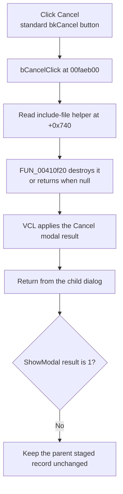

# Cancel

> Analysis status: Complete. The handler address was recovered from the raw Delphi published-method table.

## Control

| Property | Recovered value |
| --- | --- |
| Form | dlgflowchartInterruptPicUART |
| Component path | dlgflowchartInterruptPicUART.bCancel |
| Control class | TBitBtn |
| Caption | Supplied by the recovered `bkCancel` button kind. |
| Hint | Not present in the recovered resource. |
| Text | Not present in the recovered resource. |
| Handler name | bCancelClick |
| Handler address | `00faeb00` (manual published-method-table recovery) |
| Graph node | `resource:dfm:dlgflowchartInterruptPicUART/dlgflowchartInterruptPicUART.bCancel` |
| Generated handler node | `concept:dfm-handler:TdlgflowchartInterruptPicUART/bCancelClick` |
| Recovered function node | `function:00faeb00` |
| Graph layer | tina.exe |

## What happens when clicked

The standard `bkCancel` button path requests cancellation and calls `bCancelClick` at `00faeb00`. The handler reads the include-file helper at form offset `+0x740` and passes it to the nil-safe object destructor. If the field is null, the destructor returns without an operation. The handler then returns.

The click does not read or write the staged PIC UART parameter record. It does not validate an input, show a message, write a file, or call a hardware or code-generation path. It has no branch, retry, fallback, rollback, or local exception handler.

The parent modal coordinator creates this form for PIC UART receiver and transmitter interrupt kinds. It copies the complete child record back only when `ShowModal` returns `1`. A normal Cancel result is not `1`, so the parent keeps its prior staged record and destroys the child form.

## Click flow

## Handler evidence

- Handler source: [FUN_00faeb00](../../../DecompiledSources/Tina16/functions/0000000000FAEB00__FUN_00faeb00.c)
- Form-show source: [FUN_00faded0](../../../DecompiledSources/Tina16/functions/0000000000FADED0__FUN_00faded0.c)
- Dialog initializer: [FUN_00faddb0](../../../DecompiledSources/Tina16/functions/0000000000FADDB0__FUN_00faddb0.c)
- Parent modal coordinator: [FUN_00fd1520](../../../DecompiledSources/Tina16/functions/0000000000FD1520__FUN_00fd1520.c)
- Nil-safe destructor: [FUN_00410f20](../../../DecompiledSources/Tina16/functions/0000000000410F20__FUN_00410f20.c)
- Recovered role: Release the PIC UART include-file helper before modal cancellation.
- Complexity: simple.
- Distinct outgoing calls: 1.

The `TdlgFlowchartInterruptPicUART` VMT is based at `00face58`. Its class-name pointer at VMT offset `-0x88` points to the length-prefixed class string at `00fad6d8`. Its published-method-table pointer at VMT offset `-0x98` points to `00fad57d`. The `bCancelClick` record at `00fad645` contains code address `00faeb00`.

`FUN_00faded0` creates the include-file helper at `+0x740` during `FormShow`. `FUN_00faeb00` releases that same field. `FUN_00fd1520` creates this exact class through VMT pointer `00face58`, shows it modally, and copies the record at `+0x800` only after result `1`.

## Direct calls

- `function:00410f20` — nil-safe object destruction.

## Resource evidence

- Form caption: `PIC UART`.
- Kind: `bkCancel`.
- Modal result: Not present as a separate recovered DFM property.
- Image reference and extracted glyph: None.
- The parameter controls do not supply Cancel behavior; the recovered handler does.

## Nearby label candidates

Nearby labels are layout candidates only. They are not proof of behavior.

- Rank 1: `xxx` at distance 112.
- Rank 2: `xxx` at distance 141.
- Rank 3: `Text` at distance 160.

## Analysis limits

- The current generated graph still connects the DFM trigger to an unresolved concept. The raw RTTI table and recovered source establish `00faeb00`, but a later graph rebuild must update event resolution.
- The original Delphi name of the helper field at `+0x740` is not recovered. Its creation, use, and destruction establish its include-file helper role.
- The destructor can call the helper's virtual destroy method. The handler has no local exception handling for that call.
