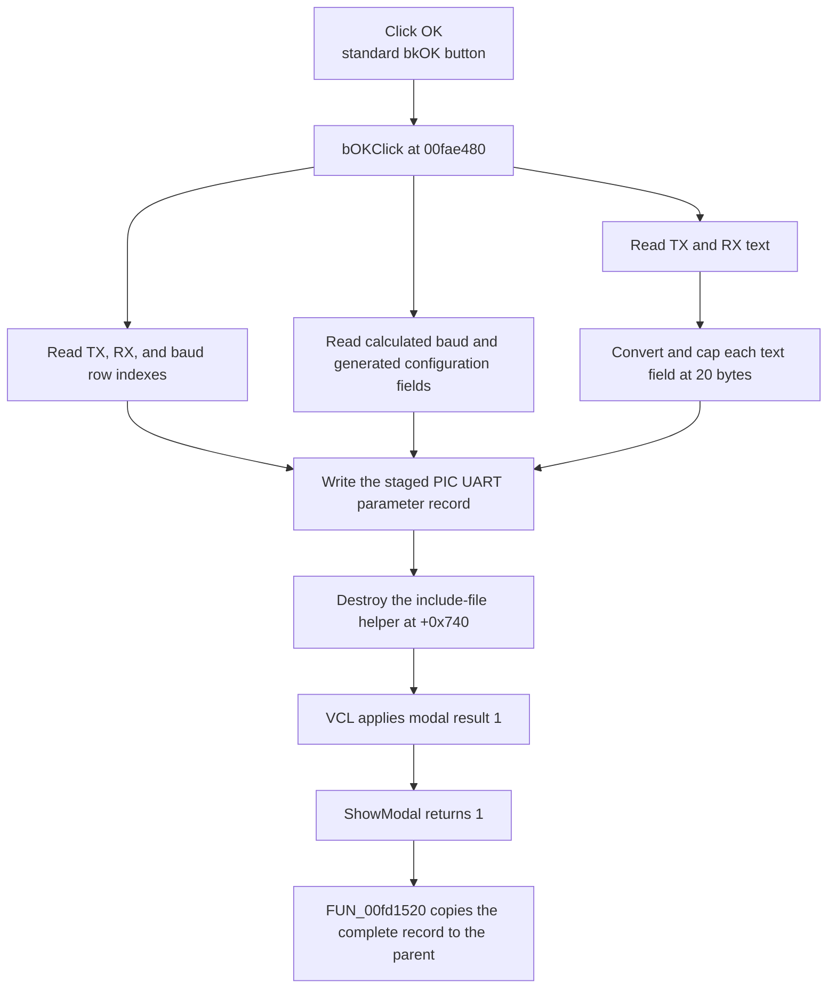

# OK

> Analysis status: Complete. The handler address was recovered from the raw Delphi published-method table.

## Control

| Property | Recovered value |
| --- | --- |
| Form | dlgflowchartInterruptPicUART |
| Component path | dlgflowchartInterruptPicUART.bOK |
| Control class | TBitBtn |
| Caption | Supplied by the recovered `bkOK` button kind. |
| Hint | Not present in the recovered resource. |
| Text | Not present in the recovered resource. |
| Handler name | bOKClick |
| Handler address | `00fae480` (manual published-method-table recovery) |
| Graph node | `resource:dfm:dlgflowchartInterruptPicUART/dlgflowchartInterruptPicUART.bOK` |
| Generated handler node | `concept:dfm-handler:TdlgflowchartInterruptPicUART/bOKClick` |
| Recovered function node | `function:00fae480` |
| Graph layer | tina.exe |

## What happens when clicked

The standard `bkOK` button path requests modal result `1` and calls `bOKClick` at `00fae480`. The handler updates the dialog's staged PIC UART parameter record. It does not write to the parent interrupt record directly.

The handler reads these controls:

- `Cb_data_bits_TX` and `Cb_data_bits_RX`, whose DFM rows are `8-bit` and `9-bit`;
- `Cb_baud`, whose DFM has 11 baud rows from `300` through `115.2k`;
- `usart_tx_text` and `usart_rx_text`.

It stores each data-bit row plus `8`, the raw TX, RX, and baud row indexes, and the selected baud value calculated by the form. It also stores the derived baud-register values and generated UART configuration fields that `FormShow` and `Cb_baudChange` maintain at form offsets `+0x7f0` through `+0x7fc`.

The handler gets both text values as Unicode strings, converts them to short strings, and copies at most 20 bytes into the staged record fields at `+0xa9d` and `+0xa88`. Longer converted text is truncated to this field limit. It then releases the include-file helper at `+0x740`.

There is no input-validation branch, message, retry, fallback, or rollback. The handler has no local exception block. If a control, conversion, or destructor call raises, the recovered function does not handle it locally and normal completion is not proven.

After normal result `1`, `FUN_00fd1520` copies the complete staged record from form offset `+0x800` back to the parent interrupt dialog. Cancel or another result skips that copy.

## Click flow

## Handler evidence

- Handler source: [FUN_00fae480](../../../DecompiledSources/Tina16/functions/0000000000FAE480__FUN_00fae480.c)
- Form-show source: [FUN_00faded0](../../../DecompiledSources/Tina16/functions/0000000000FADED0__FUN_00faded0.c)
- Baud calculation: [FUN_00fae6c0](../../../DecompiledSources/Tina16/functions/0000000000FAE6C0__FUN_00fae6c0.c)
- Dialog initializer: [FUN_00faddb0](../../../DecompiledSources/Tina16/functions/0000000000FADDB0__FUN_00faddb0.c)
- Parent modal coordinator: [FUN_00fd1520](../../../DecompiledSources/Tina16/functions/0000000000FD1520__FUN_00fd1520.c)
- Bounded short-string copy: [FUN_00415020](../../../DecompiledSources/Tina16/functions/0000000000415020__FUN_00415020.c)
- Recovered role: Stage PIC UART selections, generated register fields, and text for modal acceptance.
- Complexity: complex.
- Distinct outgoing calls: 5.

The `TdlgFlowchartInterruptPicUART` VMT is based at `00face58`. Its class-name pointer at VMT offset `-0x88` points to the length-prefixed class string at `00fad6d8`. Its published-method-table pointer at VMT offset `-0x98` points to `00fad57d`. The `bOKClick` record at `00fad5e0` contains code address `00fae480`.

The handler data flow establishes these staged-record writes:

| Destination | Recovered input |
| --- | --- |
| `+0xa58`, `+0xa5c` | TX and RX data-bit row plus 8 |
| `+0xa60` | Selected baud value |
| `+0xa68`, `+0xa6c`, `+0xa70` | Raw TX, RX, and baud row indexes |
| `+0xa74`, `+0xa78` | Derived high and low baud-register values |
| `+0xa7c`, `+0xa80`, `+0xa84` | Generated TX, RX, and baud configuration fields |
| `+0xa88`, `+0xa9d` | RX and TX text, each capped at 20 bytes |

`FUN_00faddb0` initializes the full record at `+0x800`. `FUN_00faded0` restores these selections and text values during `FormShow`. `FUN_00fae6c0` recalculates the baud-register fields when the baud row changes. `FUN_00fd1520` creates this exact class for PIC UART kinds `6` and `7` and copies the complete record only after result `1`.

## Direct calls

- `function:0064dd90` — get control text as a Unicode string.
- `function:00416910` — convert Unicode text to a bounded short string.
- `function:00415020` — copy at most 20 short-string bytes.
- `function:00410f20` — nil-safe helper destruction.
- `function:00414480` — finalize temporary Unicode strings.

The combo-box reads use indirect VCL virtual calls and do not appear as direct graph call edges.

## Resource evidence

- Form caption: `PIC UART`.
- Kind: `bkOK`.
- Data-bit rows: `8-bit` and `9-bit`.
- Baud rows: 11 entries from `300` through `115.2k`.
- The form contains separate TX and RX text controls and hidden generated-register edits.
- Image reference and extracted glyph: None.

## Nearby label candidates

The source identifies the controls used by the handler. Layout alone is not the evidence.

- Rank 1: `Text` at distance 73.
- Rank 2: `Baud rate` at distance 183.
- Rank 3: `xxx` at distance 191.

## Analysis limits

- The current generated graph still connects the DFM trigger to an unresolved concept. The raw RTTI table and recovered source establish `00fae480`, but a later graph rebuild must update event resolution.
- The original Delphi record field names are not recovered. This article uses exact form and record offsets plus the paired initialization and display paths.
- The handler does not range-check combo indexes. The DFM list styles and normal form initialization constrain the visible choices, but the handler has no guard for an invalid programmatic value.
- Text conversion can produce an empty short string when conversion fails. The handler does not show a message for that result.
