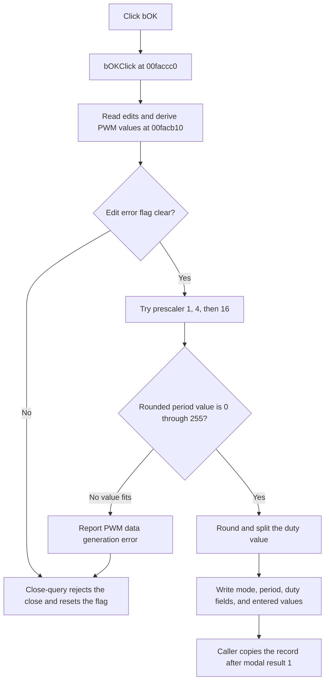

# bOK

> Analysis status: Evidence-backed source review complete.

## Control

| Property | Recovered value |
| --- | --- |
| Form | dlgFlowchartInterruptPWM |
| Component path | dlgFlowchartInterruptPWM.bOK |
| Control class | TBitBtn |
| Caption | Not present in the recovered resource. |
| Hint | Not present in the recovered resource. |
| Text | Not present in the recovered resource. |
| Handler name | bOKClick |
| Handler address | 00faccc0 |
| Graph node | `resource:dfm:dlgFlowchartInterruptPWM/dlgFlowchartInterruptPWM.bOK` |
| Handler node | `function:00faccc0` |
| Graph layer | UI |

## What happens when clicked

The click handler reads the PWM period and duty-cycle values from the two `TFloatEdit` controls. Its validation helper also reads the oscillator period from the dialog settings record. If the form error flag is clear, the helper tries the three recovered prescaler values `1`, `4`, and `16`. For each value, it calculates `round(PWM period / (4 * prescaler * oscillator period)) - 1`. It accepts the first result from `0` through `255`.

If no prescaler gives an 8-bit period value, the helper reports `Error in generation of PWM data`, sets the form error flag, and returns failure. The click handler does not write the output fields on this failure path. The form close-query handler also rejects the close while the error flag is set, and then resets the flag.

On success, the handler writes the derived PIC PWM configuration to the dialog's copied settings record. It converts prescaler `1`, `4`, or `16` to mode value `0`, `1`, or `2`. It stores the 8-bit period value. It then rounds `duty cycle / (prescaler * oscillator period)`, stores its upper bits after a two-bit right shift, and stores its two low bits in bit positions 5 and 4 of a second field. It also stores the entered PWM period and duty-cycle values.

The surrounding flowchart editor copies this record back only when the dialog returns modal result `1`. The recovered validation helper does not explicitly assign its return register when the edit error flag is already set before the prescaler calculation. Therefore, the exact handler branch after an edit-control error is not proven. The close-query error guard is proven.

## Click flow

## Handler evidence

- Source: [DecompiledSources/Tina16/functions/0000000000FACCC0__FUN_00faccc0.c](../../../DecompiledSources/Tina16/functions/0000000000FACCC0__FUN_00faccc0.c)
- Recovered role: Validates and commits PIC PWM period and duty-cycle settings.
- Current graph summary: Handles 1 Delphi UI event: dlgFlowchartInterruptPWM.bOK.OnClick.
- Current graph behavior: The checked-in graph does not yet include this review annotation.
- Current graph evidence: The handler calls the PWM derivation helper, maps prescaler values to mode values, encodes the rounded duty count, and writes the copied settings record only after the helper returns success.
- Complexity: moderate
- Distinct outgoing calls: 2

## Direct calls

- [`function:0040c770`](../../../DecompiledSources/Tina16/functions/000000000040C770__FUN_0040c770.c) — rounds the final duty count before the handler splits its bits.
- [`function:00facb10`](../../../DecompiledSources/Tina16/functions/0000000000FACB10__FUN_00facb10.c) — reads the two numeric edits, selects a prescaler, validates the period range, and derives the timer values.

Relevant downstream and state-consumer evidence:

- [`FUN_00faca70`](../../../DecompiledSources/Tina16/functions/0000000000FACA70__FUN_00faca70.c) passes the PWM error text and the form error flag to the shared first-error reporter.
- [`FormCloseQuery`](../../../DecompiledSources/Tina16/functions/0000000000FAC7B0__FUN_00fac7b0.c) allows closure only when the error flag is clear, and then resets the flag.
- [`FormShow`](../../../DecompiledSources/Tina16/functions/0000000000FAC7D0__FUN_00fac7d0.c) displays the oscillator frequency and maximum period and duty-cycle values, and loads the stored values into the two edits.
- [`FUN_00fd1520`](../../../DecompiledSources/Tina16/functions/0000000000FD1520__FUN_00fd1520.c) creates this dialog for interrupt type `4` and copies its settings record back only after modal result `1`.

## Resource evidence

- Kind: bkOK
- Modal result: Not present in the recovered resource.
- Checked state: Not present in the recovered resource.
- List items: Not present in the recovered resource.
- Image reference: Not present in the recovered resource.
- Extracted glyph: None.

## Nearby label candidates

Nearby labels are layout candidates only. They are not proof of behavior.

- Rank 1: Duty Cycle: at distance 100.
- Rank 2: PWM Period: at distance 163.
- Rank 3: Max Duty Cycle:  at distance 194.

## Analysis limits

- The recovered source does not give Delphi names to the copied settings-record fields.
- The DFM labels do not specify the units of the PWM period, duty cycle, or oscillator values. The formulas prove that the three values use compatible time units.
- The validator's return value is not explicit in the recovered C when the edit error flag is already set. This article does not claim which click-handler branch runs in that case.
