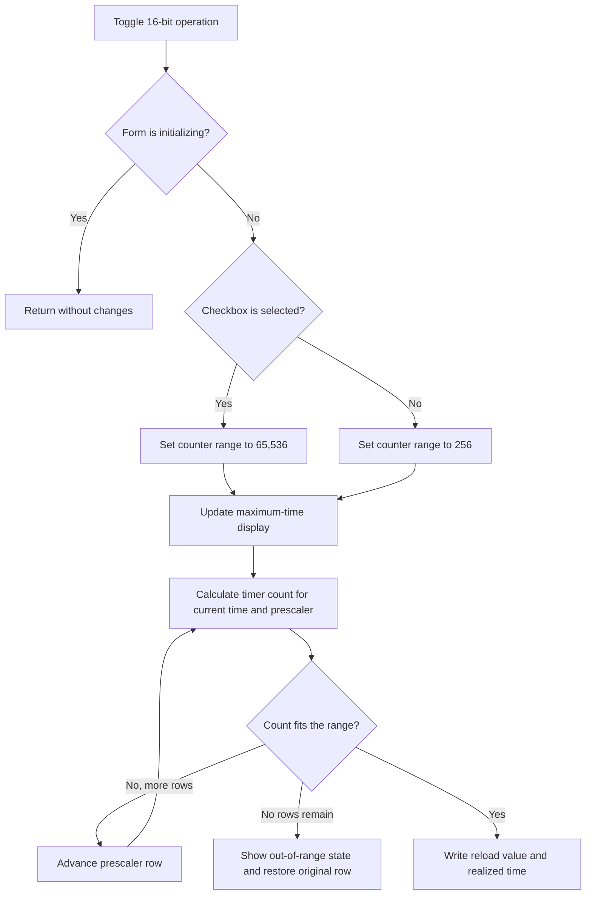

# 16-bit operation

## Control

| Property | Recovered value |
| --- | --- |
| Form | dlgFlowchartInterruptTmr0 |
| Component path | dlgFlowchartInterruptTmr0.bitszam |
| Control class | TCheckBox |
| Caption | 16-bit operation |
| Hint | Not present in the recovered resource. |
| Text | Not present in the recovered resource. |
| Handler name | bitszamClick |
| Handler address | 00f9fa90 |
| Graph node | `resource:dfm:dlgFlowchartInterruptTmr0/dlgFlowchartInterruptTmr0.bitszam` |
| Handler node | `function:00f9fa90` |
| Graph layer | UI |

## What happens when clicked

The click changes the working Timer0 counter range and recalculates the fields
that represent the requested time. If the form-initialization flag is set, the
handler returns without a change.

When `16-bit operation` is checked, the handler sets the counter range to
65,536. When it is clear, the handler sets the range to 256. It uses one
quarter of the supplied clock frequency and a maximum prescaler factor of 256
to calculate and display the new `Time max` value.

The handler then tries to keep the current value from the `Time` editor. It
starts at the current prescaler row. If the rounded timer count does not fit
the new counter range, it advances the prescaler row and calculates again. It
stops when the count fits or when it reaches the last recovered row.

If the count fits, the handler writes `counter range - rounded count` to the
`Reload value` editor. It also displays the time that the selected prescaler
and integer reload value produce. The selected prescaler row remains at the
first row that fits.

If no tested row fits, the handler displays `Time: Out of range`, replaces the
reload text with a built-in value whose text is not recovered, and restores
the original prescaler row. The changed 8-bit or 16-bit working range remains
active. The handler does not show a message dialog and does not raise a
form-specific validation exception.

This click changes only working controls and form fields. The OK handler later
stages the check state, prescaler row, and reload value. The parent interrupt
dialog receives that record only after modal result 1.

## Click flow

## Handler evidence

- Handler source: [FUN_00f9fa90](../../../DecompiledSources/Tina16/functions/0000000000F9FA90__FUN_00f9fa90.c)
- Form-show initialization: [FUN_00f9d8b0](../../../DecompiledSources/Tina16/functions/0000000000F9D8B0__FUN_00f9d8b0.c)
- Time-to-reload synchronizer: [FUN_00f9e8b0](../../../DecompiledSources/Tina16/functions/0000000000F9E8B0__FUN_00f9e8b0.c)
- Reload normalizer: [FUN_00f9f050](../../../DecompiledSources/Tina16/functions/0000000000F9F050__FUN_00f9f050.c)
- OK staging handler: [FUN_00f9e510](../../../DecompiledSources/Tina16/functions/0000000000F9E510__FUN_00f9e510.c)
- Parent parameter editor: [FUN_00fd1520](../../../DecompiledSources/Tina16/functions/0000000000FD1520__FUN_00fd1520.c)
- Recovered role: Recalculate Timer0 range, prescaler, reload, and time after a
  counter-width change.
- Complexity: complex
- Distinct outgoing calls: 9

The DFM binds `dlgFlowchartInterruptTmr0.bitszam.OnClick` to `bitszamClick` at
`00f9fa90`. The handler reads the checkbox at form field `+0x730`, writes the
working range at `+0x784`, reads `FE_Time` at `+0x700`, changes
`cbPrescaler.ItemIndex` at `+0x718`, writes `eReload` at `+0x728`, and updates
the time labels at `+0x6D8` and `+0x6F0`. Field `+0x788` is the initialization
guard.

The prescaler-value table starts at `+0x760`. `FormShow` fills it with powers
of two and initializes the working controls from the staged record. The OK
handler is the proven later writer from these working values to the staged
record.

## Direct calls

- `function:00b90090` - read the numeric value from `FE_Time`.
- `function:00468860` and `function:00462650` - calculate and round the timer
  count.
- `function:00f61040` - format the reload integer.
- `function:00b8fd60` - format maximum and realized time values.
- `function:00416ba0` - add the `Time max` or `Time` prefix.
- `function:0064de00` - update labels and reload text.
- `function:00460ba0` and `function:00414560` - finalize temporary values.

## Resource evidence

- The checkbox caption is `16-bit operation`.
- The `Timer data` group supplies `Frequency`, `Time max`, and `Time` fields.
- The `Registers` group supplies the TMR0 prescaler rows from `1:1` through
  `1:256` and the reload editor.
- The checkbox has no recovered hint, image, or glyph.

## Nearby label candidates

No same-parent label candidate is available. The handler's direct field reads
and writes connect this checkbox to the nested timer and register controls.

## Analysis limits

- The built-in reload text used after an out-of-range result is not decoded in
  the recovered source.
- The source does not give a recovered unit name for the formatted time.
- This handler recalculates working UI state. It does not save or apply the
  parent interrupt record.
