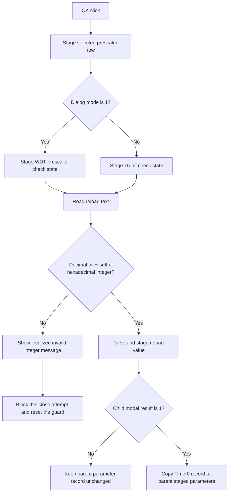

# OK

## Control

| Property | Recovered value |
| --- | --- |
| Form | dlgFlowchartInterruptTmr0 |
| Component path | dlgFlowchartInterruptTmr0.bOK |
| Control class | TBitBtn |
| Caption | Supplied by the recovered `bkOK` button kind. |
| Hint | Not present in the recovered resource. |
| Text | Not present in the recovered resource. |
| Handler name | bOKClick |
| Handler address | 00f9e510 |
| Graph node | `resource:dfm:dlgFlowchartInterruptTmr0/dlgFlowchartInterruptTmr0.bOK` |
| Handler node | `function:00f9e510` |
| Graph layer | UI |

## What happens when clicked

The click validates and stages the current Timer0 settings for modal
acceptance. It first copies the selected `cbPrescaler` row to the staged
parameter record. It then stages one check-box value. Dialog mode 1 uses
`cbWDT`; the other recovered mode uses `bitszam`.

The handler reads `eReload` and accepts nonempty decimal digits or an
`H`-suffix hexadecimal integer. If the text is valid, the handler parses it
and stores the integer in the staged record. This click path has no explicit
reload-range check.

If the text is not a supported integer form, the handler builds the localized
`HDLStrings.Msg_FC_NotValidInt` text with the rejected input. It shows a VCL
message dialog and sets the form's close-guard byte. `FormCloseQuery` then
rejects that close attempt and resets the guard. The prescaler row and check
state have already been staged, but the previous staged reload value remains.

The button has kind `bkOK`. The parent parameter editor in `FUN_00fd1520`
shows this child dialog modally. Only child modal result 1 copies the accepted
Timer0 parameter record to the parent interrupt dialog's staged record. Cancel
or another result leaves the parent record unchanged. This click does not
write the final flowchart interrupt object or save a project.

The recovered handler has no local catch, retry, fallback, or rollback block.
The invalid-text path uses the one-close-attempt guard instead of raising a
form-specific exception.

## Click flow

## Handler evidence

- Handler source: [FUN_00f9e510](../../../DecompiledSources/Tina16/functions/0000000000F9E510__FUN_00f9e510.c)
- Integer-form validator: [FUN_00f60f00](../../../DecompiledSources/Tina16/functions/0000000000F60F00__FUN_00f60f00.c)
- Integer parser: [FUN_00f60f70](../../../DecompiledSources/Tina16/functions/0000000000F60F70__FUN_00f60f70.c)
- Validation-message helper: [FUN_00f9e4a0](../../../DecompiledSources/Tina16/functions/0000000000F9E4A0__FUN_00f9e4a0.c)
- Close guard: [FUN_00f9d890](../../../DecompiledSources/Tina16/functions/0000000000F9D890__FUN_00f9d890.c)
- Form initialization: [FUN_00f9d790](../../../DecompiledSources/Tina16/functions/0000000000F9D790__FUN_00f9d790.c)
- Parent parameter editor: [FUN_00fd1520](../../../DecompiledSources/Tina16/functions/0000000000FD1520__FUN_00fd1520.c)
- Recovered role: Validate and stage Timer0 interrupt parameters for modal
  acceptance.
- Complexity: complex
- Distinct outgoing calls: 9

The DFM binds `dlgFlowchartInterruptTmr0.bOK.OnClick` to `bOKClick` at
`00f9e510` and assigns kind `bkOK`. The handler copies working prescaler row
`+0x758` to staged field `+0x7D8`. It writes the selected check state to
`+0x7DC` and a valid parsed reload value to `+0x7E0`. Mode field `+0x748`
selects the check box.

`FUN_00f9d790` loads the child form's managed parameter record before the
dialog opens. `FUN_00fd1520` copies the child result back only when
`ShowModal` returns 1. This establishes the accepted-output boundary.

## Direct calls

- `function:0064dd90` - read Unicode text from `eReload`.
- `function:00f60f00` - accept decimal or `H`-suffix hexadecimal integer
  syntax.
- `function:00f60f70` - parse the accepted integer text.
- `function:00b89270`, `function:0041ddd0`, and `function:00b8e650` - load
  the localized invalid-integer text.
- `function:00416cd0` - add the rejected input to the message.
- `function:00f9e4a0` - show the message and set the close guard.
- `function:00414560` - finalize temporary Unicode strings.

## Resource evidence

- The form caption is `Timer0 Properties`.
- The `Registers` group contains the `TMR0 prescaler rate` combo and `Reload
  value` editor.
- The OK control has kind `bkOK`. It has no recovered hint, image, or custom
  glyph.

## Nearby label candidates

No same-parent label candidate is available for the button. The nested control
tree and handler field reads establish the prescaler and reload inputs.

## Analysis limits

- This handler checks integer syntax but does not check that the parsed reload
  value fits the current 8-bit or 16-bit counter range.
- The numeric processor mode does not have a recovered Delphi enumeration
  name. The source only proves that mode 1 uses `cbWDT` and the other branch
  uses `bitszam`.
- The outer flowchart-object commit and persistence paths are outside this
  child-dialog click.
