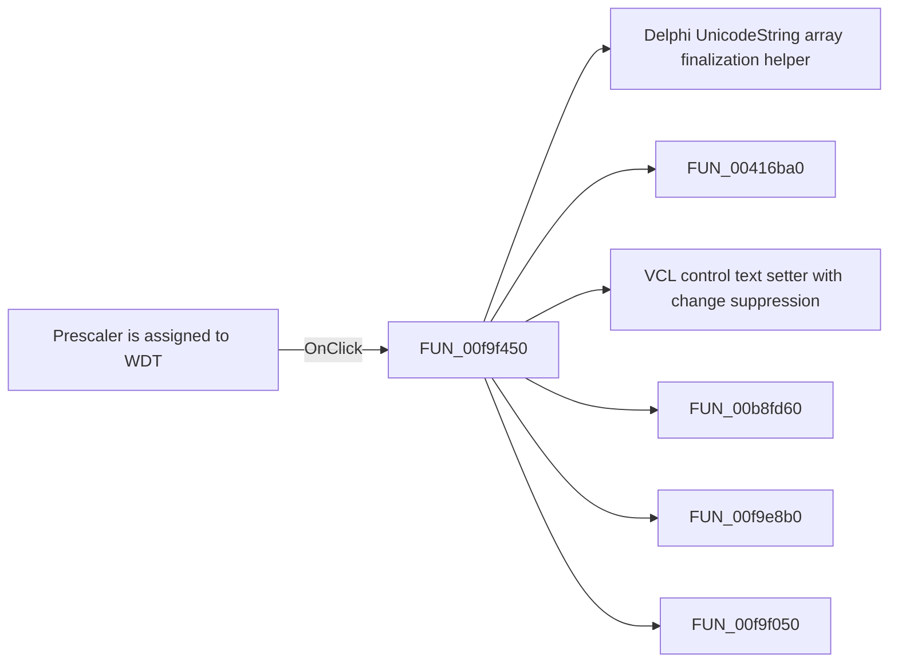

# Prescaler is assigned to WDT

> Analysis status: Pending individual source review.

## Control

| Property | Recovered value |
| --- | --- |
| Form | dlgFlowchartInterruptTmr0 |
| Component path | dlgFlowchartInterruptTmr0.cbWDT |
| Control class | TCheckBox |
| Caption | Prescaler is assigned to WDT |
| Hint | Not present in the recovered resource. |
| Text | Not present in the recovered resource. |
| Handler name | cbWDTClick |
| Handler address | 00f9f450 |
| Graph node | `resource:dfm:dlgFlowchartInterruptTmr0/dlgFlowchartInterruptTmr0.cbWDT` |
| Handler node | `function:00f9f450` |
| Graph layer | UI |

## What happens when clicked

Pending individual analysis. An agent must read the recovered handler source and its relevant callees before it replaces this text.

## Click flow

## Handler evidence

- Source: [DecompiledSources/Tina16/functions/0000000000F9F450__FUN_00f9f450.c](../../../DecompiledSources/Tina16/functions/0000000000F9F450__FUN_00f9f450.c)
- Recovered role: Not present in the recovered resource.
- Current graph summary: Handles 1 Delphi UI event: dlgFlowchartInterruptTmr0.cbWDT.OnClick.
- Current graph behavior: Not present in the recovered resource.
- Current graph evidence: Not present in the recovered resource.
- Complexity: complex
- Distinct outgoing calls: 6

## Direct calls

- `function:00414560` — Delphi UnicodeString array finalization helper
- `function:00416ba0` — FUN_00416ba0
- `function:0064de00` — VCL control text setter with change suppression
- `function:00b8fd60` — FUN_00b8fd60
- `function:00f9e8b0` — Handles 1 Delphi UI event: dlgFlowchartInterruptTmr0.GBtimer0data.FE_Time.OnChange.
- `function:00f9f050` — Handles 1 Delphi UI event: dlgFlowchartInterruptTmr0.GB_Register.eReload.OnExit.

## Resource evidence

- Kind: Not present in the recovered resource.
- Modal result: Not present in the recovered resource.
- Checked state: Not present in the recovered resource.
- List items: Not present in the recovered resource.
- Image reference: Not present in the recovered resource.
- Extracted glyph: None.

## Nearby label candidates

Nearby labels are layout candidates only. They are not proof of behavior.

- No same-parent label candidate is available.

## Analysis limits

- Do not infer behavior from the control class, caption, hint, glyph, or nearby label alone.
- Do not replace the pending status until the handler source and relevant call path provide enough evidence.
