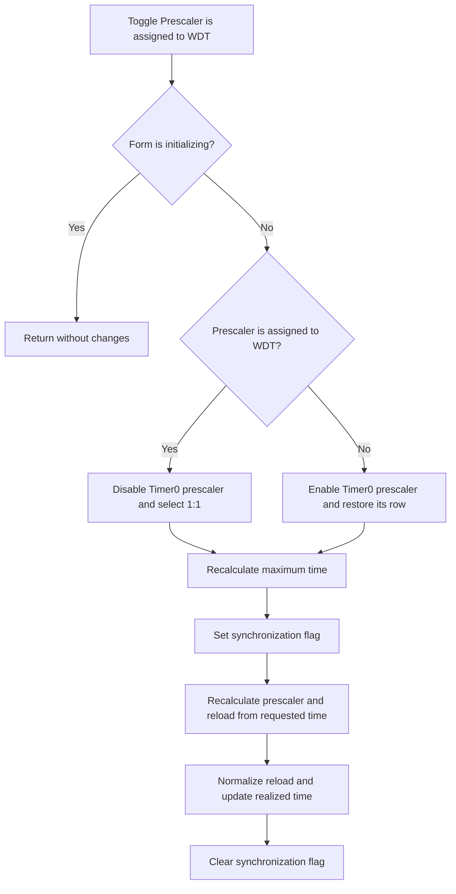

# Prescaler is assigned to WDT

## Control

| Property | Recovered value |
| --- | --- |
| Form | dlgFlowchartInterruptTmr0 |
| Component path | dlgFlowchartInterruptTmr0.cbWDT |
| Control class | TCheckBox |
| Caption | Prescaler is assigned to WDT |
| Hint | Not present in the recovered resource. |
| Text | Not present in the recovered resource. |
| Handler name | cbWDTClick |
| Handler address | 00f9f450 |
| Graph node | `resource:dfm:dlgFlowchartInterruptTmr0/dlgFlowchartInterruptTmr0.cbWDT` |
| Handler node | `function:00f9f450` |
| Graph layer | UI |

## What happens when clicked

The click changes whether Timer0 can use the shared prescaler. If the
form-initialization flag is set, the handler returns without a change.

When `Prescaler is assigned to WDT` is checked, the handler changes the first
eight prescaler rows to `1:1` through `1:128`, sets the current text to `1:1`,
and disables the TMR0 prescaler combo. It uses an effective Timer0 prescaler
factor of 1 for the next calculations.

When the checkbox is clear, the handler changes the first eight rows to `1:2`
through `1:256`, enables the combo, and restores its text from the saved
Timer0 prescaler row. It uses 256 as the maximum prescaler factor for the
maximum-time calculation.

The handler recalculates the `Time max` label from the supplied clock, current
counter range, and selected branch. It then sets a synchronization flag and
calls the existing time-change and reload-exit handlers. These handlers adjust
the prescaler, reload text, realized-time label, and numeric time value so that
the fields agree with the new WDT-prescaler state. The handler clears the flag
after both calls.

The called synchronization paths can display `Time: out of range`, replace an
invalid reload value with the largest value that fits the counter range, and
show the localized `HDLStrings.Msg_FC_invalid_reload` text. This click does not
show a separate message dialog and has no local catch, retry, fallback, or
rollback block.

This click changes working controls and form fields only. The OK handler later
stages the WDT check state, prescaler row, and reload value. The parent
interrupt dialog receives that record only after modal result 1.

## Click flow

## Handler evidence

- Handler source: [FUN_00f9f450](../../../DecompiledSources/Tina16/functions/0000000000F9F450__FUN_00f9f450.c)
- Time-to-reload synchronizer: [FUN_00f9e8b0](../../../DecompiledSources/Tina16/functions/0000000000F9E8B0__FUN_00f9e8b0.c)
- Reload normalizer: [FUN_00f9f050](../../../DecompiledSources/Tina16/functions/0000000000F9F050__FUN_00f9f050.c)
- Form-show initialization: [FUN_00f9d8b0](../../../DecompiledSources/Tina16/functions/0000000000F9D8B0__FUN_00f9d8b0.c)
- OK staging handler: [FUN_00f9e510](../../../DecompiledSources/Tina16/functions/0000000000F9E510__FUN_00f9e510.c)
- Parent parameter editor: [FUN_00fd1520](../../../DecompiledSources/Tina16/functions/0000000000FD1520__FUN_00fd1520.c)
- Recovered role: Configure Timer0 prescaler availability and resynchronize
  timer fields after a WDT assignment change.
- Complexity: complex
- Distinct outgoing calls: 6

The DFM binds `dlgFlowchartInterruptTmr0.cbWDT.OnClick` to `cbWDTClick` at
`00f9f450`. The handler reads `cbWDT` at form field `+0x6C8`, changes
`cbPrescaler` at `+0x718`, updates the maximum-time label at `+0x6D8`, and
uses form flag `+0x74C` while it calls `FUN_00f9e8b0` and `FUN_00f9f050`.
Field `+0x788` is the initialization guard. Working counter range `+0x784`
comes from the active timer mode.

`FUN_00f9e510` is the proven later writer of `cbWDT.Checked`, the prescaler
row, and reload value to the staged record. `FUN_00fd1520` copies the child
record to the parent only for modal result 1.

## Direct calls

- The `cbPrescaler` VCL methods enable or disable the combo, replace its row
  text, restore a saved row, and set the current text.
- `function:00b8fd60` - format the maximum-time value.
- `function:00416ba0` - add the `Time max` prefix.
- `function:0064de00` - update the combo text and maximum-time label.
- `function:00f9e8b0` - derive a prescaler row and reload value from the
  requested time.
- `function:00f9f050` - constrain reload and update the realized time.
- `function:00414560` - finalize temporary Unicode strings.

## Resource evidence

- The checkbox caption is `Prescaler is assigned to WDT`.
- The `Registers` group identifies the `TMR0 prescaler rate` combo and its
  initial rows from `1:1` through `1:256`.
- The `Timer data` group identifies the maximum-time, time, and frequency
  displays.
- The checkbox has no recovered hint, image, or glyph.

## Nearby label candidates

No same-parent label candidate is available. The handler's direct control
accesses connect this checkbox to the nested prescaler, reload, and timer
controls.

## Analysis limits

- The numeric dialog mode that enables this WDT branch does not have a
  recovered Delphi enumeration name.
- The source does not give a recovered unit name for the formatted time.
- This handler recalculates working UI state. It does not save or apply the
  parent interrupt record.
