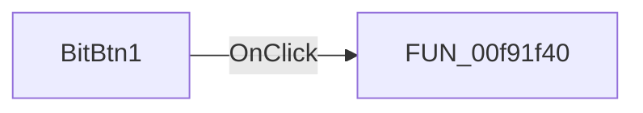

# BitBtn1

> Analysis status: Pending individual source review.

## Control

| Property | Recovered value |
| --- | --- |
| Form | dlgFlowChartOptions |
| Component path | dlgFlowChartOptions.BitBtn1 |
| Control class | TBitBtn |
| Caption | Not present in the recovered resource. |
| Hint | Not present in the recovered resource. |
| Text | Not present in the recovered resource. |
| Handler name | BitBtn1Click |
| Handler address | 00f91f40 |
| Graph node | `resource:dfm:dlgFlowChartOptions/dlgFlowChartOptions.BitBtn1` |
| Handler node | `function:00f91f40` |
| Graph layer | UI |

## What happens when clicked

Pending individual analysis. An agent must read the recovered handler source and its relevant callees before it replaces this text.

## Click flow

## Handler evidence

- Source: [DecompiledSources/Tina16/functions/0000000000F91F40__FUN_00f91f40.c](../../../DecompiledSources/Tina16/functions/0000000000F91F40__FUN_00f91f40.c)
- Recovered role: Flowchart color-options commit handler
- Current graph summary: Commits the preview label's body color to the global flowchart setting. Handles 1 Delphi UI event: dlgFlowChartOptions.BitBtn1.OnClick.
- Current graph behavior: Commits the preview label's body color to the global flowchart setting.
- Current graph evidence: The dialog OK-button path reads the same preview label color and writes it to global flowchart setting offset 4.
- Complexity: simple
- Distinct outgoing calls: 0

## Direct calls

- No direct call edge is present in the recovered graph.

## Resource evidence

- Kind: bkOK
- Modal result: Not present in the recovered resource.
- Checked state: Not present in the recovered resource.
- List items: Not present in the recovered resource.
- Image reference: Not present in the recovered resource.
- Extracted glyph: None.

## Nearby label candidates

Nearby labels are layout candidates only. They are not proof of behavior.

- Rank 1: Body:  at distance 74.
- Rank 2: Color at distance 137.

## Analysis limits

- Do not infer behavior from the control class, caption, hint, glyph, or nearby label alone.
- Do not replace the pending status until the handler source and relevant call path provide enough evidence.
