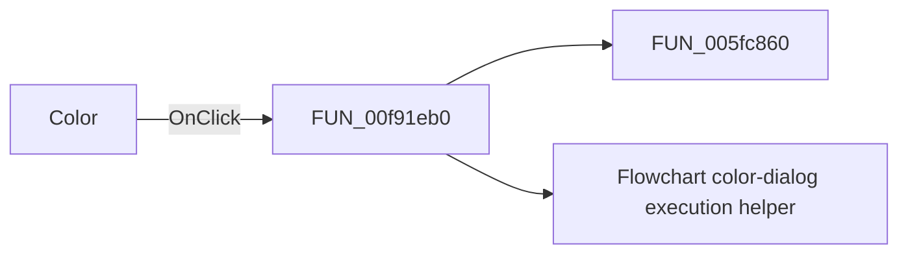

# Color

> Analysis status: Pending individual source review.

## Control

| Property | Recovered value |
| --- | --- |
| Form | dlgFlowChartOptions |
| Component path | dlgFlowChartOptions.lSetBodyColor |
| Control class | TLabel |
| Caption | Color |
| Hint | Click here to set the color |
| Text | Not present in the recovered resource. |
| Handler name | lSetBodyColorClick |
| Handler address | 00f91eb0 |
| Graph node | `resource:dfm:dlgFlowChartOptions/dlgFlowChartOptions.lSetBodyColor` |
| Handler node | `function:00f91eb0` |
| Graph layer | UI |

## What happens when clicked

Pending individual analysis. An agent must read the recovered handler source and its relevant callees before it replaces this text.

## Click flow

## Handler evidence

- Source: [DecompiledSources/Tina16/functions/0000000000F91EB0__FUN_00f91eb0.c](../../../DecompiledSources/Tina16/functions/0000000000F91EB0__FUN_00f91eb0.c)
- Recovered role: Flowchart body-color preview click handler
- Current graph summary: Opens the form's color dialog with the current flowchart body color. When accepted, it applies the selected color to the Color label preview. Handles 1 Delphi UI event: dlgFlowChartOptions.lSetBodyColor.OnClick.
- Current graph behavior: Opens the form's color dialog with the current flowchart body color. When accepted, it applies the selected color to the Color label preview.
- Current graph evidence: The clickable Color label has hint Click here to set the color and is next to Body. This handler uses global body-color offset 4 and updates the preview only; the dialog OK handler commits it.
- Complexity: moderate
- Distinct outgoing calls: 2

## Direct calls

- `function:005fc860` — FUN_005fc860
- `function:00f91e80` — Flowchart color-dialog execution helper

## Resource evidence

- Kind: Not present in the recovered resource.
- Modal result: Not present in the recovered resource.
- Checked state: Not present in the recovered resource.
- List items: Not present in the recovered resource.
- Image reference: Not present in the recovered resource.
- Extracted glyph: None.

## Nearby label candidates

Nearby labels are layout candidates only. They are not proof of behavior.

- Rank 1: Color at distance 0.
- Rank 2: Body:  at distance 63.

## Analysis limits

- Do not infer behavior from the control class, caption, hint, glyph, or nearby label alone.
- Do not replace the pending status until the handler source and relevant call path provide enough evidence.
