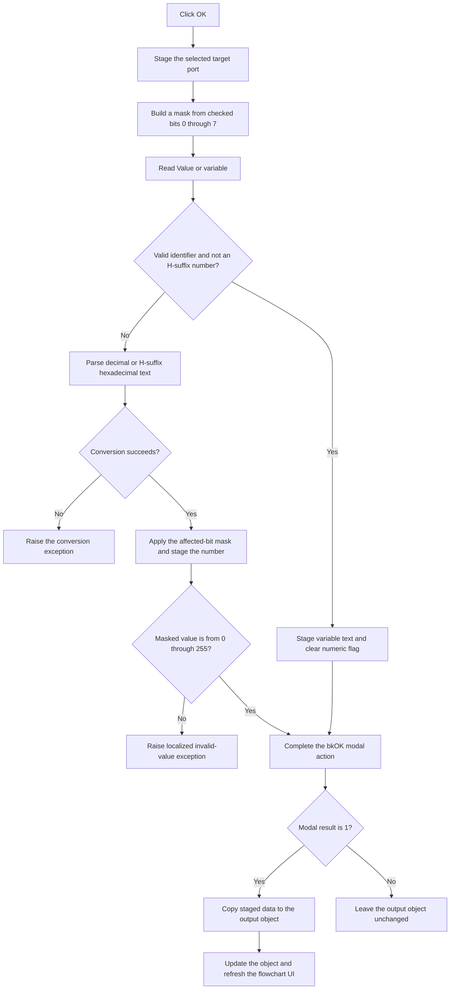

# bOK

> Analysis status: Reviewed from recovered source and UI evidence.

## Control

| Property | Recovered value |
| --- | --- |
| Form | dlgFlowChartOutput |
| Component path | dlgFlowChartOutput.bOK |
| Control class | TBitBtn |
| Caption | Not present in the recovered resource. |
| Hint | Not present in the recovered resource. |
| Text | Not present in the recovered resource. |
| Handler name | bOKClick |
| Handler address | 00f96d90 |
| Graph node | `resource:dfm:dlgFlowChartOutput/dlgFlowChartOutput.bOK` |
| Handler node | `function:00f96d90` |
| Graph layer | UI |

## What happens when clicked

The click validates and stages the three parts of a flowchart output operation:

1. The selected `cbPortList` item becomes the target port.
2. The checked rows in `cbMask` become an affected-bit mask. Rows 0 through 7 set bits 0 through 7.
3. The text in `eValue` becomes either a variable name or an integer value.

The value text is a variable when it is a valid identifier and is not also an `H`-suffix hexadecimal number. An identifier must be nonempty, start with an ASCII letter or underscore, and contain only ASCII letters, digits, or underscores. The handler stores variable text at form offset `0x708` and clears the numeric-value flag at `0x718`.

All other value text goes to the integer parser. The parser accepts decimal text and hexadecimal text with a final `H`. It converts lower-case text to upper case before the hexadecimal test. The handler sets the numeric-value flag, applies the affected-bit mask to the parsed value, and stores the result at `0x710`. If no bit is checked, the mask is zero and a numeric input becomes zero. The handler does not reject this case.

The source has a final range guard for values outside 0 through 255. That guard builds and raises a localized `HDLStrings.Msg_FC_InvValue` exception. The recovered eight-item mask normally limits the stored numeric result to this range. Text that the integer parser cannot convert raises its normal conversion exception. The click handler has no local catch or rollback block.

The button has kind `bkOK`. After normal modal acceptance, caller `FUN_01050e50` copies the staged target port, variable text or numeric value, value-type flag, and bit mask to the flowchart output object. It then calls the object's update method and refreshes the flowchart UI. Cancel or any modal result other than 1 skips this copy and refresh path.

## Click flow

## Handler evidence

- Handler source: [FUN_00f96d90](../../../DecompiledSources/Tina16/functions/0000000000F96D90__FUN_00f96d90.c)
- Bit-mask builder: [FUN_00f97330](../../../DecompiledSources/Tina16/functions/0000000000F97330__FUN_00f97330.c)
- Identifier validator: [FUN_00f60aa0](../../../DecompiledSources/Tina16/functions/0000000000F60AA0__FUN_00f60aa0.c)
- Hexadecimal-form validator: [FUN_00f60e10](../../../DecompiledSources/Tina16/functions/0000000000F60E10__FUN_00f60e10.c)
- Integer parser: [FUN_00f60f70](../../../DecompiledSources/Tina16/functions/0000000000F60F70__FUN_00f60f70.c)
- Modal caller and commit path: [FUN_01050e50](../../../DecompiledSources/Tina16/functions/0000000001050E50__FUN_01050e50.c)
- Form staging source: [FUN_00f97240](../../../DecompiledSources/Tina16/functions/0000000000F97240__FUN_00f97240.c)
- Recovered role: Validate and stage a flowchart output target, value, and affected-bit mask for modal acceptance.
- Current graph summary: Handles 1 Delphi UI event: dlgFlowChartOutput.bOK.OnClick.
- Current graph behavior: Reads the selected target port and checked output bits. It stages either variable text or a masked integer value. Validation failures raise exceptions before normal OK completion.
- Current graph evidence: The handler reads form fields `0x6f0`, `0x6e0`, and `0x6d8`, which the form-show and resource evidence identify as `cbPortList`, `cbMask`, and `eValue`. Caller `FUN_01050e50` copies the staged fields only after modal result 1.
- Complexity: complex
- Distinct outgoing calls: 14

## Direct calls

- `function:004134c0` — raise the constructed validation exception.
- `function:00414480` — Delphi UnicodeString clear and finalization helper
- `function:00414560` — Delphi UnicodeString array finalization helper
- `function:00414ad0` — Delphi UnicodeString assignment helper
- `function:00416cd0` — format the rejected input into the validation message.
- `function:0041ddd0` — prepare the localization argument.
- `function:0044d490` — construct the validation exception.
- `function:0064dd90` — VCL control Unicode text reader
- `function:00b89270` and `function:00b8e650` — load `HDLStrings.Msg_FC_InvValue`.
- `function:00f60aa0` — validate identifier syntax.
- `function:00f60e10` — detect an `H`-suffix hexadecimal integer.
- `function:00f60f70` — parse decimal or hexadecimal integer text.
- `function:00f97330` — build the mask from checked `cbMask` rows.

## Resource evidence

- Kind: `bkOK`
- Modal result: Not present in the recovered resource.
- Checked state: Not present in the recovered resource.
- List items: Not present in the recovered resource.
- Image reference: Not present in the recovered resource.
- Extracted glyph: None.

## Nearby label candidates

The handler and form fields confirm these labels. Their distance alone is not the evidence.

- `Value or variable` identifies `eValue`.
- `Target Port` identifies `cbPortList`.
- `Affected bits` identifies `cbMask`.

## Analysis limits

- The handler reads the selected combo-box item without a separate invalid-index guard. The drop-down-list resource and form-show code constrain normal use, but the handler does not guard a programmatic empty list.
- The source proves that invalid numeric syntax reaches the Delphi conversion exception path. It does not provide a form-specific message for that case.
- The range guard remains in the recovered source. With the recovered eight affected-bit choices, the mask already limits a numeric result to 0 through 255.
