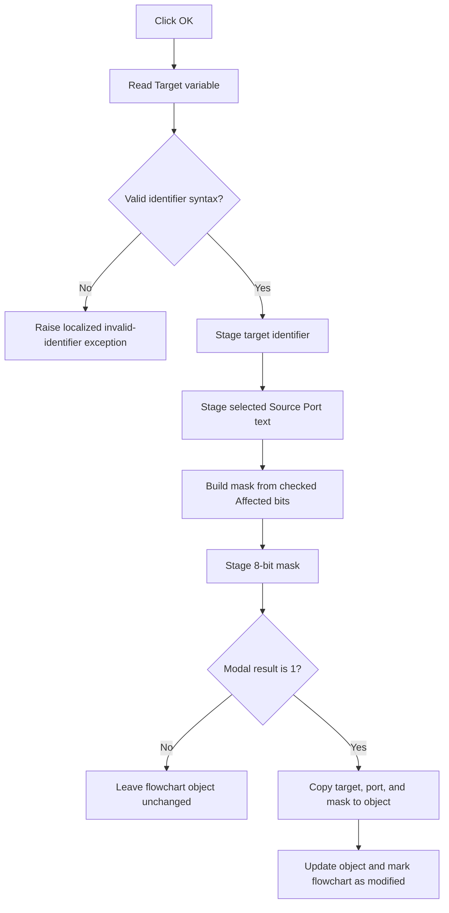

# bOK

> Analysis status: Reviewed from recovered source, UI resources, and the graph call path.

## Control

| Property | Recovered value |
| --- | --- |
| Form | dlgFlowChartReadIO |
| Component path | dlgFlowChartReadIO.bOK |
| Control class | TBitBtn |
| Caption | Supplied by the recovered `bkOK` button kind. |
| Hint | Not present in the recovered resource. |
| Text | Not present in the recovered resource. |
| Handler name | bOKClick |
| Handler address | 00f95f60 |
| Graph node | `resource:dfm:dlgFlowChartReadIO/dlgFlowChartReadIO.bOK` |
| Handler node | `function:00f95f60` |
| Graph layer | UI |

## What happens when clicked

The click validates and stages a FlowChart Read Input operation. It reads the
`Target variable` edit first. A valid identifier is not empty, starts with an
ASCII letter or underscore, and then contains only ASCII letters, digits, or
underscores. Valid text is copied to the dialog's staged target field.

Invalid target text is included in a localized
`HDLStrings.Msg_FC_InvIdentifier` message. The handler constructs and raises a
validation exception. Normal handler execution stops before it stages the
source port or affected-bit mask. The handler has no local catch, retry,
fallback, or rollback block.

After successful target validation, the handler reads the selected row from
the `Source Port` combo box and copies that row's text to the staged source-port
field. It does not locally reject an invalid or missing row. Form show normally
selects the previously staged port when it exists in the list. Otherwise, it
selects row zero.

The handler then reads the eight `Affected bits` checklist rows. It starts with
a zero mask and sets bit *n* when checklist row *n* is checked. It stores the
resulting 8-bit mask in the dialog's staged mask field.

The click handler does not change the selected flowchart object directly. The
button has standard kind `bkOK`. The modal caller tests the result for exact
value 1. Only that branch copies the staged target, source port, and mask to the
object. It then calls the object's update method, marks the flowchart as
modified, and sets a related flowchart state flag. Cancel or another result
destroys the dialog without these object writes. The accepted path has no
equality check and no local rollback if a later notification fails.

## Click flow

## Handler evidence

- Handler source: [FUN_00f95f60](../../../DecompiledSources/Tina16/functions/0000000000F95F60__FUN_00f95f60.c)
- Identifier validator: [FUN_00f60aa0](../../../DecompiledSources/Tina16/functions/0000000000F60AA0__FUN_00f60aa0.c)
- Mask builder: [FUN_00f962d0](../../../DecompiledSources/Tina16/functions/0000000000F962D0__FUN_00f962d0.c)
- Dialog initialization: [FUN_00f961f0](../../../DecompiledSources/Tina16/functions/0000000000F961F0__FUN_00f961f0.c)
- Form-show staging: [FUN_00f95e70](../../../DecompiledSources/Tina16/functions/0000000000F95E70__FUN_00f95e70.c)
- Modal caller and commit path: [FUN_010510a0](../../../DecompiledSources/Tina16/functions/00000000010510A0__FUN_010510a0.c)
- Recovered role: Validates and stages a FlowChart Read Input operation for modal acceptance.
- Current graph summary: Handles 1 Delphi UI event: `dlgFlowChartReadIO.bOK.OnClick`.
- Current graph behavior: Validates the target, stages the selected port, and converts the checked bit rows to a mask.
- Current graph evidence: The DFM resolves `bOKClick` to `00f95f60`. The handler reads form controls at `+0x6d8`, `+0x6f0`, and `+0x6e8` and stores staged values at `+0x700`, `+0x708`, and `+0x710`.
- Complexity: complex
- Distinct outgoing calls: 11

## Direct calls

- `function:0064dd90` reads Unicode text from `eIdentifier`.
- `function:00f60aa0` validates identifier syntax.
- `function:00f962d0` converts checked checklist rows to a bit mask.
- `function:00414ad0` copies accepted strings to staged form fields.
- `function:00b89270`, `function:0041ddd0`, and `function:00b8e650` load the localized validation message.
- `function:00416cd0` includes the rejected target text in that message.
- `function:0044d490` and `function:004134c0` construct and raise the validation exception.
- `function:00414560` finalizes temporary Unicode strings.

## Resource evidence

- Kind: `bkOK`.
- Modal result: Not present in the recovered resource.
- Checked state: Not present in the recovered resource.
- List items: Not present in the recovered resource.
- Image reference: Not present in the recovered resource.
- Extracted glyph: None.

## Nearby label candidates

The handler and control fields confirm these labels. Their distance alone is
not the evidence.

- `Target variable` identifies the edit that the handler validates.
- `Source Port` identifies the combo box that supplies the staged text.
- `Affected bits` identifies the checklist rows that supply mask bits 0 through 7.

## Analysis limits

- The handler validates only the target identifier. It does not locally check
  that the selected source-port row is valid.
- The form contains a separate message-and-close-guard helper at `00f96260`,
  but the recovered click graph does not connect the invalid-target branch to
  it. This article does not claim that the helper keeps the dialog open.
- The later generated-code execution of the Read Input operation is outside
  this modal edit call tree.
