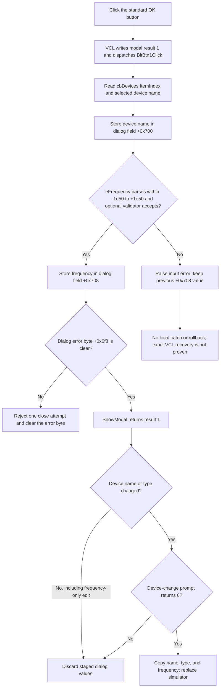

# Accept the selected flowchart device and frequency

> Analysis status: Complete. The recovered DFM, OK handler, float-edit parser, dialog lifecycle, and sole caller support this explanation.

## Control

| Property | Recovered value |
| --- | --- |
| Form | dlgFlowChartSetDevice |
| Component path | dlgFlowChartSetDevice.BitBtn1 |
| Control class | TBitBtn |
| Caption | Supplied by `Kind = bkOK`; no custom caption is present. |
| Hint | Not present in the recovered resource. |
| Device selector | dlgFlowChartSetDevice.cbDevices (`TComboBox`) |
| Frequency editor | dlgFlowChartSetDevice.eFrequency (`TFloatEdit`) |
| Handler name | BitBtn1Click |
| Handler address | 00fd8430 |
| Graph node | `resource:dfm:dlgFlowChartSetDevice/dlgFlowChartSetDevice.BitBtn1` |
| Handler node | `function:00fd8430` |
| Graph layer | UI |

`BitBtn1` has the standard VCL button kind `bkOK`. This kind supplies the OK caption, glyph, default-button state, and modal result `1`. The recovered DFM has no custom caption, hint, image, or extracted glyph for this control.

## What happens when clicked

The inherited VCL click path writes the button's modal result to the parent form and then dispatches `BitBtn1Click`. The recovered handler ignores `Sender` and performs these operations in order:

1. It reads the selected index from `cbDevices` at form offset `+0x6c0`.
2. It reads the Unicode device name at that index from the combo box item list.
3. It assigns the device name to dialog working field `+0x700`.
4. It passes `eFrequency` at form offset `+0x6c8` to the shared float-edit getter.
5. It stores the returned double in dialog working field `+0x708`.

The handler does not change the selected type. `cbType.OnChange` and the dialog initializer maintain the type code at `+0x6fc` and fill `cbDevices` from the matching MCU-family list.

The handler has no decision branch, fallback, or local exception handler. It also has no explicit guard for an invalid device-list index. The normal initializer and type-change path select a device-list entry, but the recovered source does not prove the result of an empty list.

## Frequency validation and close guard

The float-edit getter reads the current Unicode text and parses it as a floating-point number. It rejects a value below `-1e50` or above `+1e50`. If the edit has an optional validator callback, it also rejects a value when that callback returns false. A successful call updates the edit's numeric cache and returns the value. A failure raises a formatted Delphi input exception.

`eFrequency.OnError` reads the error message from the edit and passes it to the dialog error wrapper. The shared presenter displays only the first pending message and sets dialog byte `+0x6f8`. `FormCloseQuery` permits the close only when this byte is clear. It then clears the byte. Thus, a reported edit error blocks one close attempt and lets the user correct the input.

The direct parser path and the `OnError` event are separate in the recovered source. The source does not prove that every parser exception invokes `OnError`. If parsing raises, `BitBtn1Click` does not write frequency field `+0x708`. The device name was already written to `+0x700`, so the still-open dialog can contain a new staged name and the previous staged frequency. There is no rollback. These fields remain dialog-local until the modal caller accepts them.

## Caller copy-back and downstream effect

`FUN_01053f40` is the sole recovered caller that creates this dialog. It supplies four MCU-family device lists and the current flowchart type, device name, and frequency. After `ShowModal`, it reads dialog values only when the result is `1`.

The caller first compares the selected device name and type with the current flowchart values. It does not compare the frequency.

- If only the frequency changed, the caller discards it.
- If the device name or type changed, the caller shows the device-change confirmation prompt.
- Only confirmation result `6` copies the staged frequency, device name, and type to the flowchart form.
- The accepted path then frees the old simulator, creates a simulator for the selected MCU, rebuilds the available register list, caches MCU information, and updates the title.

The OK handler itself does not change the flowchart, replace a simulator, compile, save, or persist data. A Cancel result is not `1`, so the caller destroys the dialog and ignores all staged values. The caller also ignores staged values when the change prompt is not accepted.

## Click flow

## Source evidence

- [OK handler `FUN_00fd8430`](../../../DecompiledSources/Tina16/functions/0000000000FD8430__FUN_00fd8430.c) reads the selected `cbDevices` item, writes dialog field `+0x700`, parses `eFrequency`, and writes dialog field `+0x708`.
- [Dialog initializer `FUN_00fd82f0`](../../../DecompiledSources/Tina16/functions/0000000000FD82F0__FUN_00fd82f0.c) stores the working type, device name, frequency, and four family lists. It fills `cbDevices` and `eFrequency` from those values.
- [Device-list loader `FUN_00fd8220`](../../../DecompiledSources/Tina16/functions/0000000000FD8220__FUN_00fd8220.c) installs one MCU-family list in `cbDevices` and selects either the supplied device name or index `0`.
- [Type-change handler `FUN_00fd8530`](../../../DecompiledSources/Tina16/functions/0000000000FD8530__FUN_00fd8530.c) updates the working type and reloads `cbDevices` when the type selection changes.
- [Float-edit getter `FUN_00b90090`](../../../DecompiledSources/Tina16/functions/0000000000B90090__FUN_00b90090.c) reads and parses the frequency text, applies the recovered range and optional validator checks, caches a successful number, and raises on failure.
- [Edit error handler `FUN_00fd8160`](../../../DecompiledSources/Tina16/functions/0000000000FD8160__FUN_00fd8160.c) forwards the edit's error text to [the dialog error wrapper](../../../DecompiledSources/Tina16/functions/0000000000FD8100__FUN_00fd8100.c).
- [One-shot error presenter `FUN_01b1cf30`](../../../DecompiledSources/Tina16/functions/0000000001B1CF30__FUN_01b1cf30.c) displays the first pending message and sets the supplied error byte.
- [Close-query handler `FUN_00fd80b0`](../../../DecompiledSources/Tina16/functions/0000000000FD80B0__FUN_00fd80b0.c) assigns `CanClose` from the inverse of dialog byte `+0x6f8` and then clears the byte.
- [Dialog caller `FUN_01053f40`](../../../DecompiledSources/Tina16/functions/0000000001053F40__FUN_01053f40.c) checks modal result `1`, compares only the device name and type, asks for confirmation, and commits all three staged values only on result `6`.
- [TBitBtn kind setter `FUN_0082bc30`](../../../DecompiledSources/Tina16/functions/000000000082BC30__FUN_0082bc30.c) maps `bkOK` to its standard caption, glyph, default state, and modal result. [The inherited custom-button click path](../../../DecompiledSources/Tina16/functions/0000000000687F30__FUN_00687f30.c) copies the modal result to the parent form before it dispatches the click event.
- [Recovered Delphi resource evidence](../../../DecompiledSources/Tina16/resources/dfm/ui-evidence.json) supplies the form caption, control classes, labels, type items, button kind, and event bindings.
- The related [Set Device menu article](../flowchartmainform/mnsetdevice-55cdc2a124.md) explains the catalog, confirmation, simulator replacement, and persistence boundaries owned by the caller.

## Analysis limits and ownership

- This Bead owns the direct OK handler, the dialog-specific edit error path, and the close guard.
- The shared VCL button path, string helpers, float-edit parser, and one-shot error presenter are cited as common evidence. This fragment does not redefine them.
- The menu article owns the catalog loading, change confirmation, simulator replacement, and later compiler effects. This article uses that path only to establish how the staged values are consumed.
- The Delphi field names at `+0x6f8`, `+0x700`, and `+0x708` are not recovered. Their roles follow from their writers and readers.
- The exact VCL recovery after a direct parser or list-index exception is not recovered.
