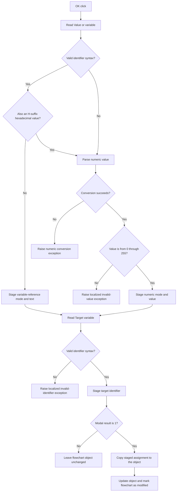

# OK

## Control

| Property | Recovered value |
| --- | --- |
| Form | dlgFlowChartSetVariable |
| Component path | dlgFlowChartSetVariable.bOK |
| Control class | TBitBtn |
| Caption | Supplied by the recovered `bkOK` button kind. |
| Hint | Not present in the recovered resource. |
| Text | Not present in the recovered resource. |
| Handler name | bOKClick |
| Handler address | 00f92880 |
| Graph node | `resource:dfm:dlgFlowChartSetVariable/dlgFlowChartSetVariable.bOK` |
| Handler node | `function:00f92880` |
| Graph layer | UI |

## What happens when clicked

The click validates and stages a FlowChart Set Variable assignment. The dialog
has a target identifier and value text. The value text can identify another
variable or specify an 8-bit number.

The handler first reads `eValue`. If the text is a valid identifier and is not
also an `H`-suffix hexadecimal form, the handler selects variable-reference
mode and stages the text. A valid identifier is nonempty, starts with an ASCII
letter or underscore, and contains only ASCII letters, digits, or underscores.

All other value text goes to the integer parser. The parser accepts decimal
text and hexadecimal text whose final character is `H`. The handler selects
numeric mode, stages the parsed integer, and requires a value from 0 through
255. Text that the parser cannot convert raises its normal conversion
exception. A converted value outside this range raises the localized
`HDLStrings.Msg_FC_InvValue` exception. A name that consists of hexadecimal
digits and ends in `H` is therefore processed as a number, not as a variable
reference.

The handler then reads `eIdentifier`. The same identifier rule applies to this
target. Invalid text raises the localized
`HDLStrings.Msg_FC_InvIdentifier` exception. Valid text is copied to the
dialog's staged target field.

The click handler does not change the selected flowchart object directly. The
`bkOK` modal action returns control to `FUN_01050cd0`. Only modal result 1
copies the staged target, variable text, mode flag, and numeric value to the
object. That accepted path calls the object's update method, marks the
flowchart as modified, and sets a related flowchart state flag. Cancel or a
different modal result skips these writes. The accepted path has no equality
check, so it sends the update and modified notifications even when the values
did not change.

The handler has no local catch, retry, fallback, or rollback block. A raised
validation or conversion exception interrupts normal completion. The modal
coordinator writes the two strings, mode byte, and integer before it sends the
notifications; it has no local rollback if a later accepted-path call fails.

## Click flow

## Handler evidence

- Handler source: [FUN_00f92880](../../../DecompiledSources/Tina16/functions/0000000000F92880__FUN_00f92880.c)
- Identifier validator: [FUN_00f60aa0](../../../DecompiledSources/Tina16/functions/0000000000F60AA0__FUN_00f60aa0.c)
- Hexadecimal-form validator: [FUN_00f60e10](../../../DecompiledSources/Tina16/functions/0000000000F60E10__FUN_00f60e10.c)
- Integer parser: [FUN_00f60f70](../../../DecompiledSources/Tina16/functions/0000000000F60F70__FUN_00f60f70.c)
- Dialog initialization: [FUN_00f92e60](../../../DecompiledSources/Tina16/functions/0000000000F92E60__FUN_00f92e60.c)
- Form-show staging: [FUN_00f927a0](../../../DecompiledSources/Tina16/functions/0000000000F927A0__FUN_00f927a0.c)
- Modal caller and commit path: [FUN_01050cd0](../../../DecompiledSources/Tina16/functions/0000000001050CD0__FUN_01050cd0.c)
- Modified-state synchronizer: [FUN_01053e80](../../../DecompiledSources/Tina16/functions/0000000001053E80__FUN_01053e80.c)
- Recovered role: Validate and stage a FlowChart Set Variable assignment for
  modal acceptance.
- Complexity: complex
- Distinct outgoing calls: 12

The DFM binds `dlgFlowChartSetVariable.bOK.OnClick` to `bOKClick` at
`00f92880` and assigns kind `bkOK`. The source reads `eValue` at form field
`+0x6D0` and `eIdentifier` at `+0x6C8`. It stages the target at `+0x6F0`,
variable text at `+0x6F8`, numeric value at `+0x700`, and mode at `+0x704`.
Mode 0 identifies variable text; mode 1 identifies a number.

`FUN_00f92e60` initializes these fields from object offsets `+0x110` through
`+0x124`. `FUN_01050cd0` tests the modal result for exact value 1 and copies
the four fields back only on that branch. This establishes the accepted-output
boundary.

## Direct calls

- `function:0064dd90` - read Unicode text from `eValue` and `eIdentifier`.
- `function:00f60aa0` - validate identifier syntax.
- `function:00f60e10` - detect an `H`-suffix hexadecimal integer.
- `function:00f60f70` - parse decimal or hexadecimal integer text.
- `function:00414ad0` - copy accepted strings to staged form fields.
- `function:00b89270`, `function:0041ddd0`, and `function:00b8e650` - load
  localized validation text.
- `function:00416cd0` - format rejected input into a validation message.
- `function:0044d490` and `function:004134c0` - construct and raise the
  validation exception.
- `function:00414560` - finalize temporary Unicode strings.

## Resource evidence

- The form caption is `Set Variable`.
- The labels identify `Target variable` and `Value or variable`.
- The OK control has kind `bkOK`. It has no recovered hint, custom glyph, or
  explicit modal-result property.

## Nearby label candidates

The handler and control fields confirm these labels; their distance alone is
not the evidence.

- `Value or variable` is the label for `eValue`.
- `Target variable` is the label for `eIdentifier`.

## Analysis limits

- The recovered click handler validates and stages the assignment. It does not
  execute the assignment during the click.
- The source proves the integer-parser exception path. It does not provide a
  form-specific message for a conversion failure.
- The later save or persistence path is outside this modal edit call tree.
