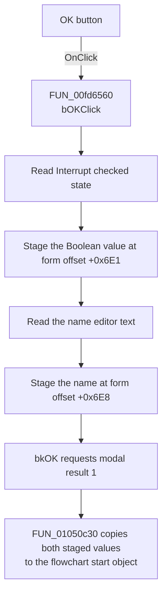

# bOK

> Analysis status: Recovered start-property acceptance path reviewed.

## Control

| Property | Recovered value |
| --- | --- |
| Form | dlgFlowchartStart |
| Component path | dlgFlowchartStart.bOK |
| Control class | TBitBtn |
| Caption | Not present in the recovered resource. |
| Hint | Not present in the recovered resource. |
| Text | Not present in the recovered resource. |
| Handler name | bOKClick |
| Handler address | 00fd6560 |
| Graph node | `resource:dfm:dlgFlowchartStart/dlgFlowchartStart.bOK` |
| Handler node | `function:00fd6560` |
| Graph layer | UI |

## What happens when clicked

`bOKClick` reads the current **Interrupt** check box state and stores it in the
dialog's staged Boolean field. It then reads the current text from the name
editor and copies the text to the dialog's staged name field. The handler does
not trim or validate the name. It also copies the name when **Interrupt** is
clear and the editor is disabled.

The button kind is `bkOK`, so the button requests modal result `1`. The caller
checks for this exact result. Only that result copies the staged Boolean and
name from the dialog back to the flowchart start object. The caller then invokes
the object's recovered update method and two downstream state-update paths.
Cancel or another modal result skips this accepted-value copy.

The click handler has no branch, error message, fallback, or rollback path.

## Click flow

## Handler evidence

- Source: [DecompiledSources/Tina16/functions/0000000000FD6560__FUN_00fd6560.c](../../../DecompiledSources/Tina16/functions/0000000000FD6560__FUN_00fd6560.c)
- Dialog initialization: [DecompiledSources/Tina16/functions/0000000000FD6420__FUN_00fd6420.c](../../../DecompiledSources/Tina16/functions/0000000000FD6420__FUN_00fd6420.c)
- Accepted-value caller: [DecompiledSources/Tina16/functions/0000000001050C30__FUN_01050c30.c](../../../DecompiledSources/Tina16/functions/0000000001050C30__FUN_01050c30.c)
- Recovered role: Stages the flowchart start interrupt state and name for modal
  acceptance.
- Current graph summary: Handles 1 Delphi UI event: dlgFlowchartStart.bOK.OnClick.
- Current graph behavior: Reads the check box and name editor, then stores both
  values in dialog fields that the modal caller copies on result `1`.
- Current graph evidence: `FUN_00fd6560` calls the Boolean getter at VMT slot
  `+0x260` on form field `+0x6D8`, stores the result at `+0x6E1`, reads text
  from form field `+0x6B8`, and assigns it at `+0x6E8`. `FUN_00fd6420` performs
  the inverse object-to-dialog copy from object offsets `+0x110` and `+0x118`.
- Complexity: complex
- Distinct outgoing calls: 3

## Direct calls

- `function:00414480` - finalizes the temporary Delphi UnicodeString.
- `function:00414ad0` - assigns the editor text to the staged UnicodeString.
- `function:0064dd90` - reads Unicode text from the name editor.

## Resource evidence

- Kind: bkOK
- Modal result: Not present in the recovered resource.
- Checked state: Not present in the recovered resource.
- List items: Not present in the recovered resource.
- Image reference: Not present in the recovered resource.
- Extracted glyph: None.

## Nearby label candidates

Nearby labels are layout candidates only. They are not proof of behavior.

- Rank 1: Name: at distance 87. The recovered text read from form field
  `+0x6B8` and the field mapping in the Interrupt handler confirm that this is
  the name editor used by the OK handler.

## Analysis limits

- The original Delphi field names are not recovered. DFM component order,
  control-specific virtual calls, and the inverse initialization and commit
  paths establish the mappings.
- The handler does not validate the name or require a name when **Interrupt**
  is selected.
- The handler always stages the current name text. It does not clear the text
  when **Interrupt** is clear.
- The purposes of the two downstream state-update calls after the object update
  are not fully recovered. The article does not assign a more specific effect
  to them.
