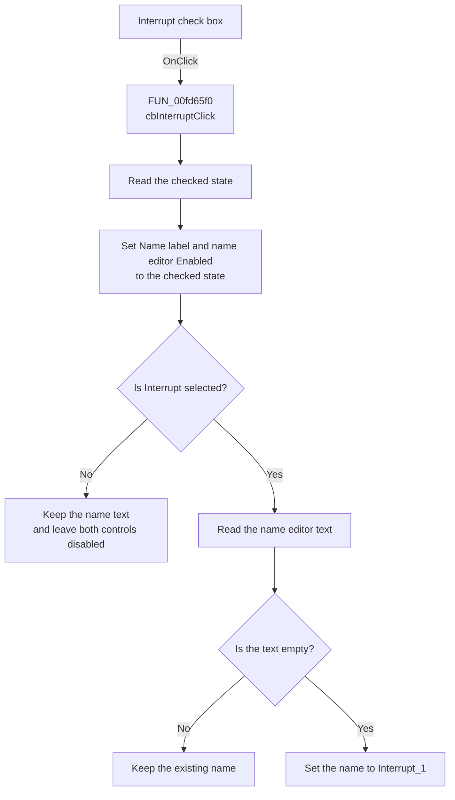

# Interrupt

> Analysis status: Recovered name-control enablement and defaulting path reviewed.

## Control

| Property | Recovered value |
| --- | --- |
| Form | dlgFlowchartStart |
| Component path | dlgFlowchartStart.cbInterrupt |
| Control class | TCheckBox |
| Caption | Interrupt |
| Hint | Not present in the recovered resource. |
| Text | Not present in the recovered resource. |
| Handler name | cbInterruptClick |
| Handler address | 00fd65f0 |
| Graph node | `resource:dfm:dlgFlowchartStart/dlgFlowchartStart.cbInterrupt` |
| Handler node | `function:00fd65f0` |
| Graph layer | UI |

## What happens when clicked

`cbInterruptClick` reads the current **Interrupt** check box state. It applies
the same Boolean value to the enabled state of the **Name:** label and the name
editor.

When the check box is selected, the handler reads the name editor. If the text
is empty, it sets the text to `Interrupt_1`. If the editor already contains
text, the handler keeps that text. When the check box is clear, the handler
disables the label and editor and keeps the current text unchanged.

The shared VCL enabled-state setter sends an enabled-change message only when
the requested value differs from the current value. This click does not copy
the check box state or name to the flowchart start object. The OK handler stages
those values, and the modal caller applies them only after modal result `1`.

## Click flow

## Handler evidence

- Source: [DecompiledSources/Tina16/functions/0000000000FD65F0__FUN_00fd65f0.c](../../../DecompiledSources/Tina16/functions/0000000000FD65F0__FUN_00fd65f0.c)
- Enabled-state setter: [DecompiledSources/Tina16/functions/000000000064DC60__FUN_0064dc60.c](../../../DecompiledSources/Tina16/functions/000000000064DC60__FUN_0064dc60.c)
- Form creation path: [DecompiledSources/Tina16/functions/0000000000FD64C0__FUN_00fd64c0.c](../../../DecompiledSources/Tina16/functions/0000000000FD64C0__FUN_00fd64c0.c)
- Form display path: [DecompiledSources/Tina16/functions/0000000000FD6470__FUN_00fd6470.c](../../../DecompiledSources/Tina16/functions/0000000000FD6470__FUN_00fd6470.c)
- OK handler: [DecompiledSources/Tina16/functions/0000000000FD6560__FUN_00fd6560.c](../../../DecompiledSources/Tina16/functions/0000000000FD6560__FUN_00fd6560.c)
- Recovered role: Enables or disables the start interrupt name controls and
  supplies a default name when an enabled editor is empty.
- Current graph summary: Handles 1 Delphi UI event: dlgFlowchartStart.cbInterrupt.OnClick.
- Current graph behavior: Applies the check box state to the name label and
  editor. When selected, it changes an empty name to `Interrupt_1`.
- Current graph evidence: `FUN_00fd65f0` reads the Boolean getter at VMT slot
  `+0x260` from form field `+0x6D8`. It passes that value to VMT slot `+0x128`
  on fields `+0x6B0` and `+0x6B8`. When the state is true, it reads text from
  `+0x6B8` and calls the text setter with `Interrupt_1` only for a nil or empty
  UnicodeString.
- Complexity: complex
- Distinct outgoing calls: 3

## Direct calls

- `function:00414480` - finalizes the temporary Delphi UnicodeString.
- `function:0064dd90` - reads Unicode text from the name editor.
- `function:0064de00` - sets the name editor text with repeated-value
  suppression.

The two enabled-state calls are virtual. The recovered VMT slot maps to
`FUN_0064dc60`, which changes the enabled byte and sends message `0xB00C` only
when the state changes.

## Resource evidence

- Kind: Not present in the recovered resource.
- Modal result: Not present in the recovered resource.
- Checked state: Not present in the recovered resource.
- List items: Not present in the recovered resource.
- Image reference: Not present in the recovered resource.
- Extracted glyph: None.

## Nearby label candidates

Nearby labels are layout candidates only. They are not proof of behavior.

- Rank 1: Name: at distance 31. The handler applies the enabled state to the
  label field at `+0x6B0` and the adjacent edit field at `+0x6B8`. This call
  pattern confirms that the label identifies the editor controlled here.

## Analysis limits

- The original Delphi field names are not recovered. DFM component order,
  control-specific virtual calls, and the form lifecycle paths establish the
  mappings.
- The handler tests only whether the editor text is empty. It does not validate
  the text, check uniqueness, or replace a nonempty name.
- The handler does not save the check box state or name to the flowchart start
  object. The OK and modal-caller paths do that after acceptance.
