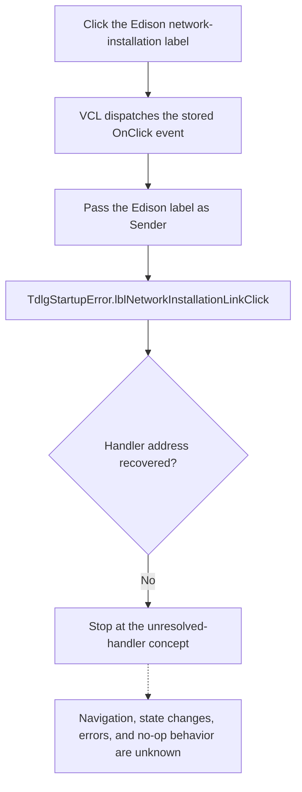

# http://www.edisonlab.com/enetwins.htm

> Analysis status: The DFM control and VCL event boundary are recovered. The custom handler address and application behavior remain unresolved.

## Control

| Property | Recovered value |
| --- | --- |
| Form | dlgStartupError |
| Form class | TdlgStartupError |
| Form caption | Startup Error |
| Component path | dlgStartupError.lblEdisonNetworkInstallationLink |
| Control class | TLabel |
| Caption | http://www.edisonlab.com/enetwins.htm |
| DFM visibility | false |
| Hint | Not present in the recovered resource. |
| Handler name | lblNetworkInstallationLinkClick |
| Handler address | Not recovered. |
| Graph node | `resource:dfm:dlgStartupError/dlgStartupError.lblEdisonNetworkInstallationLink` |
| Handler node | `concept:dfm-handler:TdlgStartupError/lblNetworkInstallationLinkClick` |
| Graph layer | tina.exe |

## What happens when clicked

The recovered evidence proves this event boundary:

1. The DFM creates `lblEdisonNetworkInstallationLink` as a label with the displayed URL as its caption.
2. The DFM assigns `OnClick = lblNetworkInstallationLinkClick`.
3. The common VCL click dispatcher can call the stored event with the clicked Edison label as `Sender`.
4. The event binding has no code address. The graph therefore ends at an unresolved-handler concept.

No address-backed source proves that the handler opens the displayed URL. It can read the `Sender`, compare the two labels, use a fixed target, copy text, show another dialog, return without an operation, or take another action. The URL caption and hand-link presentation are not sufficient implementation evidence.

## Click flow

## Shared-handler distinction

The Tina and Edison labels use the same method name, but they remain separate controls. VCL passes the clicked label as `Sender`. The missing handler can branch on that object, read its caption, or ignore it. The shared binding does not prove that both controls use the same URL or final action.

## Form and visibility evidence

The DFM stores all four message labels as hidden:

- `lblNetworkVersion` explains that a network version is installed on a local drive and points the user to installation instructions.
- `lblEdisonNetworkInstallationLink` contains this Edison URL.
- `lblTinaNetworkInstallationLink` contains the Tina URL.
- `lblSingleVersion` explains that a single-user version is installed on a network server.

The form has an unresolved `FormShow` method. It can select which message and link become visible, but its code address and body are not recovered. Therefore the DFM proves the stored startup-error choices, not the runtime condition that displays this Edison label.

## Address-recovery evidence

### Graph and extractor

The graph contains one `triggers` edge from this control to `concept:dfm-handler:TdlgStartupError/lblNetworkInstallationLinkClick`. The concept has no function address, source path, incoming function-call edge, or outgoing call edge.

[Recovered DFM evidence](../../../DecompiledSources/Tina16/resources/dfm/ui-evidence.json) was produced by the checked-in [UI evidence extractor](../../../analysis/undelphi/TiaraUiEvidence.rs). The extractor first uses an address from the event binding. If that is absent, it asks the owning form class and published method table to resolve the method name. Both paths returned no address for this event.

### Recovered binary artifacts

A focused read-only scan found one exact `TdlgStartupError` string and two exact `lblNetworkInstallationLinkClick` strings in each of these recovered artifacts:

- the rebuilt runtime executable;
- the mapped runtime image;
- the complete process dump.

In each artifact, the class name follows a `TPF0` marker and both handler-name occurrences are inside that same form stream. The two occurrences are the two DFM `OnClick` properties. No second class-name or method-name occurrence identifies a class VMT or published method table.

The raw pointer test used the successful `TdlgFlowchartInterruptAVRext0` pattern. That class has a qword from VMT offset `-0x88` to its length-prefixed class name and a published-method-table pointer at VMT offset `-0x98`. In the mapped image, the only `TdlgStartupError` copy is at `03843ea1`, five bytes after the `TPF0` marker at `03843e9c`. The two `lblNetworkInstallationLinkClick` copies are at `038441ea` and `0384432b` in the same stream. No qword points to the class string at `03843ea1` or its length byte at `03843ea0`. Thus, the available image supplies no class VMT base and no VMT `-0x98` table pointer from which to read an exact handler address.

### Decompiled source

The [function index](../../../DecompiledSources/Tina16/functions/function-index.csv) catalogs the recovered functions. Searches of the index and function sources found no exact `TdlgStartupError`, `dlgStartupError`, or `lblNetworkInstallationLinkClick` reference. Numeric-only code can still exist, but no recovered address binds such code to this control.

The recovered [VCL click dispatcher](../../../DecompiledSources/Tina16/functions/0000000000650840__FUN_00650840.c) establishes the `Sender` dispatch boundary. It does not establish the missing application method.

## Inputs, outputs, and limits

| Question | Proven result |
| --- | --- |
| Immediate input | A click on `lblEdisonNetworkInstallationLink`; VCL can pass that label as `Sender`. |
| URL input | The label caption stores `http://www.edisonlab.com/enetwins.htm`. No recovered handler read of that caption is available. |
| Browser or shell operation | Unknown. No open-URL, browser, or shell call is tied to this event. |
| Form-state change | Unknown. The `FormShow` and click handlers are both unresolved. |
| Repeated-click behavior | Unknown. No guard, state check, or no-op branch is recovered. |
| Error behavior | Unknown. No exception, message, fallback, or return-value handling is tied to the event. |
| Persistence | Unknown. No settings, file, registry, or database operation is tied to the event. |

## Resource evidence

- The control is a `TLabel` with the exact Edison URL as its caption and no hint, action, image reference, or extracted glyph.
- Its DFM visibility is false.
- Its nearest other labels are the Tina URL and the network-version explanation. They provide startup-error context only.

## Analysis limits

- No function annotation fragment is created because no application function address has a proven responsibility for this control.
- Further analysis needs the module that owns the `TdlgStartupError` VMT and published method table, a symbol or map file, or a runtime trace that captures the resolved `OnClick` target.
